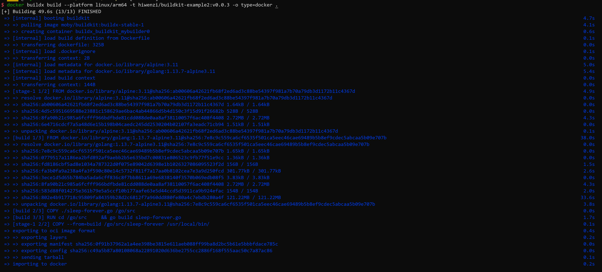
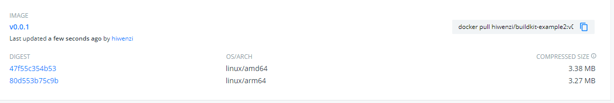

# Demo
## 使用buildx/buildkit构建第一个镜像
* 启用`buildx`命令
    ```bash
    export DOCKER_CLI_EXPERIMENTAL=enabled
    ```
    要求docker版本19.03
* 执行`docker buildx build .`进行构建
    
## 构建多平台镜像
* 启用宿主机`binfmt_misc`
    ```bash
    docker run --rm --privileged docker/binfmt:66f9012c56a8316f9244ffd7622d7c21c1f6f28d
    ```
    要求linux内核版本4.8及以上
* 验证`binfmt_misc`是否开启
    ```bash
    $ ls -al /proc/sys/fs/binfmt_misc/
    total 0
    drwxr-xr-x 2 root root 0 Feb 20 20:13 .
    dr-xr-xr-x 1 root root 0 Feb 18 09:55 ..
    -rw-r--r-- 1 root root 0 Feb 20 20:22 qemu-aarch64
    -rw-r--r-- 1 root root 0 Feb 20 20:22 qemu-arm
    -rw-r--r-- 1 root root 0 Feb 20 20:22 qemu-ppc64le
    -rw-r--r-- 1 root root 0 Feb 20 20:22 qemu-s390x
    --w------- 1 root root 0 Feb 20 20:13 register
    -rw-r--r-- 1 root root 0 Feb 20 20:13 status
    ```
* 验证是否启用了相应的处理器
    ```bash
    $ cat /proc/sys/fs/binfmt_misc/qemu-arm
    enabled
    interpreter /usr/bin/qemu-arm
    flags: OCF
    offset 0
    magic 7f454c4601010100000000000000000002002800
    mask ffffffffffffff00fffffffffffffffffeffffff
    ```
* 从默认的构建器切换到多平台构建器
Buildx默认会使用不支持多 CPU 架构的构建器，我们需要手动切换。
先创建一个新的构建器：
    ```bash
    docker buildx create --use --name mybuilder
    ```
    启动构建器：
    ```bash
    docker buildx inspect mybuilder --bootstrap
    ```
    查看当前使用的构建器及构建器支持的 CPU 架构，可以看到支持很多 CPU 架构：
    ```bash
    $ docker buildx ls
    NAME/NODE    DRIVER/ENDPOINT             STATUS  PLATFORMS
    mybuilder *  docker-container
    mybuilder0 unix:///var/run/docker.sock running linux/amd64, linux/arm64, linux/ppc64le, linux/s390x, linux/386, linux/arm/v7, linux/arm/v6
    default      docker
    default    default                     running linux/amd64, linux/386
    ```
* 构建多平台镜像
    ```bash
    docker buildx build --platform linux/arm64,linux/amd64 -t hiwenzi/buildkit-example2:v0.0.1  --push .
    ```
* 登录dockerhub查看镜像
    

如果想将构建好的镜像保存在本地，可以将 type 指定为 docker，但必须分别为不同的 CPU 架构构建不同的镜像，不能合并成一个镜像，即：
```bash
docker buildx build --platform linux/arm64 -t hiwenzi/buildkit-example2:v0.0.1 -o type=docker .
docker buildx build --platform linux/amd64 -t hiwenzi/buildkit-example2:v0.0.1 -o type=docker .
```
## 验证buildx的并发构建
准备Dockerfile如下：
```Dockerfile
FROM golang:1.13.7-alpine3.11 AS build-1
ENV GOPROXY=https://goproxy.cn
RUN mkdir -p /go/src/github.com/zdnscloud/cluster-agent
COPY ./cluster-agent /go/src/github.com/zdnscloud/cluster-agent
WORKDIR /go/src/github.com/zdnscloud/cluster-agent
RUN CGO_ENABLED=0 GOOS=linux go build -o cmd/cluster-agent cmd/cluster-agent.go

FROM golang:1.13.7-alpine3.11 AS build-2
ENV GOPROXY=https://goproxy.cn
RUN mkdir -p /go/src/github.com/zdnscloud/elb-controller
COPY ./elb-controller /go/src/github.com/zdnscloud/elb-controller
WORKDIR /go/src/github.com/zdnscloud/elb-controller
RUN CGO_ENABLED=0 GOOS=linux go build -ldflags "-w -s" -o cmd/elbc cmd/elbc.go

FROM golang:1.13.7-alpine3.11 AS build-3
ENV GOPROXY=https://goproxy.cn
RUN mkdir -p /go/src/github.com/zdnscloud/immense
COPY ./immense /go/src/github.com/zdnscloud/immense
WORKDIR /go/src/github.com/zdnscloud/immense
RUN CGO_ENABLED=0 GOOS=linux go build cmd/operator.go

FROM golang:1.13.7-alpine3.11 AS build-4
ENV GOPROXY=https://goproxy.cn
RUN mkdir -p /go/src/github.com/zdnscloud/singlecloud
COPY ./singlecloud /go/src/github.com/zdnscloud/singlecloud
WORKDIR /go/src/github.com/zdnscloud/singlecloud
RUN CGO_ENABLED=0 GOOS=linux go build -ldflags "-w -s" cmd/singlecloud/singlecloud.go

FROM alpine:3.10.0
COPY --from=build-1 /go/src/github.com/zdnscloud/cluster-agent/cmd/cluster-agent /cluster-agent
COPY --from=build-2 /go/src/github.com/zdnscloud/elb-controller/cmd/elbc /elbc
COPY --from=build-3 /go/src/github.com/zdnscloud/immense/operator /operator
COPY --from=build-4 /go/src/github.com/zdnscloud/singlecloud/singlecloud /singlecloud
```
结果：buildx耗时92s、docker build耗时160s
## 使用远程context进行构建
buildx构建时，构建的上下文环境可以不是本地当前目录，支持git
```bash
$ docker buildx build --platform linux/amd64 -t hiwenzi/singlecloud:v0.0.1 -o type=docker git://github.com/zdnscloud/singlecloud.git
```