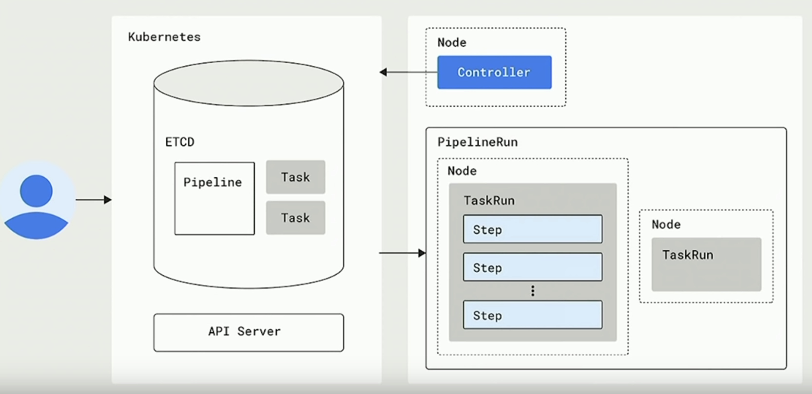

# Architecture

# Base concept
1. Step   
    Not a new CRD but k8s container spec
    run command in single image

1. Task CRD  
    Sequence of steps
    Run in sequential order on same k8s node

1. Pipeline CRD   
    Express tasks order(dependency)
    - Sequentially
    - Concurrently
    - Graph

    Execute tasks on different nodes
    Link inputs to outputs between tasks

1. TaskRun CRD   
    Runtime instance of task

1. PipelineRun CRD   
    Runtime instance of Pipeline

1. PipelineResource CRD    
   Runtime info (parameter for task like image registry, git repo)


# Example
1. Build Task
```yaml
apiVersion: tekton.dev/v1alpha1
kind: Task
metadata:
  name: source-to-image
spec:
  inputs:
    resources:
      - name: git-source
        type: git
    params:
      - name: pathToContext
        description: The path to the build context, used by Kaniko - within the workspace
        default: .
      - name: pathToDockerFile
        description: The path to the dockerfile to build (relative to the context)
        default: Dockerfile
      - name: imageUrl
        description: Url of image repository
      - name: imageTag
        description: Tag to apply to the built image
        default: "latest"
  steps:
    - name: build-and-push
      image: gcr.io/kaniko-project/executor
      command:
        - /kaniko/executor
      args:
        - --dockerfile=$(inputs.params.pathToDockerFile)
        - --destination=$(inputs.params.imageUrl):$(inputs.params.imageTag)
        - --context=/workspace/git-source/$(inputs.params.pathToContext)
```

1. Deploy Task
```yaml
apiVersion: tekton.dev/v1alpha1
kind: Task
metadata:
  name: deploy-using-kubectl
spec:
  inputs:
    resources:
      - name: git-source
        type: git
    params:
      - name: pathToYamlFile
        description: The path to the yaml file to deploy within the git source
      - name: imageUrl
        description: Url of image repository
      - name: imageTag
        description: Tag of the images to be used.
        default: "latest"
  steps:
    - name: update-yaml
      image: alpine
      command: ["sed"]
      args:
        - "-i"
        - "-e"
        - "s;__IMAGE__;$(inputs.params.imageUrl):$(inputs.params.imageTag);g"
        - "/workspace/git-source/$(inputs.params.pathToYamlFile)"
    - name: run-kubectl
      image: lachlanevenson/k8s-kubectl
      command: ["kubectl"]
      args:
        - "apply"
        - "-f"
        - "/workspace/git-source/$(inputs.params.pathToYamlFile)"
```

1. Pipeline
```
apiVersion: tekton.dev/v1alpha1
kind: Pipeline
metadata:
  name: build-and-deploy-pipeline
spec:
  resources:
    - name: git-source
      type: git
  params:
    - name: pathToContext
      description: The path to the build context, used by Kaniko - within the workspace
      default: src
    - name: pathToYamlFile
      description: The path to the yaml file to deploy within the git source
    - name: imageUrl
      description: Url of image repository
    - name: imageTag
      description: Tag to apply to the built image
  tasks:
  - name: source-to-image
    taskRef:
      name: source-to-image
    params:
      - name: pathToContext
        value: "$(params.pathToContext)"
      - name: imageUrl
        value: "$(params.imageUrl)"
      - name: imageTag
        value: "$(params.imageTag)"
    resources:
      inputs:
        - name: git-source
          resource: git-source
  - name: deploy-to-cluster
    taskRef:
      name: deploy-using-kubectl
    runAfter:
      - source-to-image
    params:
      - name: pathToYamlFile
        value:  "$(params.pathToYamlFile)"
      - name: imageUrl
        value: "$(params.imageUrl)"
      - name: imageTag
        value: "$(params.imageTag)"
    resources:
      inputs:
        - name: git-source
          resource: git-source
```

1. PipelineResource
```
apiVersion: tekton.dev/v1alpha1
kind: PipelineResource
metadata:
  name: picalc-git
spec:
  type: git
  params:
    - name: revision
      value: master
    - name: url
      value: https://github.com/IBM/tekton-tutorial
```

1. PipelineRun
```yaml
apiVersion: tekton.dev/v1alpha1
kind: PipelineRun
metadata:
  generateName: picalc-pr-
spec:
  pipelineRef:
    name: build-and-deploy-pipeline
  resources:
    - name: git-source
      resourceRef:
        name: picalc-git
  params:
    - name: pathToYamlFile
      value: "knative/picalc.yaml"
    - name: imageUrl
      value: <REGISTRY>/<NAMESPACE>/picalc
    - name: imageTag
      value: "1.0"
  serviceAccountName: pipeline-account
```

# Reference
https://github.com/IBM/tekton-tutorial    
https://www.youtube.com/watch?v=JhxydV-v2Og
