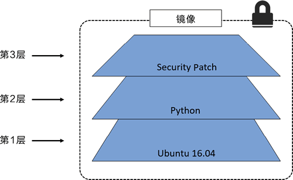
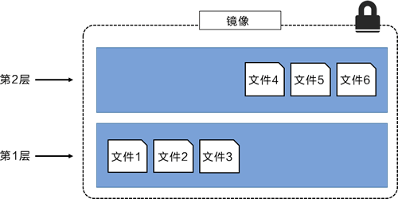
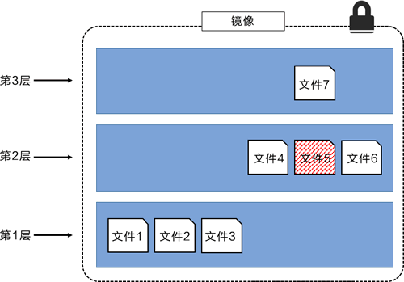
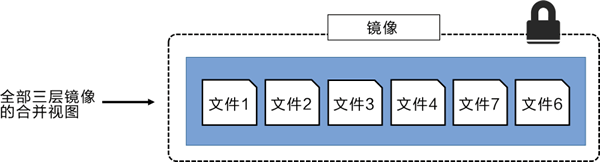
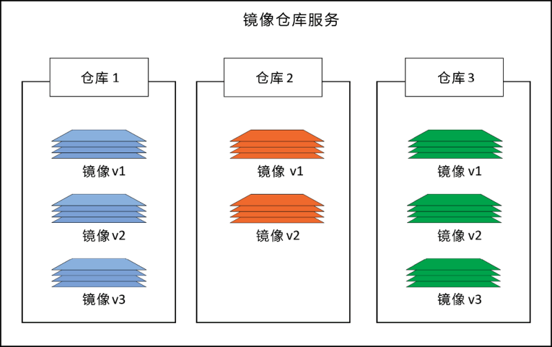

# docker镜像
## 前言
关于docker，我们已经知道Linux 的命名空间和控制组分别解决了不同资源隔离的问题，前者解决了进程、网络以及文件系统的隔离，后者实现了 CPU、内存等资源的隔离，但是在 Docker 中还有另一个非常重要的问题需要解决 - 也就是镜像。
## 什么是镜像
镜像（Image） -- 一个特殊的文件系统
* 除了提供容器运行时所需的程序、库、资源、配置等文件外，还包含了一些为运行时准备的一些配置参数（如匿名卷、环境变量、用户等）。 
* 镜像不包含任何动态数据，其内容在构建之后也不会被改变。 
* 镜像构建时，会一层层构建，前一层是后一层的基础。每一层构建完就不会再发生改变，后一层上的任何改变只发生在自己这一层。
>挂载在容器根目录上、用来为容器进程提供隔离后执行环境的文件系统，就是所谓的“容器镜像”。它还有一个更为专业的名字，叫作：rootfs（根文件系统）。需要明确的是，rootfs 只是一个操作系统所包含的文件、配置和目录，并不包括操作系统内核。在 Linux 操作系统中，这两部分是分开存放的，操作系统只有在开机启动时才会加载指定版本的内核镜像.
## 镜像详解
### 镜像分层
Docker镜像由一些松耦合的只读镜像层组成。如下图所示。

Docker 负责堆叠这些镜像层，并且将它们表示为单个统一的对象。
查看镜像分层的方式可以通过 docker image inspect 命令。下面同样以 ubuntu:latest 镜像为例。
```json
[
    {
        "Id": "sha256:775349758637aff77bf85e2ff0597e86e3e859183ef0baba8b3e8fc8d3cba51c",
        "RepoTags": [
            "ubuntu:latest"
        ],
        "RootFS": {
            "Type": "layers",
            "Layers": [
                "sha256:cc967c529ced563b7746b663d98248bc571afdb3c012019d7f54d6c092793b8b",
                "sha256:2c6ac8e5063e35e91ab79dfb7330c6154b82f3a7e4724fb1b4475c0a95dfdd33",
                "sha256:6c01b5a53aac53c66f02ea711295c7586061cbe083b110d54dafbeb6cf7636bf",
                "sha256:e0b3afb09dc386786d49d6443bdfb20bc74d77dcf68e152db7e5bb36b1cca638"
            ]
        },
        "Metadata": {
            "LastTagTime": "0001-01-01T00:00:00Z"
        }
    }
]
```
输出显示该镜像包含 4 个镜像层。只不过输出内容中使用的是镜像的 SHA256 散列值来标识镜像层。
`docker history` 命令显示了镜像的构建历史记录，但其并不是严格意义上的镜像分层。例如，有些 Dockerfile 中的指令并不会创建新的镜像层。比如 ENV、EXPOSE、CMD 以及 ENTRY- POINT。不过，这些命令会在镜像中添加元数据。

所有的 Docker 镜像都起始于一个基础镜像层，当进行修改或增加新的内容时，就会在当前镜像层之上，创建新的镜像层。

举一个简单的例子，假如基于 Ubuntu Linux 16.04 创建一个新的镜像，这就是新镜像的第一层；如果在该镜像中添加 Python 包，就会在基础镜像层之上创建第二个镜像层；如果继续添加一个安全补丁，就会创建第三个镜像层。

该镜像当前已经包含 3 个镜像层，如下图所示（这只是一个用于演示的很简单的例子）。

在添加额外的镜像层的同时，镜像始终保持是当前所有镜像的组合，理解这一点非常重要。下图中举了一个简单的例子，每个镜像层包含 3 个文件，而镜像包含了来自两个镜像层的 6 个文件。

上图中的镜像层跟之前图中的略有区别，主要目的是便于展示文件。

下图中展示了一个稍微复杂的三层镜像，在外部看来整个镜像只有 6 个文件，这是因为最上层中的文件 7 是文件 5 的一个更新版本。

这种情况下，上层镜像层中的文件覆盖了底层镜像层中的文件。这样就使得文件的更新版本作为一个新镜像层添加到镜像当中。

Docker 通过存储引擎（新版本采用快照机制）的方式来实现镜像层堆栈，并保证多镜像层对外展示为统一的文件系统。

Linux 上可用的存储引擎有 AUFS、Overlay2、Device Mapper、Btrfs 以及 ZFS。顾名思义，每种存储引擎都基于 Linux 中对应的文件系统或者块设备技术，并且每种存储引擎都有其独有的性能特点。

Docker 在 Windows 上仅支持 windowsfilter 一种存储引擎，该引擎基于 NTFS 文件系统之上实现了分层和 CoW[1]。

下图展示了与系统显示相同的三层镜像。所有镜像层堆叠并合并，对外提供统一的视图。

### 共享镜像层
多个镜像之间可以并且确实会共享镜像层。这样可以有效节省空间并提升性能。
> docker pull时注意那些以 Already exists 结尾的行，表示对应的layer已在本地存在，不会重复拉取
Docker 在 Linux 上支持很多存储引擎（Snapshotter）。每个存储引擎都有自己的镜像分层、镜像层共享以及写时复制（CoW）技术的具体实现。
### 镜像散列值（摘要）
从 Docker 1.10 版本开始，镜像就是一系列松耦合的独立层的集合。

镜像本身就是一个配置对象，其中包含了镜像层的列表以及一些元数据信息。

镜像层才是实际数据存储的地方（比如文件等，镜像层之间是完全独立的，并没有从属于某个镜像集合的概念）。

镜像的唯一标识是一个加密 ID，即配置对象本身的散列值。每个镜像层也由一个加密 ID 区分，其值为镜像层本身内容的散列值。

这意味着修改镜像的内容或其中任意的镜像层，都会导致加密散列值的变化。所以，镜像和其镜像层都是不可变的，任何改动都能很轻松地被辨别。

这就是所谓的内容散列（Content Hash）。

到目前为止，事情都很简单。但是接下来的内容就有点儿复杂了。

在推送和拉取镜像的时候，都会对镜像层进行压缩来节省网络带宽以及仓库二进制存储空间。

但是压缩会改变镜像内容，这意味着镜像的内容散列值在推送或者拉取操作之后，会与镜像内容不相符！这显然是个问题。

例如，在推送镜像层到 Docker Hub 的时候，Docker Hub 会尝试确认接收到的镜像没有在传输过程中被篡改。

为了完成校验，Docker Hub 会根据镜像层重新计算散列值，并与原散列值进行比较。

因为镜像在传输过程中被压缩（发生了改变），所以散列值的校验也会失败。

为避免该问题，每个镜像层同时会包含一个分发散列值（Distribution Hash）。这是一个压缩版镜像的散列值，当从镜像仓库服务拉取或者推送镜像的时候，其中就包含了分发散列值，该散列值会用于校验拉取的镜像是否被篡改过。

这个内容寻址存储模型极大地提升了镜像的安全性，因为在拉取和推送操作后提供了一种方式来确保镜像和镜像层数据是一致的。

该模型也解决了随机生成镜像和镜像层 ID 这种方式可能导致的 ID 冲突问题。
## 镜像操作
* docker pull：把远端仓库的镜像下载到本地并解压到指定目录（默认/var/lib/docker/overlay2和/var/lib/docker/image）
* docker push：把本地镜像推送到远端仓库
* docker image rm
当不再需要某个镜像的时候，可以通过 docker image rm 命令从 Docker 主机删除该镜像。其中，rm 是 remove 的缩写。
删除操作会在当前主机上删除该镜像以及相关的镜像层。这意味着无法通过 docker image ls 命令看到删除后的镜像，并且对应的包含镜像层数据的目录会被删除。
但是，如果某个镜像层被多个镜像共享，那只有当全部依赖该镜像层的镜像都被删除后，该镜像层才会被删除。
如果被删除的镜像上存在运行状态的容器，那么删除操作不会被允许。再次执行删除镜像命令之前，需要停止并删除该镜像相关的全部容器。
## 镜像仓库
Docker 镜像存储在镜像仓库服务（Image Registry）当中。
Docker 客户端的镜像仓库服务是可配置的，默认使用 Docker Hub。
镜像仓库服务包含多个镜像仓库（Image Repository）。同样，一个镜像仓库中可以包含多个镜像。
可能这听起来让人有些迷惑，所以下图展示了包含 3 个镜像仓库的镜像仓库服务，其中每个镜像仓库都包含一个或多个镜像。

## 镜像命名和标签
docker镜像命名和标签通过`:`分隔
* 不指定tag的情况下默认拉取`latest`标签的镜像，但latest不一定是最新的镜像，而且latest镜像表示会经常更新，不建议使用
* 一个镜像可以打多个不同的tag，相当于镜像别名
## 实验
### 查看镜像在本地磁盘的存储结构
只拉取一个ubuntu:latest镜像，相关目录：
* /var/lib/docker/image #存储镜像元数据，不同的存储引擎的镜像元数据用不同的folder区分
    * repositories.json存储本机的镜像信息
    ```json
    {
  "Repositories": {
    "ubuntu": {
      "ubuntu:latest": "sha256:775349758637aff77bf85e2ff0597e86e3e859183ef0baba8b3e8fc8d3cba51c",
      "ubuntu@sha256:6e9f67fa63b0323e9a1e587fd71c561ba48a034504fb804fd26fd8800039835d": "sha256:775349758637aff77bf85e2ff0597e86e3e859183ef0baba8b3e8fc8d3cba51c"
    }
  }
}
    ```
    问题：`ubuntu@sha256:6e9f67fa63b0323e9a1e587fd71c561ba48a034504fb804fd26fd8800039835d`这个tag是什么，sha256后边的这串id又是什么（看起来也是sha256摘要）即镜像摘要和镜像id的区别
    答案：镜像id是镜像元数据中config文件的sha256；镜像摘要是在上传镜像至仓库时，对镜像manifest.json压缩后的sha256值，所以一个刚build好但是尚未上传的镜像没有摘要，上传后就有摘要了
    * layerdb：镜像层元数据，目录采用chainID的方式命名，内部cache-id对应实际的overlay数据目录，parent记录这个镜像层的上一层，size记录这层大小
> chainID=sha256sum(H(chainID) diffid)
例如：
echo -n "sha256:cc967c529ced563b7746b663d98248bc571afdb3c012019d7f54d6c092793b8b sha256:2c6ac8e5063e35e91ab79dfb7330c6154b82f3a7e4724fb1b4475c0a95dfdd33" |sha256sum
565879c6effe6a013e0b2e492f182b40049f1c083fc582ef61e49a98dca23f7e  -
    * imagedb：镜像元数据
* /var/lib/docker/overlay2 #存储镜像layer数据
### docker save
可以通过docker save命令将镜像导出为一个压缩文件，接下来我们看一下这个压缩文件的内容（其实就是一个镜像的目录结构）
```bash
docker save ubuntu:latest -o ubuntu.tar
tar -xvf ubuntu.tar
ls -al
total 65076
drwxr-xr-x  6 root root     4096 Nov 29 12:34 .
drwx------ 18 root root     4096 Nov 29 12:34 ..
drwxr-xr-x  2 root root     4096 Nov  1 06:20 1deda32b51f60aed996dcb1dad69bea935c7dbad76fd84759b1fe233184450eb
drwxr-xr-x  2 root root     4096 Nov  1 06:20 4ee264e6ad5f21ee150fa5303288b949d47437a712e7a3ca4a35d2c89856cab4
drwxr-xr-x  2 root root     4096 Nov  1 06:20 58f779882ffe65366a23a39a875c8be31dac92dda8be3f0ca946d88c9dd3a03f
-rw-r--r--  1 root root     3411 Nov  1 06:20 775349758637aff77bf85e2ff0597e86e3e859183ef0baba8b3e8fc8d3cba51c.json
drwxr-xr-x  2 root root     4096 Nov  1 06:20 7910994e29f168b0a36e7feb1adfd6b29a3998e814862e5ae37cbdfd89df66bf
-rw-r--r--  1 root root      433 Jan  1  1970 manifest.json
-rw-r--r--  1 root root       89 Jan  1  1970 repositories
-rw-------  1 root root 66600960 Nov 29 12:33 ubuntu.tar
```
cat manifest.json |jq
```json
[
  {
    "Config": "775349758637aff77bf85e2ff0597e86e3e859183ef0baba8b3e8fc8d3cba51c.json",
    "RepoTags": [
      "ubuntu:latest"
    ],
    "Layers": [
      "1deda32b51f60aed996dcb1dad69bea935c7dbad76fd84759b1fe233184450eb/layer.tar",
      "7910994e29f168b0a36e7feb1adfd6b29a3998e814862e5ae37cbdfd89df66bf/layer.tar",
      "58f779882ffe65366a23a39a875c8be31dac92dda8be3f0ca946d88c9dd3a03f/layer.tar",
      "4ee264e6ad5f21ee150fa5303288b949d47437a712e7a3ca4a35d2c89856cab4/layer.tar"
    ]
  }
]
```
