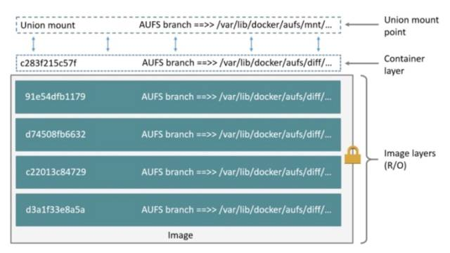
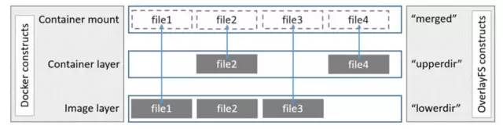
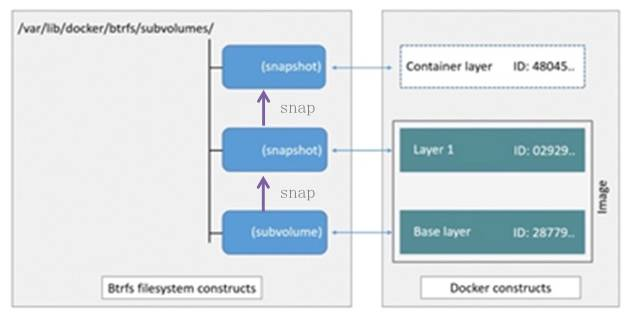
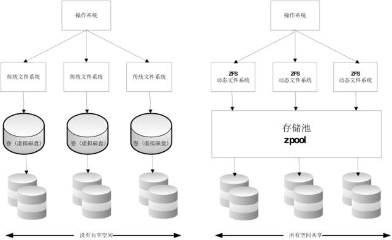
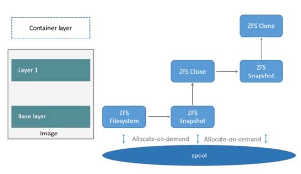
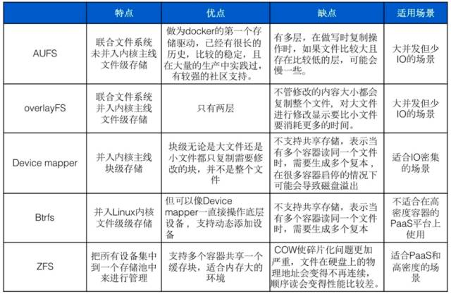

## docker存储引擎
* docker支持的存储驱动如下（现在的docker master分支）：
```bash
~/code/go/src/github.com/docker/docker/daemon/graphdriver   master  pwd
/Users/wangyanwei/code/go/src/github.com/docker/docker/daemon/graphdriver
~/code/go/src/github.com/docker/docker/daemon/graphdriver   master  tree -L 1
.
├── aufs
├── btrfs
├── copy
├── counter.go
├── devmapper
├── driver.go
├── driver_freebsd.go
├── driver_linux.go
├── driver_test.go
├── driver_unsupported.go
├── driver_windows.go
├── errors.go
├── fsdiff.go
├── graphtest
├── lcow
├── overlay
├── overlay2
├── overlayutils
├── plugin.go
├── proxy.go
├── quota
├── register
├── vfs
├── windows
└── zfs
```
有aufs、btrfs、devmapper（devicemapper）、overlay、overlay2、vfs、zfs、windows（windowsfilter）八个存储驱动，其中windows只适用于windows，底层基于ntfs，现在docker默认采用overlay2作为其底层存储驱动。这些驱动基本都都涉及到了写时复制和写时分配这两个技术。
docker官方对于存储驱动的说明：
>Docker支持以下存储驱动程序：
overlay2 是当前所有受支持的Linux发行版的首选存储驱动程序，不需要任何额外的配置。
aufs是在内核3.13上不支持的Ubuntu 14.04上运行时，Docker 18.06和更早版本的首选存储驱动程序overlay2。
devicemapper支持，但direct-lvm对于生产环境是必需的，因为loopback-lvm零配置虽然性能很差。devicemapper是CentOS和RHEL的推荐存储驱动程序，因为它们的内核版本不支持overlay2。但是，当前版本的CentOS和RHEL现在支持overlay2，这是推荐的驱动程序。
如果btrfs和zfs驱动程序是后备文件系统（安装了Docker的主机的文件系统），则使用它们。这些文件系统允许使用高级选项，例如创建“快照”，但需要更多的维护和设置。这些中的每一个都依赖于正确配置的后备文件系统。
该vfs存储驱动程序的目的是为了进行测试，并在那里不能使用任何写入时复制文件系统的情况。此存储驱动程序的性能很差，通常不建议在生产中使用。
### 原理说明
* 写时复制（CoW）
所有驱动都用到的技术——写时复制（CoW）。CoW就是copy-on-write，表示只在需要写时才去复制，这个是针对已有文件的修改场景。比如基于一个image启动多个Container，如果为每个Container都去分配一个image一样的文件系统，那么将会占用大量的磁盘空间。而CoW技术可以让所有的容器共享image的文件系统，所有数据都从image中读取，只有当要对文件进行写操作时，才从image里把要写的文件复制到自己的文件系统进行修改。所以无论有多少个容器共享同一个image，所做的写操作都是对从image中复制到自己的文件系统中的复本上进行，并不会修改image的源文件，且多个容器操作同一个文件，会在每个容器的文件系统里生成一个复本，每个容器修改的都是自己的复本，相互隔离，相互不影响。使用CoW可以有效的提高磁盘的利用率。
* 用时分配（allocate-on-demand）
而写时分配是用在原本没有这个文件的场景，只有在要新写入一个文件时才分配空间，这样可以提高存储资源的利用率。比如启动一个容器，并不会为这个容器预分配一些磁盘空间，而是当有新文件写入时，才按需分配新空间。
### AUFS
AUFS（AnotherUnionFS）是一种Union FS，是文件级的存储驱动。AUFS能透明覆盖一或多个现有文件系统的层状文件系统，把多层合并成文件系统的单层表示。简单来说就是支持将不同目录挂载到同一个虚拟文件系统下的文件系统。这种文件系统可以一层一层地叠加修改文件。无论底下有多少层都是只读的，只有最上层的文件系统是可写的。当需要修改一个文件时，AUFS创建该文件的一个副本，使用CoW将文件从只读层复制到可写层进行修改，结果也保存在可写层。在Docker中，底下的只读层就是image，可写层就是Container。结构如下图所示：

### Overlay
Overlay是Linux内核3.18后支持的，也是一种Union FS，和AUFS的多层不同的是Overlay只有两层：一个upper文件系统和一个lower文件系统，分别代表Docker的镜像层和容器层。当需要修改一个文件时，使用CoW将文件从只读的lower复制到可写的upper进行修改，结果也保存在upper层。在Docker中，底下的只读层就是image，可写层就是Container。结构如下图所示：

### Device mapper
Device mapper是Linux内核2.6.9后支持的，提供的一种从逻辑设备到物理设备的映射框架机制，在该机制下，用户可以很方便的根据自己的需要制定实现存储资源的管理策略。前面讲的AUFS和OverlayFS都是文件级存储，而Device mapper是块级存储，所有的操作都是直接对块进行操作，而不是文件。Device mapper驱动会先在块设备上创建一个资源池，然后在资源池上创建一个带有文件系统的基本设备，所有镜像都是这个基本设备的快照，而容器则是镜像的快照。所以在容器里看到文件系统是资源池上基本设备的文件系统的快照，并不有为容器分配空间。当要写入一个新文件时，在容器的镜像内为其分配新的块并写入数据，这个叫用时分配。当要修改已有文件时，再使用CoW为容器快照分配块空间，将要修改的数据复制到在容器快照中新的块里再进行修改。Device mapper 驱动默认会创建一个100G的文件包含镜像和容器。每一个容器被限制在10G大小的卷内，可以自己配置调整。结构如下图所示：

### Btrfs
Btrfs被称为下一代写时复制文件系统，并入Linux内核，也是文件级级存储，但可以像Device mapper一直接操作底层设备。Btrfs把文件系统的一部分配置为一个完整的子文件系统，称之为subvolume 。那么采用 subvolume，一个大的文件系统可以被划分为多个子文件系统，这些子文件系统共享底层的设备空间，在需要磁盘空间时便从底层设备中分配，类似应用程序调用 malloc()分配内存一样。为了灵活利用设备空间，Btrfs 将磁盘空间划分为多个chunk 。每个chunk可以使用不同的磁盘空间分配策略。比如某些chunk只存放metadata，某些chunk只存放数据。这种模型有很多优点，比如Btrfs支持动态添加设备。用户在系统中增加新的磁盘之后，可以使用Btrfs的命令将该设备添加到文件系统中。Btrfs把一个大的文件系统当成一个资源池，配置成多个完整的子文件系统，还可以往资源池里加新的子文件系统，而基础镜像则是子文件系统的快照，每个子镜像和容器都有自己的快照，这些快照则都是subvolume的快照。

当写入一个新文件时，为在容器的快照里为其分配一个新的数据块，文件写在这个空间里，这个叫用时分配。而当要修改已有文件时，使用CoW复制分配一个新的原始数据和快照，在这个新分配的空间变更数据，变结束再更新相关的数据结构指向新子文件系统和快照，原来的原始数据和快照没有指针指向，被覆盖。
### ZFS
ZFS 文件系统是一个革命性的全新的文件系统，它从根本上改变了文件系统的管理方式，ZFS 完全抛弃了“卷管理”，不再创建虚拟的卷，而是把所有设备集中到一个存储池中来进行管理，用“存储池”的概念来管理物理存储空间。过去，文件系统都是构建在物理设备之上的。为了管理这些物理设备，并为数据提供冗余，“卷管理”的概念提供了一个单设备的映像。而ZFS创建在虚拟的，被称为“zpools”的存储池之上。每个存储池由若干虚拟设备（virtual devices，vdevs）组成。这些虚拟设备可以是原始磁盘，也可能是一个RAID1镜像设备，或是非标准RAID等级的多磁盘组。于是zpool上的文件系统可以使用这些虚拟设备的总存储容量。

下面看一下在Docker里ZFS的使用。首先从zpool里分配一个ZFS文件系统给镜像的基础层，而其他镜像层则是这个ZFS文件系统快照的克隆，快照是只读的，而克隆是可写的，当容器启动时则在镜像的最顶层生成一个可写层。如下图所示：

当要写一个新文件时，使用按需分配，一个新的数据快从zpool里生成，新的数据写入这个块，而这个新空间存于容器（ZFS的克隆）里。
当要修改一个已存在的文件时，使用写时复制，分配一个新空间并把原始数据复制到新空间完成修改。
### VFS
VFS存储驱动程序不是联合文件系统。相反，每一层都是磁盘上的目录，并且不支持写时复制。要创建新层，需要对上一层进行“深层复制”。与其他存储驱动程序相比，这导致较低的性能和更多的磁盘空间使用。但是，它是健壮，稳定的，并且可以在每种环境下工作。在测试环境中，它还可以用作验证其他存储后端所依据的机制。
### 存储驱动的对比及适应场景

### 实验
通过修改docker配置文件并重启docker来切换存储驱动
* vim /etc/docker/daemon.json
```json
{
  "storage-driver": "aufs"
}
```
* docker images可以发现之前pull的镜像都没有了
* docker pull一个新的镜像，可以看到docker会把新pull的镜像数据存放到/var/lib/docker/image/aufs和/var/lib/docker/aufs这两个目录中

### 参考文档
- [](https://docs.docker.com/storage/storagedriver/)
- [](http://dockone.io/article/1513)