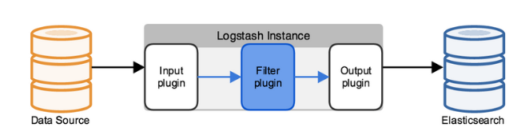

# ELK 协议栈介绍及体系结构 
ELK 其实并不是一款软件，而是一整套解决方案，是三个软件产品的首字母缩写，Elasticsearch，Logstash 和 Kibana。这三款软件都是开源软件，通常是配合使用，而且又先后归于 Elastic.co 公司名下，故被简称为 ELK 协议栈
  
## Elasticsearch
Elasticsearch 是一个实时的分布式搜索和分析引擎，它可以用于全文搜索，结构化搜索以及分析。它是一个建立在全文搜索引擎 Apache Lucene 基础上的搜索引擎，使用 Java 语言编写
##### 主要特点
- 实时分析
- 分布式实时文件存储，并将每一个字段都编入索引
- 文档导向，所有的对象全部是文档
- 高可用性，易扩展，支持集群（Cluster）、分片和复制（Shards 和 Replicas）。见图 2 和图 3
- 接口友好，支持 JSON
##### 集群角色

##### 分片和复制

## Logstash
Logstash 是一个具有实时渠道能力的数据收集引擎。使用 JRuby 语言编写
##### 主要特点
几乎可以访问任何数据
可以和多种外部应用结合
支持弹性扩展
#####  主要部分组成
- Inputs：用于从数据源获取数据，常见的插件如file, syslog, redis, beats 等
- Filters：用于处理数据如格式转换，数据派生等，常见的插件如grok, mutate, drop,  clone, geoip等
- Outputs：用于数据输出，常见的插件如elastcisearch，file, graphite, statsd等

## Kibana
Kibana 是一款基于 Apache 开源协议，使用 JavaScript 语言编写，为 Elasticsearch 提供分析和可视化的 Web 平台。它可以在 Elasticsearch 的索引中查找，交互数据，并生成各种维度的表图

## ELK架构图
### 简单架构图

### Beats作为日志收集器

这种架构解决了 Logstash 在各服务器节点上占用系统资源高的问题。相比 Logstash，Beats 所占系统的 CPU 和内存几乎可以忽略不计。另外，Beats 和 Logstash 之间支持 SSL/TLS 加密传输，客户端和服务器双向认证，保证了通信安全。

因此这种架构适合对数据安全性要求较高，同时各服务器性能比较敏感的场景
### 引入消息队列

这种架构适合于日志规模比较庞大的情况。但由于 Logstash 日志解析节点和 Elasticsearch 的负荷比较重，可将他们配置为集群模式，以分担负荷。引入消息队列，均衡了网络传输，从而降低了网络闭塞，尤其是丢失数据的可能性，但依然存在 Logstash 占用系统资源过多的问题
