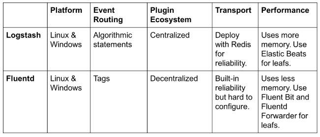

 
## 路由
- Logstash：将所有数据路由到单个流中，然后用if-then区分发送到目标
- Fluentd：依靠标签来路由事件

Fluentd的方法更具说明性，而Logstash的方法是程序性的，在复杂路由中更好

## 插件
Logstash和Fluentd都有丰富的插件生态系统，涵盖许多输入、过滤、输出，关键区别时如何管理插件
- Logstash：GitHub仓库下管理其所有插件
- Fluentd：分散存储。虽然有516个插件，但官方存储库只容纳其中10个

## 运输
- Logstash：缺少持久的内部消息队列，内置的内存队列可以容纳20个事件（固定大小）
- Fluentd：具有高度可配置的缓冲系统。它可以是内存中的，也可以是磁盘上的。配置较为复杂

## 性能
- Logstash：使用内存略多。使用beats
- Fluentd：使用内存较少。使用Fluent Bit和Fluentd Forwarder
