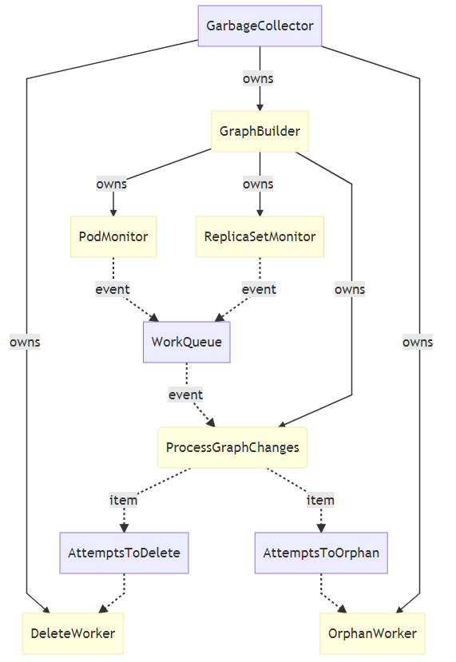
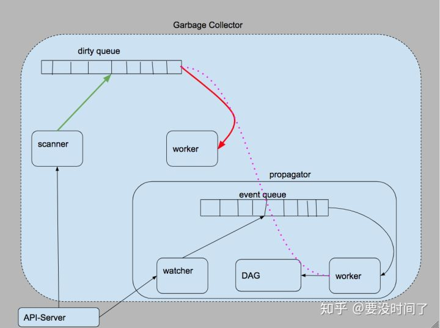

垃圾收集器在 Kubernetes 中的作用就是删除之前有所有者但是现在所有者已经不存在的对象，例如删除 ReplicaSet 时会删除它依赖的 Pod，虽然它的名字是垃圾收集器，但是它在 Kubernetes 中还是以控制器的形式进行设计和实现的。  

设计目标包括:  
* 支持服务器端级联删除。  
* 集中级联删除逻辑，而不是在控制器中扩展。  
* 允许选择性地孤立依赖对象。  
非目标包括:  
* 立即释放对象的名称，以便可以尽快重用它。  
* 在级联删除中传播宽限期。  

在 Kubernetes 引入垃圾收集器之前，所有的级联删除逻辑都是在客户端完成的，kubectl 会先删除 ReplicaSet 持有的 Pod 再删除 ReplicaSet，但是垃圾收集器的引入就让级联删除的实现移到了服务端，我们在这里就会介绍垃圾收集器的设计和实现原理。

## 概述
垃圾收集主要提供的功能就是级联删除，它向对象的 API 中加入了 ObjectMeta.ownerReferences 字段，这一字段会包含当前对象的所有依赖者，在默认情况下，如果当前对象的所有依赖者都被删除，那么当前对象就会被删除：  
```go
type ObjectMeta struct {  
	...  
	OwnerReferences []OwnerReference  
}  
  
type OwnerReference struct {  
	APIVersion string  
	Kind string  
	Name string  
	UID types.UID  
}  
```
OwnerReference 包含了足够的信息来标识当前对象的依赖者，对象的依赖者必须与当前对象位于同一个命名空间 namespace，否则两者就无法建立起依赖关系。  
通过引入 metadata.ownerReferences 能够建立起不同对象的关系，但是我们依然需要其他的组件来负责处理对象之间的联系并在所有依赖者不存在时将对象删除，这个处理不同对象联系的组件就是 GarbageCollector，也是 Kubernetes 控制器的一种。
## the Garbage Collector
如果对象的OwnerReferences中列出的所有者都不存在，则垃圾收集器负责删除对象。垃圾收集器由扫描器、垃圾处理器和传播器组成。
* 扫描器:
  * 使用discovery API检测系统支持的所有资源。
  * 定期扫描系统中的所有资源，并将每个对象添加到脏队列中。
* 垃圾处理器:
  * 由脏队列和workers组成。
  * 每个worker:
    * 从脏队列中删除项。
    * 如果项目的OwnerReferences为空，则继续处理脏队列中的下一个项目。
    * 否则检查所有者引用中的每个条目:
      * 如果存在至少一个所有者，则什么也不做。
      * 如果不存在任何所有者，则请求API服务器删除项。
* 传播器（Propagator）:
  * 传播器用于优化，而不是用于正确性。
  * 由事件队列、单个worker和所有者依赖关系的DAG组成。
    * DAG只存储name/uid/orphan三个属性，而不是每个项目的整个主体。
  * 监视所有资源的创建/更新/删除事件，将事件插入到事件队列。
  * Worker:
    * 从事件队列中删除项。
    * 如果item是创建或更新，则相应地更新DAG。
      * 如果对象有一个所有者，而该所有者还不存在于DAG中，那么除了将该对象添加到DAG之外，还将该对象排队到脏队列中。
    * 如果item是删除，则从DAG中删除该对象，并将其所有依赖对象排队到脏队列。
  * 传播器不需要执行任何RPCs，因此一个worker就足够了。这使得锁定更加容易。
  * 使用传播器，我们只需要在启动GC时运行扫描器来填充DAG和脏队列。
## 用"orphan" finalizer使后代成为孤儿  
用户可能希望在孤立依赖对象(例如pods)的同时删除拥有的对象(例如replicaset)，也就是说，保持依赖对象不变。我们通过引入"orphan" finalizer来支持这种用例。Finalizer 是一个泛型API，所以我们首先描述泛型终结器框架，然后描述"orphan" finalizer的特定设计。
### The finalizer framework

### API changes

```go
type ObjectMeta struct {
	…
	Finalizers []string
}
```
**ObjectMeta.Finalizers**:在删除对象之前需要运行的终结器列表。在从注册表中删除对象之前，此列表必须为空。列表中的每个字符串都是负责组件的标识符，用于从列表中删除条目。如果对象的deletionTimestamp为非nil，则只能删除此列表中的条目。出于安全原因，更新终结器需要特殊权限。为了强制执行准入规则，我们将终结器公开为子资源，并且在更新主资源时不允许直接更改终结器。
### 新组件
* Finalizers:
  * 就像控制器一样，终结器总是在运行。
  * 第三方可以在集群中开发并运行自己的终结器。终结器不需要在API服务器上注册。
  * 监视满足两个条件的更新事件:
    1. 更新后的对象在ObjectMeta.finalizer中具有终结器的标识符;
    2. ObjectMeta.DeletionTimestamp从nil更新到非nil.
  * 将结束逻辑应用于更新事件中的对象.
  * 执行完结束逻辑之后，将自己在ObjectMeta.Finalizers中移除.
  * 当最后一个finalizer从ObjectMeta.Finalizers删除后，API服务会把对像删除。
  * 因为结束逻辑可能被多次应用（例如，终结器在应用结束逻辑之后但在从ObjectMeta.Finalizers移除之前崩溃），结束逻辑必须是幂等的。
  * 如果终结器未能及时执行，具有适当权限的用户可以从ObjectMeta.Finalizers手动删除终结器。我们将提供kubectl命令来执行此操作。

### 对现有组件的更改

* API server:
  * Deletion handler:
    * 如果要删除的对象的`ObjectMeta.Finalizers`非空，则更新DeletionTimestamp，但不删除该对象。
    * 如果`ObjectMeta.Finalizers`为空且options.GracePeriod为零，则删除该对象。如果options.GracePeriod不为零，则只更新DeletionTimestamp。
  * Update handler:
    * 如果更新删除了最后一个终结器，并且DeletionTimestamp为非零，并且DeletionGracePeriodSeconds为零，则从注册表中删除该对象。
    * 如果更新删除了最后一个终结器，并且DeletionTimestamp为非零，但DeletionGracePeriodSeconds不为零，则只更新该对象。

### The "orphan" finalizer
### API changes

```go
type DeleteOptions struct {
	…
	OrphanDependents bool
}
```
**DeleteOptions.OrphanDependents**: 允许用户表达依赖对象是否应该是孤立的。它默认为true，因为版本1.2之前的控制器期望依赖对象成为孤立对象。

### 对现有组件的更改

* API server:
处理删除请求时，根据DeleteOptions.OrphanDependents是否为真，API服务器更新对象以向/从ObjectMeta.Finalizers map添加/删除"orphan" finalizer。

### 新组件

将第四个组件添加到垃圾收集器, the"orphan" finalizer:
* 如上所述监视更新事件[The finalizer framework](#the-finalizer-framework).
* 从其依赖项的`OwnerReferences`中删除事件中的对象。
  * 依赖对象可以通过GC保存的DAG找到，或者通过重新依赖依赖资源并检查每个潜在依赖对象的OwnerReferences字段。
* 同时删除依赖对象具有的任何悬空所有者引用。
* 最后，将自己从对象的`ObjectMeta.Finalizers`中删除。

## 实现原理
GarbageCollector 中包含一个 GraphBuilder 结构体，这个结构体会以 Goroutine 的形式运行并使用 Informer 监听集群中几乎全部资源的变动，一旦发现任何的变更事件 — 增删改，就会将事件交给主循环处理，主循环会根据事件的不同选择将待处理对象加入不同的队列，与此同时 GarbageCollector 持有的另外两组队列会负责删除或者孤立目标对象。



接下来我们会从几个关键点介绍垃圾收集器是如何删除 Kubernetes 集群中的对象以及它们的依赖的。  

## 删除策略


在上图中，我用三种颜色分别标记了三条较为重要的处理过程：

红色：worker 从 dirtyQueue 中取出资源对象，检查其是否带有 owner ，如果没带，则不处理。否则检测其 owner是否存在，存在，则处理下一个资源对象，不存在，删除这个 object。  
绿色： scanner 从 api-server 中扫描存在于 k8s 集群中的资源对象并加入至 dirtyQueue  
粉色：propagator.worker 从 eventQueue 中取出相应的事件并且获得对应的资源对象，根据事件的类型以及相应资源对象所属 owner 对象的情况来进行判定，是否要进行两个操作：  
从 DAG 中删除相应节点（多为响应 DELETE 事件的逻辑）  
将有级联关系但是 owner 不存在的对象送入 diryQueue 中  
其中红色是「数据处理」过程，而绿色和粉色是「数据收集」的过程。在「数据处理」的过程中（即我们上面分析过的 GC 的 Worker 的工作过程），worker 做的较为重要的工作有两步：  

检查资源对象信息的「ownerReference」字段，判断其是否处在一个级联关系中  
若资源对象有所属 owner 且不存在，则删除这个对象  

* 指定同步的删除模式，需要在两个不同的位置设置两个参数：

1、dependents 对象 meta 信息中 OwnerReference.BlockOwnerDeletion
2、在发送删除对象请求时，设置 DeleteOptions.PropagationPolicy

`DeleteOptions.PropagationPolicy`一共有3个候选值："Orphan"，"Background"，"Foreground"

`BlockOwnerDeletion` ：如果为真，并且所有者具有“foregroundDeletion”终结器，则在删除dependents 之前，不能从k-v中删除所有者。默认值为false。

* orphan删除  
  owner 删除，dependents 留下。如果想在「数据处理」这条链路上做些修改达到我们目的的话，唯一可行的办法就是：在删除了 dependents 对应的 owner 对象之后，同时删除 dependents 信息中 「ownerReference」字段和对应的值。这样一来，在检测资源对象是否应该被删除的过程就会因为其没有「ownerReference」字段而放过它，最终实现了 dependents 对象的“孤立”。

1、删除k-v的宿主资源  
2、propagator收到删除事件，更新DAG，把dependents资源放到DirtyQueue  
3、worker处理资源时，执行orphan finalizer，删除 dependents 的 OwnerReference 部分，并且删除orphan finalizer  
4、dependents成功变成孤儿  

* Background

级联删除不会因 dependent 对象而影响 owner 对象的删除操作。当我们发送给 API-Server 删除一个 owner 身份的对象的请求之后，这个资源对象会立即被删除。它「管辖」的 dependent 对象会以「静默」的方式删除。
1、删除k-v的宿主资源  
2、propagator收到删除事件，更新DAG，把dependents资源放到DirtyQueue  
3、worker处理资源时，发现资源有OwnerReferences，但是不存在，删除  

* Foreground

API-Server 的`Delete`函数，在接受到删除请求的时候，会检查 `DeleteOptions.PropagationPolicy`参数，若其值为`DeletePropagationForeground`, API-Server 随即会对该资源对象进行 Update 操作：

1. 插入`FinalizerDeleteDependents` Finalizer

2. 设置`ObjectMeta.DeletionTimestamp`为当前值

然后，在 GC 处理 owner 对象的 Update 事件的逻辑中，还会给 owner 对象打上一个「正在删除 dependents」 对象的标签。之后，我们会将 owner 对象管辖的 dependent 对象和他自己都加入到 dirtyQueue。dirtyQueue 的 worker 在处理 owner 对象的时候，会检查 owner 对象 「正在删除 dependents」的标签是否存在，如果仍有 dependent 对象没有被删掉，owner 会被轮询处理。而 dependent 对象将会被正常删除。当 dependent 对象相应的删除事件被 Propagator 感知到后，会将其从 DAG 和其 owner 的 dependents 信息中删除。几个循环之后，dependents 被删光，而 owner 对象中的 finalizer 和自身也会随之被删掉。
