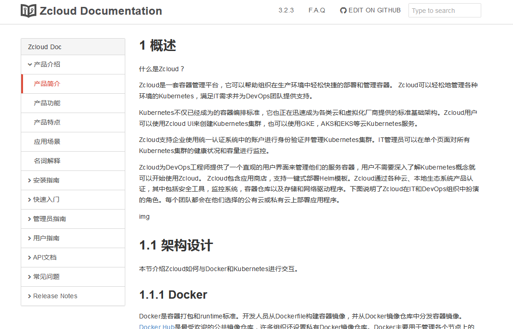

# gitbook使用方法介绍

在singlecloud/makebook目录下执行
```
gitbook serve
```
访问http://localhost:4000，就可以看到singlecloud的文档效果。具体gitbook的安装与使用如下。

## 环境要求
* NodeJS (v4.0.0 and above is recommended)
* Windows, Linux, Unix, or Mac OS X

## gitbook安装
```
$ npm install gitbook-cli -g
```
查看安装结果（不需要关注版本）  
```
$ gitbook -v
CLI version: 2.3.2
GitBook version: 3.2.3
```

## gitbook 快速入门
git clone https://github.com/GitbookIO/gitbook.git  
在gitbook/docs目录执行  
```
$ gitbook init
$ gitbook serve
```
通过访问http://localhost:4000 看效果。如果大家只想build，不想起service，可以执行
```
gitbook build
```
想生成pdf/epub/mobi，可以在docs目录下执行
```
gitbook pdf
gitbook epub
gitbook mobi
```
## 使用gitbook
首先我们要制做书的所有文档应该放在docs目录下  
在docs目录里执行
```
gitbook init
```
复制git clone中docs下的styles，_layouts到我们的docs目录下。  
复制bin，package.json，book.js，testing，lib，node_modules到我们docs的同级目录。  
在我们docs同级目录执行
```
gitbook serve
```
成功后访问页面，发现我们的md文档并不显示，这时候我们编辑docs/SUMMARY.md文件
### SUMMARY.md
这个文件主要决定 GitBook 的章节目录，它通过 Markdown 中的列表语法来表示文件的父子关系，下面是一个简单的示例：
```
# Summary

* [Introduction](README.md)
* [Part I](part1/README.md)
    * [Writing is nice](part1/writing.md)
    * [GitBook is nice](part1/gitbook.md)
* [Part II](part2/README.md)
    * [We love feedback](part2/feedback_please.md)
    * [Better tools for authors](part2/better_tools.md)
```
在我们docs同级目录执行
```
gitbook serve
```
再进行访问时，我们所要展示的md文档已全部可以展示。想要展示哪些文档都需要配置到docs/SUMMARY.md文件中。

## 附github的gitbook目录说明
标准目录结构如下所示：
```
.
|—— bin
|—— node_modules
|—— testing
|—— book.js
|—— package.json
|—— docs
    ├── README.md
    ├── SUMMARY.md
    |—— _layouts
    |—— styles
    ├── chapter-1/
    |   ├── README.md
    |   └── something.md
    └── chapter-2/
        ├── README.md
        └── something.md
```    
bin：目录下有gitbook.js，写的是安装gitbook的方法  
node_modules：gitbook用到的依赖插件  
docs/_layouts：书的页面布局文件  
docs/styles：书的css文件  
book.js：基本配置信息  
package.json：全部的配置信息，可以包含如下：  
```
    "title": "Blankj's Glory",
    "author": "Blankj",
    "description": "select * from learn",
    "language": "zh-hans",
    "gitbook": "3.2.3",
    "styles": {
        "website": "./styles/website.css"
    },
    "structure": {
        "readme": "README.md"
    },
```
### package.json
title  
本书标题  
author  
本书作者  
description  
本书描述  
language  
本书语言，中文设置 "zh-hans" 即可  
gitbook  
指定使用的 GitBook 版本  
styles  
自定义页面样式  
structure  
指定 Readme、Summary、Glossary 和 Languages 对应的文件名  

## 我做的书效果如图


## 我的SUMMARY.md
```
# Summary

### Zcloud Doc

* [产品介绍](README.md)
    * [产品简介](product/introduction.md)
    * [产品功能](product/functions.md)
    * [产品特点](product/features.md)
    * [应用场景](product/scenarios.md)
    * [名词解释](product/nouns.md)
* [安装指南](install/readme.md)
    * [安装说明](install/install.md)
* [快速入门](quickstart/readme.md)
    * [入门必读](quickstart/quickstart.md)
* [管理员指南](companion/readme1.md)
    * [集群管理](companion/admin.md)
* [用户指南](companion/readme2.md)
    * [应用管理](companion/user.md)
* [API文档](api/readme.md)
    * [API文档](api/api.md)
* [常见问题](question/readme.md)
    * [安装常见问题](question/question.md)
* [Release Notes](release/readme.md)
    * [Release Notes For 2.0](release/2.0.md)
    * [Release Notes For 1.0](release/1.0.md)
```
