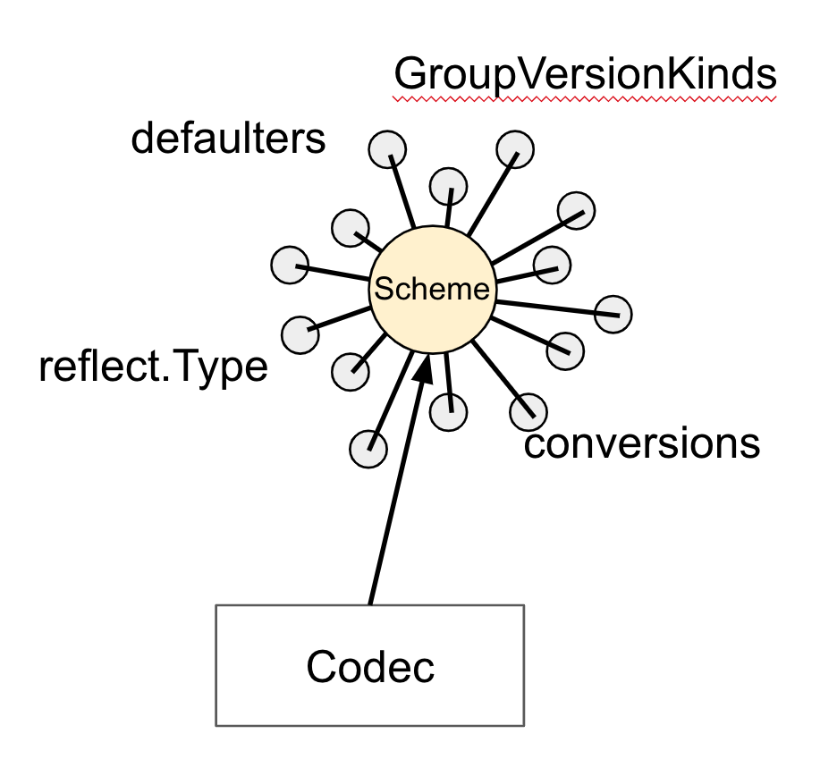

# Terminology
1. Kind
A type of an entity. A kind directly corresponds with a Golang type. They are
Singular and upper-case, as Golang types
  * Object represent a persistent entity, like Pod
  * Lists are collections of one or more kinds of entities, like PodLists
  * Special purpose kinds are used for specific actions on objects, 
    like /bindings, /scale
2. API group
A collection of Kinds that are logically related, Job and CronJob is in batch  
group
core group is located under */api/v1* instead of */apis/core/v1* for historic reason  
*/metrics*, */logs*, */healthz* are not resource aligned.  
Kind may living in mutliple api groups. Deployment in extensions and apps.

3. Version
API group could have multiple versions. From the cluster user's point of view,  
versions are just different representation of the same objects, the API server  
does lossless conversion to return objects in the required version.
  * Alpha level (v1alpha1) is disable by default, support for a feature may be  
    dropped at any time without notice
  * Beta level (v2beta3), enable by default, means code are well tested however  
    the semnatics of objects may change in incompatible ways in a subsequent beta  
    or release version
  * Stable(GA) level(v1), will appear in released software for many subsequent versions.

4. Resource
  * A usually lowercase, plural word (pods), it identify a set of HTTP endpoints(path)  
    exposing CRUD semantics of a certain object type in the system.
  * Typically, each of these endpoints receives and returns on kind.  
  * A resource can have further endpoints to perform specific actions (/pods/nginx/port-forward)  
    We call these subresources, there usually implement custom protocol instead of REST.
  * Resources are always part of an API group and version, collectively referred to as   
    GroupVersionResource(GVR), A GVR uniquely defines a HTTP path.
  * **/apis/batch/v1/namespaces/$NAMESPACE/jobs**
  * GroupVersionKind(GVK) is related to GVR. the process of mapping a GVK to a GVR is called  
    a REST mapping
  * use kubectl to access the url, *kubectl get --raw /api/v1/nodes/master*
  * use kubectl api-resources to list all the resources

5. Category
  * Resource can be part of categories
  * The most common use is the all category as in kubectl get all

# Request processing

1. The HTTP request is processed by a chain of filters registered in DefaultBuildHnalderChain().  
This chain is defined in *k8s.io/apiserver/pkg/server/config.go*. It applies a series of filter  
operations. Either the filter pass and attaches respective infos to the context,*ctx.RequestInfo*,  
or the request doesn't pass the filter, it returns an appropriate HTTP response code.
2. Next, depending on the HTTP path, the multiplexer in *k8s.io/apiserver/pkg/server/hanlder.go*  
route the HTTP request to respective handler
3. Per API group a handler is registered(*k8s.io/apiserver/pkg/endpoints/groupversion.go* and 
*k8s.io/apiserver/pkg/endpoints/installer.go*, The handler takes the HTTP request as well as the  
context and retrieves as well as delivers the requested object from etcd storage.
4. Request for RESTful resources go into pipeline consisting of:
  * admission, the chain have several plugins. Each plugin can be part of mutating phase or   
    validation phase or take part in both
  * validation: incoming objects are checked against a large validation logic
  * etcd-backed CRUD logic.

# Go Client
```golang
import (
    metav1 "k8s.io/apimachinery/pkg/apis/meta/v1"
    "k8s.io/client-go/tools/clientcmd"
    "k8s.io/client-go/kubernetes"
)

kubeconfig = flag.String("kubeconfig", "~/.kube/config", "path to the kubeconfig file")
flag.Parse()
config, err := clientcmd.BuildConfigFromFlags("", *kubeconfig)
clientset, err := kubernetes.NewForConfig(config)
pod, err := clientset.CoreV1().Pods("book").Get("example", metav1.GetOptions{})
```

# K8s object in Go
*k8s.io/apimachinery/pkg/runtime*
```golang
type Object interface {
    GetObjectKind() schema.ObjectKind
    DeepCopyObject() Object
}
```
*k8s.io/apimachinery/pkg/runtime/schema*
```golang
type ObjectKind interface {
    SetGroupVersionKind(kind GroupVersionKind)
    GroupVersionKind() GroupVersionKind
}
```
*k8s.io/apimachinery/meta/v1*
```golang
type TypeMeta struct {
    Kind string `name=kind"`
    APIVersion string `name=apiVersion"` //group + version
}

type ObjectMeta struct {
    Name string `json:"name"
    Namespace string `json:"namespace"
    UID types.UID `json:"uid"
    ResourceVersion string `json:"resourceVersion"
    CreationTimestamp Time `json:"creationTimestamp"
    DeletionTimestamp *Time `json:"deletionTimestamp"
    Labels map[string]string `json:"labels"
    Annotations map[string]string `json:"annotations"
    //...
}
```
***note: object fetched from api server has empty TypeMeta***

# Client set
*k8s.io/client-go/kubernetes/typed*
```golang
type Interface interface {
    Discovery() discovery.DiscoveryInterface
    AdmissionregistrationV1beta1() admissionregistrationv1beta1.AdmissionregistrationV1beta1Interface
    AppsV1() appsv1.AppsV1Interface
    AppsV1beta1() appsv1beta1.AppsV1beta1Interface
    AppsV1beta2() appsv1beta2.AppsV1beta2Interface
    AuditregistrationV1alpha1() auditregistrationv1alpha1.AuditregistrationV1alpha1Interface
    AuthenticationV1() authenticationv1.AuthenticationV1Interface
    AuthenticationV1beta1() authenticationv1beta1.AuthenticationV1beta1Interface
    AuthorizationV1() authorizationv1.AuthorizationV1Interface
    AuthorizationV1beta1() authorizationv1beta1.AuthorizationV1beta1Interface
    //...
}

type AppsV1beta1Interface interface {
    RESTClient() rest.Interface
    ControllerRevisionsGetter
    DeploymentsGetter
    StatefulSetsGetter
}

type DeploymentsGetter interface {
    Deployments(namespace string) DeploymentInterface
}

type DeploymentInterface interface {
    Create(*v1beta1.Deployment) (*v1beta1.Deployment, error)
    Update(*v1beta1.Deployment) (*v1beta1.Deployment, error)
    UpdateStatus(*v1beta1.Deployment) (*v1beta1.Deployment, error)
    Delete(name string, options *v1.DeleteOptions) error
    DeleteCollection(options *v1.DeleteOptions, listOptions v1.ListOptions) error
    Get(name string, options v1.GetOptions) (*v1beta1.Deployment, error)
    List(opts v1.ListOptions) (*v1beta1.DeploymentList, error)
    Watch(opts v1.ListOptions) (watch.Interface, error)
    Patch(name string, pt types.PatchType, data []byte, subresources ...string) (result *v1beta1.Deployment, err error)
    DeploymentExpansion
}
```

# list/delete options
```golang
type ListOptions struct {
    LabelSelector string `json:"labelSelector,omitempty" protobuf:"bytes,1,opt,name=labelSelector"`
    FieldSelector string `json:"fieldSelector,omitempty" protobuf:"bytes,2,opt,name=fieldSelector"`
    //...
}
```

# API Machinery
1. GVK => Go type (one go type could have several GVK)
2. GVR => Resource => REST endpoints(path)
3. RESTMapping: GVR <=> GVK
*k8s.io/apimachinery/pkg/api/meta*
```golang
type RESTMapper interface {
    KindFor(resource schema.GroupVersionResource) (schema.GroupVersionKind, error)
    // ResourceFor takes a partial resource and returns the single match
    ResourceFor(input schema.GroupVersionResource) (schema.GroupVersionResource, error)
    // ResourcesFor takes a partial resource and returns the list of potential resource in priority order
    ResourcesFor(input schema.GroupVersionResource) ([]schema.GroupVersionResource, error)
    RESTMapping(gk schema.GroupKind, versions ...string) (*RESTMapping, error)
    RESTMappings(gk schema.GroupKind, versions ...string) ([]*RESTMapping, error)
    ResourceSingularizer(resource string) (singular string, err error)
    //...
}


type RESTMapping struct {
    Resource schema.GroupVersionResource
    GroupVersionKind schema.GroupVersionKind
    Scope RESTScope
}
```
4. Scheme

*k8s.io/apimachinery/pkg/runtime*
  * golang type -> GVK
  * default values 
  * conversion between versions
  * codec

# Discovery
  * through /apis to list all the groups
  * through /apis/group-name to discovery endpoints
  * get the group, version, resource triple 
  * kubectl has local cache to store the discovery information
