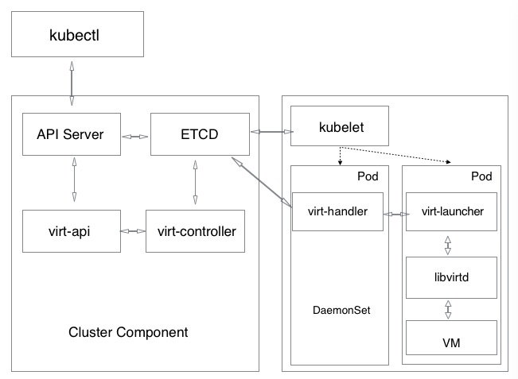
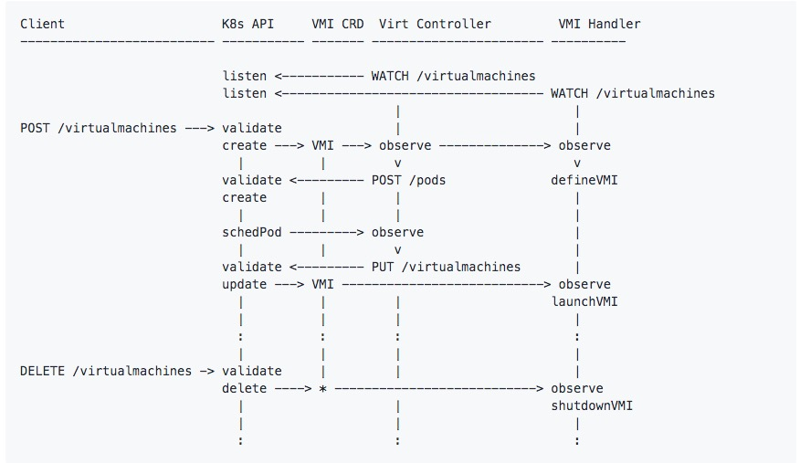

# KubeVirt
## 概念
* KubeVirt是Kubernetes(K8s)的虚拟机管理插件，提供一套通用的虚拟化解决方案，KubeVirt通过K8s的自定义资源(CRD)，添加额外的虚拟化资源类型来扩展K8s。
* KubeVirt的最主要CRD是 VirtualMachine(VM)和VirtualMachineInstance(VMI)资源，VM/VMI资源定义虚拟机本身的所有属性，例如机器和CPU类型、RAM和vcpu的数量以及虚拟机中可用的网卡的数量和类型。
* VMI是用来创建虚拟机的CRD，VM为集群中的VMI提供额外的管理功能，即创建VM，然后运行启动（kubectrl virt start vm），或将VM.spec.running设置为true，VM将创建一个VMI
* KubeVirt创建的虚拟机运行在常规的K8s pods中，在那里它们可以访问标准的pod网络和存储，并且可以使用标准的K8s工具（如kubectl）进行管理。

## 组件

* virt-api
  * 作为所有涉及虚拟化相关的处理流程的入口，负责更新与虚拟化相关的自定义资源定义
  * 负责缺省和验证所提供的VMI CRDs
  * 提供了自定义的api请求处理，如vnc、console、start、stop等
  
* virt-controller
  * 具有所有集群范围的虚拟化功能
  * 负责监控VMI并管理相关的pod
  * 确保创建和管理与VMI对象相关联的pod的生命周期
* virt-handler
  * 每个主机都需要一个virt-handler实例。所以它必须是DaemonSet。
  * 监视VMI对象的更改，一旦检测到状态变化，它将执行所有必要的操作来更改VMI以满足所需的状态。
  * virt-handler主要负责：
    * 保持集群级VMI规范与相应的libvirt域同步。
    * 向群集报告域的状态和规范的更改。
    * 调用以节点为中心的插件，来满足在VMI规范中定义的网络和存储需求。
* virt-launcher
  * 在VMI对象创建的Pod中，主要容器就是运行的virt-launcher
  * 主要目的是提供cgroup和名称空间，它们将用于托管VMI进程。
  * virt-handler通过将VMI的CRD对象传递给virt-launcher，向virt-launcher发送启动VMI的信号。然后，virt-launcher在其容器中使用本地libvirtd实例来启动VMI，并监视VMI进程直到其退出。
  * 如果K8s的runtime尝试在VMI退出之前终止virt-launcher的Pod，virt-launcher将信号从K8s转发到VMI进程，并尝试在VMI已经成功关闭后终止Pod。  
* libvirtd
  * libvirtd的实例存在于每个VMI pod中
  * virt-launcher使用libvirtd来管理VMI进程的生命周期。
## 流程

* 创建虚拟机
  * 客户端将新的VMI定义发布到K8s API服务器。
  * K8s API服务器验证输入并创建VMI自定义资源定义（CRD）对象。
  * virt-controller观察新VMI对象的创建并创建相应的pod。
  * K8s调度pod到某个node。
  * virt-controller观察到VMI的pod已经启动并更新VMI对象中的nodeName字段。然后将责任转移到virt-handler以执行任何进一步的操作。
  * virt-handler观察到VMI被分配给它运行的node。
  * virt-handler与pod内的virt-launcher通信，virt-laucher创建虚拟机，并负责虚拟机生命周期管理。
  * virt-handler 使用VMI的pod中的libvirtd实例发出创建相应域的信号。
* 删除虚拟机
  * 客户端发布删除VMI对象到k8s API服务器，删除VMI。
  * virt-handler观察删除并关闭域。