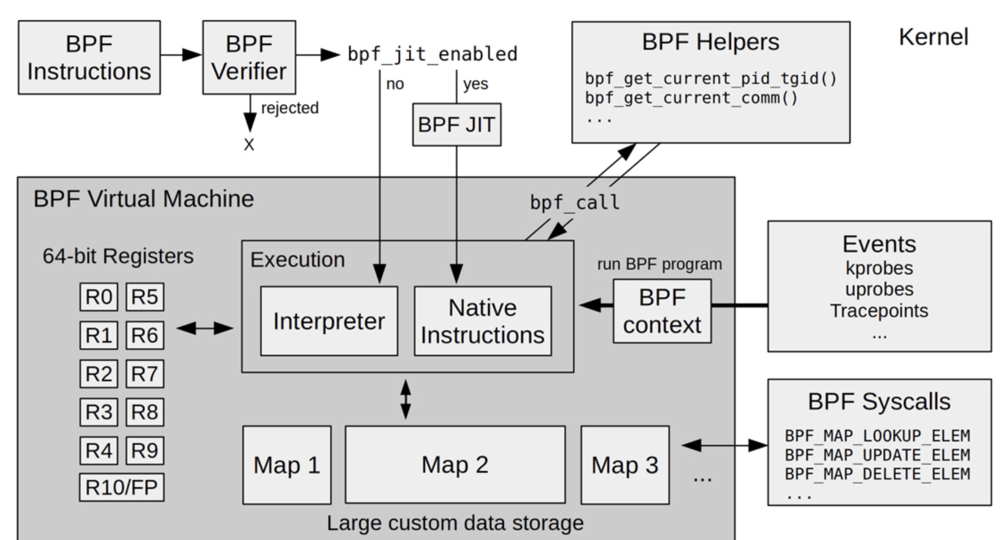

# what is eBPF
1. BPF is a highly flexible and efficient virtual machine-like construct in the 
   Linux kernel allowing to execute bytecode at various hook points in a safe manner. 
1. It is used in a number of Linux kernel subsystems, most prominently networking, 
   tracing and security
1. Berkeley Packet Filter (1992) provide a way to filter packets in kernel
1. In 2013, completely rewritten by Alexei Starovoitov
1. BPF == eBPF(cBPF)
1. Instruction set and infrastructure heavily evolved over last years
   
# What can it do
1. kernel tracing, event monitoring
1. network programming, attached to tc/XDP

# How it work
1. Overview

- Userspace sends bytecode to the kernel together with a program type which 
  determines what kernel areas can be accessed.
- The kernel runs a verifier on the bytecode to make sure the program is safe to 
  run (kernel/bpf/verifier.c).
- The kernel JIT-compiles the bytecode to native code and inserts it in (or attaches 
  to) the specified code location.
- The inserted code writes data to generic key-value maps.
- Userspace reads the result values from the shared maps or ringbuffers.

1. Register based x86 similar ISA
- 64-bit registers with 32-bit subregisters, pc, 512 byte stack
- General purpose
- Use Map to share data between eBPF kernel programs and user-space 
  application
- Use helper funciton to leverage kernel function
- IS contains jump, but verfier will restrict loop.
- Program is restricted to 4096 BPF instrucitons.
- JIT transoform eBPF code to native code which speed up execution of BPF
  program significantly.
1. Program Types
- Has different types of event could be attaced to 
- Has related helper function 

# Tool Chain
1. Backend, front end and loader

1. BCC
   - Compiling the "restricted C" backend via LLVM in the background resulting 
     in a standard ELF object format type
   - Allowing the loader to be implemented just once for all BCC programs and 
     reducing it to a minimum API(2 lines of python code)
   - It also standardizes data structures APIs for easy access via the frontend 

# eXpress Data Path(XDP)
1. Execute network function as soon as a packet hits the NIC, and before it
   starts moving upwards into the kernel's networking layer.

# Bright Future
> eBPF does to Linux what JavaScript does to HTML   
>                                       --- Brendan Gregg, Netflix

1. OS interface is syscal, it's very limited and seldomly changed
1. No overhead of copy data between use and kernel space
1. Code could be updated dynamically without having to restart kernel
1. Have a stable ABI, which means the code is protable across different 
   architecture
1. Event driven, either trigger by new packet or probe hook is reached
1. Offloads, network BPF code could be executed directly on NIC 

eBPF provide a new way to provide new feature from kernel to use space with a 
safe, clean and efficient way. eBPF is the Superpowers come to Linux


# BCC Installation
```shell
sudo apt-key adv --keyserver keyserver.ubuntu.com --recv-keys 4052245BD4284CDD
echo "deb https://repo.iovisor.org/apt/$(lsb_release -cs) $(lsb_release -cs) main" | sudo tee /etc/apt/sources.list.d/iovisor.list
sudo apt-get update
sudo apt-get install bcc-tools libbcc-examples linux-headers-$(uname -r)
```
[Install on Other OS](https://github.com/iovisor/bcc/blob/master/INSTALL.md)
