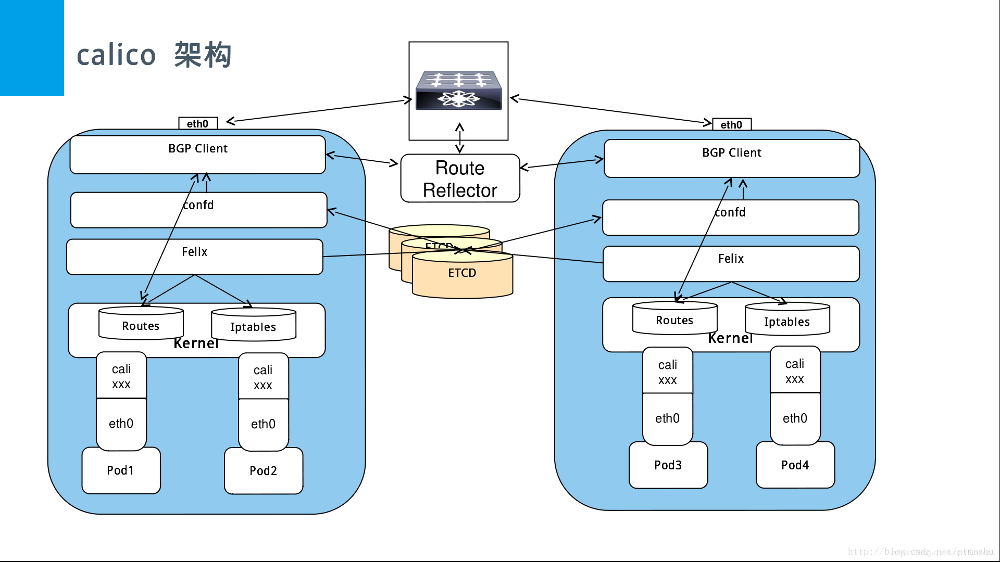

[https://github.com/projectcalico/calico](https://github.com/projectcalico/calico)

[https://docs.projectcalico.org/v3.8/introduction/](https://docs.projectcalico.org/v3.8/introduction/)

## 简介

Calico 是一个基于BGP协议的网络互联解决方案。它是一个纯3层的方法，使用路由来实现报文寻址和传输。为每个工作负载分配一个完全可路由的IP地址。 工作负载可以在没有IP封装或网络地址转换的情况下进行通信，以实现裸机性能，简化故障排除和提供更好的互操作性。

相比 flannel, ovs等SDN解决方案，Calico 避免了层叠网络带来的性能损耗。将节点当做 router ，位于节点上的 container 被当做 router 的直连设备。利用 Kernel 来实现高效的路由转发。 节点间的路由信息通过 BGP 协议在整个 Calico 网络中传播。 具有以下特点：

- 在 calico 中的数据包不需要进行封包和解封。
- 基于三层网络通信，排查问题会更方便。
- 网络安全策略使用 ACL 定义，基于 iptables 实现，比起 overlay 方案中的复杂机制更只管和容易操作
- 以.0或.255结尾的IPv4地址也可以用于分配

>	网络安全策略暂时不做说明

## 工作模式

### BGP模式

- 路由规则直接使用物理机网卡作为路由器转发
- 路由即纯bgp模式，理论上ipip模式的网络传输性能低于纯bgp模式

### IPIP模式

- 各Node的路由之间做一个tunnel，在宿主机创建1个&quot;tunl0&quot;虚拟端口
- 通过tun10作为路由转发
- 分为两种模式：
  - ipip always模式（纯ipip模式）
  - ipip cross-subnet模式（ipip-bgp混合模式），同子网内路由采用bgp，跨子网路由采用ipip

>	实际上IPIP模式就是在BGP模式的基础上加了个隧道封装已解决跨网络间路由

## 组网模式

#### BGP Speaker 全互联模式(node-to-node mesh)

全互联模式，就是一个BGP Speaker需要与其它所有的BGP Speaker建立bgp连接(形成一个bgp mesh)。网络中bgp总连接数是按照O(n^2)增长的，有太多的BGP Speaker时，会消耗大量的连接。calico默认使用全互联的方式，扩展性比较差，只能支持小规模集群

>	say 50 nodes - although this limit is not setin stone and

>	Calico has been deployed with over 100 nodes in a full mesh topology


#### BGP Speaker RR模式

RR模式，就是在网络中指定一个或多个BGP Speaker作为Router Reflection，RR与所有的BGP Speaker建立BGP连接。每个BGP Speaker只需要与RR交换路由信息，就可以得到全网路由信息。RR则必须与所有的BGP Speaker建立BGP连接，以保证能够得到全网路由信息。

在calico中可以通过Global Peer实现RR模式。
关闭了全互联模式后，再将RR作为Global Peers添加到calico中，calico网络就切换到了RR模式，可以支撑容纳更多的node。calico中也可以通过node Peer手动构建BGP Speaker（也就是node）之间的BGP连接。node Peer就是手动创建的BGP Speaker，只有指定的node会与其建立连接。

因此，可以为每一个node指定不同的BGP Peer，实现更精细的规划。

## 组件和架构

  

### BGP Client（BIRD）

[https://bird.network.cz/](https://bird.network.cz/)

在每个运行Felix服务的节点上都部署一个BGP客户端。 BGP客户端的作用是读取Felix程序编写到内核中并在数据中心内分发的路由信息。

BGP客户端负责执行以下任务：

- 路由信息分发，当Felix将路由插入Linux内核FIB时，BGP客户端将接收它们并将它们分发到集群中的其他工作节点。

默认所有的节点使用相同的 AS number 64512


### Confd

[https://github.com/kelseyhightower/confd](https://github.com/kelseyhightower/confd)

根据/etc/calico/confd/conf.d配置文件，监听etcd的prefix路径下资源，一旦发现更新，就更新模板文件src，保存到dest中，然后运行reload\_cmd命令重启相关程序

### Felix

[https://github.com/projectcalico/felix](https://github.com/projectcalico/felix)

Felix是一个守护程序，它在每个提供endpoints资源的计算机上运行。Felix 负责编制路由和ACL规则以及在该主机上所需的任何其他内容，以便为该主机上的endpoints资源正常运行提供所需的网络连接。

根据特定的编排环境，Felix负责以下任务：

- 管理网络接口，Felix将有关接口的一些信息编程到内核中，以使内核能够正确处理该endpoint发出的流量。 特别是，它将确保主机正确响应来自每个工作负载的ARP请求，并将为其管理的接口启用IP转发支持。它还监视网络接口的出现和消失，以便确保针对这些接口的编程得到了正确的应用。
- 编写路由，Felix负责将到其主机上endpoints的路由编写到Linux内核FIB（转发信息库）中。 这可以确保那些发往目标主机的endpoints的数据包被正确地转发。
- 编写ACLs，Felix还负责将ACLs编程到Linux内核中。 这些ACLs用于确保只能在endpoints之间发送有效的网络流量，并确保endpoints无法绕过Calico的安全措施。
- 报告状态，Felix负责提供有关网络健康状况的数据。 特别是，它将报告配置其主机时发生的错误和问题。 该数据会被写入etcd，以使其对网络中的其他组件和操作才可见。

>	其中可以配置只运行 Felix, 而不跑 BIRD 和 confd。 这样就没有路由分发(BGP)和配置变更, 只有当前主机的路由.

### Etcd

非必要

以分布式、一致和容错的方式存储Calico网络的数据

calico支持以kubernetes为存储后端，表示直接使用k8s api存取数据库服务，以这种方式部署时，calico不再需要额外部署etcd，而是将数据以CRD的方式存到k8s中。calico的组件依赖kubeconfig与k8s交互

### BGP Route Reflector (BIRD)

非必要

通常是在Internet中使用这样的组件充当BGP客户端连接的中心点，从而防止它们需要与群集中的每个BGP客户端进行通信。为了实现冗余，也可以同时部署多个BGP Route Reflector服务。Route Reflector仅仅是协助管理BGP网络，并没有endpoint数据会通过它们。

在Calico中，此BGP组件也是使用的最常见的BIRD，配置为Route Reflector运行，而不是标准BGP客户端。

BGP Route Reflector负责以下任务：

- 集中式的路由信息分发，当Calico BGP客户端将路由从其FIB通告到Route Reflector时，Route Reflector会将这些路由通告给部署集群中的其他节点。

### Caclictl

非必要

Calico网络命令行工具，允许从命令行界面配置实现高级策略和网络

### Typha

非必要

可帮助Calico扩展到大量节点，而不会对Kubernetes API服务器造成过多的负担。它位于Felix（Calico的每主机代理）和API服务器之间，作为代理。如果群集中有超过50个Kubernetes节点，我们建议启用Typha。如果没有Typha，API服务器上的负载和Felix的CPU使用率会随着节点数量的增加而显着增加。在我们的测试中，超过100个节点，Felix和API服务器都使用了不可接受的CPU数量。

### Kube-controllers

非必要

包含多个监视器，主要用来监视k8s资源变化后调整calico相关数据，例如policy

## 配置文件详解

Calico CNI插件是按照标准的[CNI配置规范](https://www.kubernetes.org.cn/4960.html#network-configuration)进行配置的。

一个最小化的配置文件，像下面这样：
```
{
  "name": "k8s-pod-network",
  "cniVersion": "0.3.1",
  "plugins": [
  {
	"type": "calico",
	"ipam": {
              "type": "calico-ipam"
          },
  }
}
```
### 通用配置

- datastore\_type，Datastore type，default: etcdv3，设置为kubernetes时表示直接使用k8s api存取数据库服务；
- etcd location，在使用etcd作为后端数据库服务时，以下配置项有效：
  - etcd\_endpoints
  - etcd\_key\_file
  - etcd\_cert\_file
  - etcd\_ca\_cert\_file
- log\_level，可选值为WARNING,INFO,DEBUG，默认值是WARNING，日志打印到stderr；
- ipam，IP地址管理工具，值为一个json字典，可以包含以下子配置项：
  - &quot;type&quot;: &quot;calico-ipam&quot;
  - &quot;assign\_ipv4&quot;: &quot;true&quot;
  - &quot;assign\_ipv6&quot;: &quot;true&quot;
  - &quot;ipv4\_pools&quot;: [&quot;10.0.0.0/24&quot;, &quot;20.0.0.0/16&quot;, &quot;default-ipv4-ippool&quot;]
  - &quot;ipv6\_pools&quot;: [&quot;2001:db8::1/120&quot;, &quot;default-ipv6-ippool&quot;]
- &quot;container\_settings&quot;: {&quot;allow\_ip\_forwarding&quot;: true} ，默认值为false，该选项允许在容器命名空间内配置设置。

### **Kubernetes相关的配置信息**

将Calico CNI插件与Kubernetes一起使用时，插件必须能够访问Kubernetes API服务器才能找到分配给Kubernetes pod的标签。 建议的配置访问方式是通过网络配置的kubernetes部分中指定的kubeconfig文件。
```
"kubernetes": {
              "kubeconfig": "__KUBECONFIG_FILEPATH__"
          }
```
或者
```
"kubernetes": {
              "k8s_api_root": "http://127.0.0.1:8080"
          }
```
### **Kubernetes Policy**

如果希望使用Kubernetes NetworkPolicy功能，则必须在网络配置中设置策略类型。 只有一个支持的策略类型，k8s。
```
"policy": {
              "type": "k8s"
          },
```
使用type：k8s时，Calico CNI插件需要对所有命名空间中的Pods资源具有只读Kubernetes API访问权限。

### IPAM
calico自带了calico-ipam插件，可灵活控制Pod、Namespace的IP分配

如果使用host-local，subnet字段允许使用一个特殊的值 &quot;usePodCidr&quot;（at the top-level or in a &quot;range&quot;）。 这告诉插件从Kubernetes API去获取Node.podCIDR字段，以确定自己要使用的子网。 Calico不使用网段范围的网关字段，因此不需要该字段，如果提供了则也将忽略该字段。

注意：usePodCidr只能用作子网字段的值，不能在rangeStart或rangeEnd中使用，因此如果子网设置为usePodCidr，则这些值无用。

Calico支持host-local IPAM插件的routes 字段，如下所示：

- 如果没有routes字段，Calico将在pod中安装默认的0.0.0/0和/或::/0的路由规则（取决于pod是否具有IPv4和/或IPv6地址）。
- 如果存在routes字段，则Calico将仅将routes字段中的路由规则添加到pod中。 由于Calico在pod中实现了点对点链接，因此不需要gw字段，如果存在则会忽略它。 Calico安装的所有路由都会将Calico的link-local IP作为下一跳。

>	Calico3.6+版本，如果使用k8s datastore和host-local IPAM，必须在cni-node和cni-typha中加入环境变量USE\_POD\_CIDR=true。不然路由信息不会聚合。

## Calico

### 源码解读

[https://github.com/projectcalico/cni-plugin](https://github.com/projectcalico/cni-plugin)

pkg/plugin/plugin.go

#### cmdAdd函数

构造结构体
```
conf := types.NetConf{}
        if err := json.Unmarshal(args.StdinData, &conf); err != nil {
                return fmt.Errorf("failed to load netconf: %v", err)
        }
```

创建calico客户端
```
calicoClient, err := utils.CreateClient(conf)
```
调用CmdAddK8s函数
```
if result, err = k8s.CmdAddK8s(ctx, args, conf, *wepIDs, calicoClient, endpoint); err != nil {
                        return err
                }
```
pkg/k8s/k8s.go

#### CmdAddK8s函数

```
func CmdAddK8s(ctx context.Context, args *skel.CmdArgs, conf types.NetConf, epIDs utils.WEPIdentifiers, calicoClient calicoclient.Interface, endpoint *api.WorkloadEndpoint) (*current.Result, error) {
创建k8s客户端
client, err := newK8sClient(conf, logger)
if conf.IPAM.Type == "host-local" {
获取podCIDR
cachedPodCidr, err = getPodCidr(client, conf, epIDs.Node)
}
if conf.Policy.PolicyType == "k8s" {
	if conf.IPAM.Type == "calico-ipam" {
		v4pools = annotNS["cni.projectcalico.org/ipv4pools"]
		v6pools = annotNS["cni.projectcalico.org/ipv6pools"]
		v4poolpod := annot["cni.projectcalico.org/ipv4pools"]
		v6poolpod := annot["cni.projectcalico.org/ipv6pools"]
	}
}
如果Pod或者Pod所在的namespace设置了ippool，则将pool作为参数配置的一部分
if conf.IPAM.Type == "calico-ipam" {
}
获取IP地址
result, err = utils.AddIPAM(conf, args, logger)
创建和配置网卡
_, contVethMac, err := utils.DoNetworking(args, conf, result, logger, hostVethName, routes)
创建WorkloadEndpoint
if _, err := utils.CreateOrUpdate(ctx, calicoClient, endpoint); err != nil {}
}
```
#### AddIPAM函数
```
internal/pkg/utils/utils.go
func AddIPAM(conf types.NetConf, args *skel.CmdArgs, logger *logrus.Entry) (*current.Result, error) {
ipamResult, err := ipam.ExecAdd(conf.IPAM.Type, args.StdinData)
}
```
#### DoNetworking函数
```
internal/pkg/utils/network_linux.go
func DoNetworking(
        args *skel.CmdArgs,
        conf types.NetConf,
        result *current.Result,
        logger *logrus.Entry,
        desiredVethName string,
        routes []*net.IPNet,
) (hostVethName, contVethMAC string, err error) {
	if err := netlink.LinkAdd(veth); err != nil {}
	hostVeth, err := netlink.LinkByName(hostVethName)
	if err = netlink.LinkSetUp(hostVeth); err != nil {}
	err := netlink.RouteAdd()
	if err = netlink.AddrAdd(contVeth, &netlink.Addr{IPNet: &addr.Address}); err != nil {}
	if err = netlink.LinkSetNsFd(hostVeth, int(hostNS.Fd())); err != nil {}
}
```
### 流程说明

1：先通过newK8sClient创建kubernetes client。判断conf.IPAM.Type ipam的网络实现，当然calico自身已经具备一个calico-ipam的网络管理实现，如果使用host-local网络配置并且配置了usePodCidr的话，通过k8s获取podCidr，这个里面需要在k8s里面设置node的podCidr

2：判读网络策略是否使用k8s。这个里面通过k8s api获取pod和namespace的annotation。

3.下面进入calico-ipam的地址分配，这里先要判断pod/名称空间是否指定IP地址，如果没有设置，调用ipamResult, err := ipam.ExecAdd(conf.IPAM.Type, args.StdinData)分配IP;如果ipAddrs != &quot;&quot;说明指定IP了，就不需要ipam分配，直接告诉ipam地址被占用返回地址result, err = ipAddrsResult(ipAddrs, conf, args, logger)，k8s除了设置ippool内的IP地址，还支持自己定义非IPAM管理的ip地址ipAddrsNoIpam != &quot;&quot;，这个就不需要ipam了

4：创建网卡，通过 utils.DoNetworking实现，这个函数里面通过netlink.LinkAdd创建一个网卡对veth，主机端一cali开通，后面11位是容器的id开头。然后就是把网卡插入容器内设置IP和路由，还有就是设置主机路由了，就是设置目标IP是容器的流量都交个容器在主机端的网卡就是cali-xxxxxxxxx那个网卡。

5：然后就可以创建endpoint的了，先装配各种参数，然后通过calicoClient.WorkloadEndpoints().Apply(endpoint)创建这个endpoint。一个calico的endpoint代表一个网络点，可以简单理解为网卡的别名，就是kubernetes有了pod，但一个pod有多个endpoint一样，解耦。一个calico的endpoint包含一些metadata信息

>	只有calico-ipam支持固定IP

## calico-ipam

### 分配策略

calico不需要为每个node分配子网段，当容器调度到node，node上的calico会从ippool中分配一段子网block（默认/26），后续出现该节点上的pod都从这个子网中分配ip地址。当该子网中的IP都分配完之后，会从ippool中再划分一段可用的子网给该主机。

这样做的好处是能够缩减节点上的路由表的规模，按照这种方式节点上2^6=64个ip地址只需要一个路由表项就行了，而不是为每个ip单独创建一个路由表项。而且，当64个主机位都用完之后，会从其他可用的的子网段中取值，所以并不是强制该节点只能运行64个pod ,只是增加了路由表项。

#### 地址块随机分配

libcalico-go/lib/ipam/ipam.go
```
newBlock := randomBlockGenerator(p, host)
```

查看已分配的地址块信息

kubectl get blockaffinities

#### 地址顺序分配

libcalico-go/lib/ipam/ipam\_block.go
```
 ordinals = append(ordinals, b.Unallocated[0])
 ```

查看地址块内IP地址分配信息

kubectl get ipamblocks

#### 地址回收

当容器销毁时，IP 将会被回收，且下一次分配的 IP 依然是上一次地址块中已分配的 IP 的下一个（可以观察到是从小到大）。

默认这个函数在容器销毁时不会被调用，但是在节点被删除时

libcalico-go/lib/clientv3/node.go
```
func (h *nodes) Delete(metadata api.NodeMetadata) error {
    ...
    err = h.c.IPAM().RemoveIPAMHost(metadata.Name)
    ...
}
```

即当使用 calicoctl 这类工具删除节点时将会显式删除地址块。

#### 注意

Calico IPAM 有两个全局配置项目（二者之中只能有一个为 true）：

StrictAffinity: 严格的一个 host 对应一个地址块，如果地址块耗尽不再分配新的地址，默认为false

AutoAllocateBlocks: 自动分配地址块，如果基于 host affine 的地址块耗尽，将分配新的地址块，默认为true

这部分配置没有对外暴露，只能通过人工配置对应 etcd key 值或者编程调用相关接口来进行配置

### 默认子网调整

默认的掩码是26（64个可用IP），如果想自定义，步骤如下

1：Calico-node Pod设置：
```
- name: NO_DEFAULT_POOLS
  value: "true"
```
并取消CALICO\_IPV4POOL\_CIDR和CALICO\_IPV6POOL\_CIDR参数设置。

官方说后续会增加一个环境变量名CALICO\_IPV4POOL\_BLOCK\_SIZE，但目前还没有

2：修改ippool
```
calicoctl get ipPool
	cat ippool.yaml 
apiVersion: projectcalico.org/v3
kind: IPPool
metadata:
  creationTimestamp: null
  name: default-ipv4-ippool
spec:
  blockSize: 24
  cidr: 10.42.0.0/16
  ipipMode: Always
  natOutgoing: true
```
calicoctl apply –f ippool.yaml
### Pod固定IP
#### **cni.projectcalico.org/ipAddrs**
```
annotations:
  cni.projectcalico.org/ipAddrs
```
指定一个要分配给Pod的IPv4和/或IPv6地址列表。 请求的IP地址将从Calico IPAM分配，并且必须存在于已配置的IP pool中。
#### **cni.projectcalico.org/ipAddrsNoIpam**
```
annotations:
  cni.projectcalico.org/ipAddrsNoIpam
```
指定一个要分配给Pod的IPv4和/或IPv6地址列表，绕过IPAM。 任何IP冲突和路由配置都必须由人工或其他系统处理。 Calico仅处理那些属于Calico IP pool 中的IP地址，将其路由分发到Pod。 如果分配的IP地址不在Calico IP pool中，则必须确保通过其他机制正确地处理该IP地址的路由。

默认情况下是禁用了ipAddrsNoIpam功能。 使用该功能，则需要在CNI网络配置的feature\_control部分中启用：

```
"feature_control": {
         "ip_addrs_no_ipam": true
     }
```

此功能允许通过IP欺骗绕过网络策略。 用户应确保适当的准入控制，以防止用户使用了不当的IP地址。

#### 注意事项

- ipAddrs和ipAddrNoIpam不能同时使用；
- 只能使用这些批注指定一个IPv4/IPv6地址或一个IPv4和一个IPv6地址。
- 当ipAddrs或ipAddrsNoIpam与ipv4pools或ipv6pools一起使用时，ipAddrs/ipAddrsNoIpam有更高的优先级。

### 基于名称空间分配地址块

前提：需要先创建好ippool

#### **cni.projectcalico.org/ipv4pools**

已配置的IPv4 pool列表，可从中选择Pod的地址。
```
annotations:
  cni.projectcalico.org/ipv4pools: '["zdns-ipv4-ippool"]' 
```
#### **cni.projectcalico.org/ipv6pools**

已配置的IPv6 pool列表，可从中选择Pod的地址。
```
annotations:
  cni.projectcalico.org/ipv6pools: '["zdns-ipv6-ippool"]'
```
#### 注意事项

- 如果提供上面这样的配置，这些指定的IP pool将覆盖CNI基础配置中指定的任何IP pool资源。
- 如果名称空间和pod都有此配置，则将使用pod的信息。 否则，如果只有命名空间做了这样的批注，则命名空间的批注信息将用于其中的每个pod。

## 扩展

### 利用k8s边界节点打通物理网络与K8S-Pod网络

Calico后端使用BIRD通过BGP方式广播路由，这大大方便了我们利用BGP来扩展网络

目标：k8s网络之外的主机能够直接访问到pod所在网络（自动添加路由）

方法：在calico中配置bgppeer，对端为物理网络中能够运行BGP的设备即可

注：为了减少bgppeer个数，采用RR模式组网

步骤如下：

#### 1：安装和配置calicoctl

方法一：二进制安装在k8s节点上

curl -O -L  [https://github.com/projectcalico/calicoctl/releases/download/v3.8.0/calicoctl](https://github.com/projectcalico/calicoctl/releases/download/v3.8.0/calicoctl)

chmod +x calicoctl

cat /etc/calico/calicoctl.cfg
```
apiVersion: projectcalico.org/v3
kind: CalicoAPIConfig
metadata:
spec:
  datastoreType: "kubernetes"
  kubeconfig: "/root/.kube/config"
```
运行calicoctl node status即可查看bgppeer


方法二：Pod形式运行在k8s集群里

wget https://deploy-preview-2701--calico.netlify.com/v3.8/manifests/calicoctl.yaml

修改pod为deployment方式

将主机/var/run/calico目录共享到pod /var/run/calico目录

共享主机PID和网络空间

hostNetwork: true

hostPID: true

运行calicoctl node status即可查看bgppeer

#### 2：配置BGP

1. 1）关闭全互联

cat bgpconf.yaml

```
apiVersion: projectcalico.org/v3
kind: BGPConfiguration
metadata:
  name: default
spec:
  logSeverityScreen: Info
  nodeToNodeMeshEnabled: false
  asNumber: 64512
```

1. 2）设置reflector节点

cat bgp-reflector-node.yaml

```
apiVersion: projectcalico.org/v3
kind: Node
metadata:
  creationTimestamp: null
  name: "79"					            #k8s边界节点名称
  labels:
    route-reflector: true
spec:
  bgp:
    ipv4Address: 202.173.9.79/25	#k8s边界节点IP
    ipv4IPIPTunnelAddr: 10.42.3.1
    routeReflectorClusterID: 1.0.0.1
```

1. 3）设置BGPPeer：node-peer-to-rr

cat bgppeer-node.yaml

```
kind: BGPPeer
apiVersion: projectcalico.org/v3
metadata:
  name: node-peer-to-rr
spec:
  nodeSelector: !has(route-reflector)
  peerSelector: has(route-reflector)

```

1. 4）设置BGPPeer：router-peer-to-rr

cat bgppeer-router.yaml

```
apiVersion: projectcalico.org/v3
kind: BGPPeer
metadata:
  name: peer-to-router
spec:
  nodeSelector: has(route-reflector)
  peerIP: 202.173.9.76    #路由器的IP
  asNumber: 64512
```

1. 5）路由器配置
```
AS：64512
Neighbor： 202.173.9.79
```
