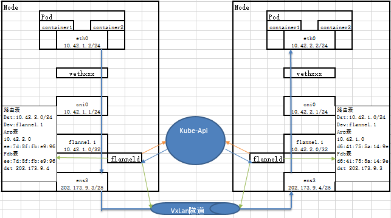
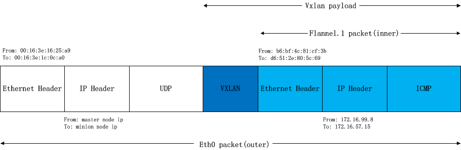
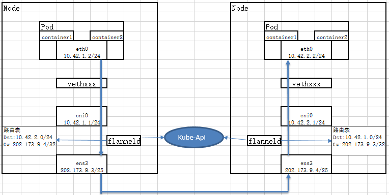

# CNI-Flannel原理解读
[https://github.com/containernetworking/plugins](https://github.com/containernetworking/plugins)
## 简介
Flannel是一种基于overlay网络的跨主机容器网络解决方案，也就是将TCP数据包封装在另一种网络包里面进行路由转发和通信，

Flannel是CoreOS开发,专门用于docker多机互联的一个工具,让集群中的不同节点主机创建的容器都具有全集群唯一的虚拟ip地址

Flannel使用go语言编写

## 工作模式
### vxlan模式
基于IP网络(L3)的基础上虚拟L2网络连接的解决方案

分为两种模式：
-	vxlan模式（纯vxlan）
-	DirectRouting模式（混合模式）：同子网路由采用host-gw，跨子网路由采用vxlan
### host-gw模式
通过直接路由的方式传送虚拟网络报文。求所有宿主机同一个二层网络中
### udp模式
与vxlan都是采用封装数据包的方式传输，但其采用用户态程序封包，比vxlan的内核封包性能降低不少，不建议使用
## 配置文件示例
cat 10-flannel.conflist
```
{
  "name":"cbr0",
  "cniVersion":"0.3.1",
  "plugins":[
    {
      "type":"flannel",
      "delegate":{
        "forceAddress":true,
        "isDefaultGateway":true
      }
    },
    {
      "type":"portmap",
      "capabilities":{
        "portMappings":true
      }
    }
  ]
}
```
## 源码分析

github.com/containernetworking/plugins/blob/master/plugins/meta/flannel/flannel.go

#### cmdAdd函数
##### 一：构造结构体（生成配置文件）
###### 结构体说明

- **name** (string, required): the name of the network.
- **type** (string, required): &quot;bridge&quot;.
- **bridge** (string, optional): name of the bridge to use/create. Defaults to &quot;cni0&quot;.
- **isGateway** (boolean, optional): assign an IP address to the bridge. Defaults to false.
- **isDefaultGateway** (boolean, optional): Sets isGateway to true and makes the assigned IP the default route. Defaults to false.
- **forceAddress** (boolean, optional): Indicates if a new IP address should be set if the previous value has been changed. Defaults to false.
- **ipMasq** (boolean, optional): set up IP Masquerade on the host for traffic originating from this network and destined outside of it. Defaults to false.
- **mtu** (integer, optional): explicitly set MTU to the specified value. Defaults to the value chosen by the kernel.
- **hairpinMode** (boolean, optional): set hairpin mode for interfaces on the bridge. Defaults to false.
- **ipam** (dictionary, required): IPAM configuration to be used for this network.
- **promiscMode** (boolean, optional): set promiscuous mode on the bridge. Defaults to false.

###### 主要函数
*loadNetConf*函数

    主要是得到NetConf结构体配置信息。通过加载/etc/cni/net.d/10-flannel.conflist和/run/flannel/subnet.env，验证参数合法性以及对于未设置的参数初始化，保存到/var/lib/cni/flannel/{容器ID}文件中。
> 会为每一个pod生成一个配置文件，同一节点上这些文件内容是一致的（感觉没有必要）
###### 注意
/run/flannel/subnet.env文件依赖于后面flanneld进程来生成。其中的subnet字段表明给该主机分配的可用子网。

如果flanneld指定--kube-subnet-mgr参数，则由kube-api管理子网，实际上是读取Node的podCIDR属性。该属性又依赖Kube-Controller-Manager开启子网划分功能。

如果kube-Controller-Manager启动时开启了--allocate-node-cidrs参数（默认false），则启动 node-ipam-controller控制器，它会从kube-Controller-Manager启动参数--cluster-cidr所定义的集群Pod网络段中给每个Node分配和管理一个小的网络段，并编辑Node的PodCIDR属性。

- 默认指定delegate为bridge
- 默认网桥名称为cni0
- 默认的ipmi为host-local
###### 生成文件示例
```
{
    "cniVersion": "0.3.1",
    "forceAddress": true,
    "ipMasq": false,
    "ipam": {
        "routes": [
            {
                "dst": "10.42.0.0/16"
            }
        ],
        "subnet": "10.42.5.0/24",
        "type": "host-local"
    },
    "isDefaultGateway": true,
    "isGateway": true,
    "mtu": 1450,
    "name": "cbr0",
    "type": "bridge"
}
```
##### 二：调用 /opt/cni/bin/bridge 命令

###### 主要函数

*setupBridge*函数

    - setupBridge里面调用ensureBridge，前面设置了N多系统调用参数
    - 通过netlink.LinkAdd(br)创建网桥。相当于ip link add br-test type bridge
    - 通过 netlink.LinkSetUp(br)启动网桥。相当于ip link set dev br-test up

*setupVeth*函数

    - 调用netlink.LinkAdd(veth)创建veth，这个是一个管道，Linux的网卡对，在容器对应的namespace下创建好虚拟网络接口。相当于ip link add test-veth0 type veth peer name test-veth1
    - 调用netlink.LinkSetUp(contVeth)启动容器端网卡。相当于ip link set dev test-veth0 up
    - 调用netlink.LinkSetNsFd(hostVeth, int(hostNS.Fd()))将host端加入namespace中。相当于ip link set $link netns $ns
    - 调用netlink.LinkSetMaster(hostVeth, br)绑到bridge。相当于ip link set dev test-veth0 master br-test
##### 三：调用 /opt/cni/bin/host-local 命令

*ipam.ExecAdd*函数

    获取IP地址
*calcGateways*函数

    根据IP地址计算对应的路由和网关
*ConfigureIface*函数

    将IP地址设置到对应的虚拟网络接口上。相当于ifconfig test-veth0 192.168.209.135/24 up
*enableIPForward(gws.family)*函数

    开启ip转发，路径/proc/sys/net/ipv4/ip\_forward写入值1
##### 四：ip.SetupIPMasq函数

    调用ip.SetupIPMasq建立iptables规则。使用iptables增加容器私有网网段到外部网段的masquerade规则，这样容器内部访问外部网络时会进行snat，在很多情况下配置了这条路由后容器内部才能访问外网。（这里代码中会做exist检查，防止生成重复的iptables规则）；

#### 实现功能

##### ADD命令

- 执行ADD命令时，brdige组件创建一个指定名字的网桥，如果网桥已经存在，就使用已有的网桥；
- 创建vethpair，将node端的veth设备连接到网桥上；
- 从ipam获取一个给容器使用的ip数据，并根据返回的数据计算出容器对应的网关；
- 进入容器网络名字空间，修改容器中网卡名和网卡ip，以及配置路由，并进行arp广播（注\&gt;- 意我们只为vethpair的容器端配置ip，node端是没有ip的）；
- 如果IsGW=true，将网桥配置为网关，具体方法是：将第三步计算得到的网关IP配置到网桥上同时根据需要将网桥上其他ip删除。最后开启网桥的ip\_forward内核参数；
- 如果IPMasq=true，使用iptables增加容器私有网网段到外部网段的masquerade规则，这样容器内部访问外部网络时会进行snat，在很多情况下配置了这条路由后容器内部才能访问外网。（这里代码中会做exist检查，防止生成重复的iptables规则）；
- 配置结束，整理当前网桥的信息，并返回给调用者。

##### DEL命令

- 根据命令执行的参数，确认要删除的容器ip，调用ipam的del命令，将IP还回IP pool;
- 进入容器的网络名字空间，根据容器IP将对应的网卡删除；
- 如果IPMasq=true，在node上删除创建网络时配置的几条iptables规则。

## /opt/cni/bin/portmap 命令

用于在node根据pod中ports配置iptables 规则链，进行SNAT、DNAT和端口转发。

portmap组件通常在main组件执行完毕后执行，因为它的执行参数仰赖之前的组件提供。

capabilities 中的 portMappings 参数设置true 则会开启ports 中信息增加DNAT, SNAT

#### 实现功能

##### ADD命令

    - 生成 CNI-HOSTPORT-DNAT 链路存在于NAT表中。根据pod 对应yaml 文件中的 ports段内容 生成对应每一个pod 的规则
    - 生成 CNI-HOSTPORT-SNAT 链路存在于NAT表中。根据pod 对应yaml 文件中的 ports段内容 生成对应每一个pod 的规则

##### DEL命令

    - 删除pod的规则链表
    - 情况SNAT和DNAT链表

# Flanneld原理解读

## Flannel和Flanneld的区别和关联

此处的flannel是coreos维护的，不是前面CNI里的flannel。

- CNI的flannel是二进制文件，而coreos的flannel实际上是flanneld
- CNI的flannel主要用于给容器分配和管理IP地址，而coreos的flannel主要用于通过不同backend实现pod与pod间通信
- CNI的flannel主要被kubelet在创建Pod时调用，CoreOS的flanneld是一个长期运行的后台进程，用于监听Api的Node变化
- CNI的flannel在给Pod分配IP地址时需要依赖Flanneld生成的配置文件subnet.env，这个文件可以自己手动编写，然后Pod就可以正常的获取IP地址了。

## 核心概念

- network 负责网络的管理（以后的方向是多网络模型，一个主机上同时存在多种网络模式），根据每个网络的配置调用 subnet;
- subnet 负责和etcd/kube交互，把 etcd/kube中的信息转换为 flannel 的子网数据结构，并对etcd/kube进行子网和网络的监听;
- backend 接受 subnet 的监听事件，负责增删相应的路由规则

## 代码解读

[https://github.com/coreos/flannel](https://github.com/coreos/flannel)

除了可执行文件的入口 main.go之外，有backend，network，pkg和subnet这么几个代码相关的文件夹。

network主要是iptables相关。主要是供main函数根据设置进行MasqRules和ForwardRules规则的设定。

pkg主要是抽象封装的ip功能库。

backed 主要是后端实现，目前支持 udp、vxlan、host-gw 等。

subnet 子网管理。主要支持etcdv2和k8s两种实现。

### Main函数

#### 1：注册所有的 backend

#### 2：解析命令行参数列表

#### 3：找到外部接口

iface和iface-regex两个参数有关。这两个参数每一个可以指定多个。flannel将按照下面的优先顺序来选取：

- 如果&quot;–iface&quot;和&quot;—-iface-regex&quot;都未指定时，则直接选取默认路由所使用的输出网卡
- 如果&quot;–iface&quot;参数不为空，则依次遍历其中的各个实例，直到找到和该网卡名或IP匹配的实例为止
- 如果&quot;–iface-regex&quot;参数不为空，操作方式和2)相同，唯一不同的是使用正则表达式去匹配

最后，对于集群间交互的Public IP，我们同样可以通过启动参数&quot;–public-ip&quot;进行指定。否则，将使用上文中获取的网卡的IP作为Public IP。

#### 4：newSubnetManager函数

创建SubnetManager（sm）：子网管理器负责子网的创建、更新、添加、删除、监听等。它会去listWatch k8s apiserver的node api，通过ksm.events与backend通信。ksm.events是一个长度为5000的subnet.Event chan，ksm作为生产者，会将从k8s那里watch到的信息封装(nodeToLease，节点信息转为租约信息)后写到ksm.events里 去。

如果没有设置kubernetes子网管理的话，默认使用的就是通过etcd做子网管理；如果传参是kube-subnet-mgr那么将启动kube的子网管理。其实kubernetes没有网络管理，只有一个网络策略，见subnet/kube/kube.go。所谓的网络管理就是listwatch node节点，原理就是放到node的annotations，通过这种方式去替换etcd的作用，只不过不再直接watch etcd了，通过kubernetes的api listwatch机制，把event放到subnet.Event这个管道里面，然后WatchLease从管道中获取。这样设计相比直接用etcd的好处的话，是它可以配合网络策略实现网络隔离。应为有了这些节点信息，配合calico的网络策略，就可以很好的控制网络隔离，例如canal。

#### 5：getConfig函数

获取网络配置，如果使用etcd类型子网管理器，则从etcd接口读取配置，如果使用kube类型子网管理器，则从kubeapi获取配置

- SubnetLen表示每个主机分配的subnet大小，我们可以在初始化时对其指定，否则使用默认配置。在默认配置的情况下，如果集群的网络地址空间大于/24，则SubnetLen配置为24，否则它比集群网络地址空间小1，例如集群的大小为/25，则SubnetLen的大小为/26
- SubnetMin是集群网络地址空间中最小的可分配的subnet，可以手动指定，否则默认配置为集群网络地址空间中第一个可分配的subnet。
- SubnetMax表示最大可分配的subnet
- BackendType为使用的backend的类型，如未指定，则默认为&quot;udp&quot;
- Backend中会包含backend的附加信息，例如backend为vxlan时，其中会存储vtep设备的mac地址

#### 6：创建backend.Manager，使用它来创建backend、注册网络，然后执行其run函数

##### RegisterNetwork过程

在需要后端要管理某个网络的时候被调用，目标就是注册要管理的网络信息到自己的数据结构中，以便后面使用

###### Vxlan

1：创建flannel（vxlan）接口。netlink下内核创建flannel.1接口，需要指定vni（默认为1），出接口，源地址，目的端口，nolearning(netlink.Vxlan)。相当于：

ip link add $DEVNAME type vxlan id $VNI dev eth0 local $IP dstport $PORT nolearning

2：调用kube subnet manager获得一个子网

3：如果从apiserver查询node的backend Annotations跟实际node的信息不一致(例如VTEP MAC不同)，则向node打patch，更新Anootations。此更新会被其他node watch到，从而更新其本地的fdb table

4：设置flannel.1接口地址，激活接口，并增加网段路由。相当于

ip address add $VXSUBNET dev $DEVNAME

ip link set $DEVNAME up

ip route add $SUBNET dev $DEVNAME scope global

5：返回一个符合 backend.Network 接口的 netwrok 结构。

注：在生产backend以后，会启动一个协程，在flanneld退出运行之前，将会执行激活的backend map中删除操作。

#### 7：ipMasq 建立iptables规则

#### 8：WriteSubnetFile函数

将配置信息写入文件/run/flannel/subnet.env中

### Run函数

在forEachNetwork()中会遍历m \*Manager中启动的网络模式，存放到参数n中，对于每一个网络n，启动一个groutine执行 func (m \*Manager) runNetwork(n \*Network)

#### runNetwork(n \*Network)

Run()的核心就是循环调用 runOnce()，其核心逻辑如下：

读取 etcd/kube 中的值，根据获得的值做一些初始化的工作

retryInit()调用 backend 的 Run 函数，让 backend 在后台运行n.bn.Run(ctx)

监听子网在 etcd/kube 中的变化，执行对应的操作

在 goroutine 里监听所有从ksm.events里监听到的subnet事件，然后交由处理函数handleSubnetEvents 完成。

#### handleSubnetEvents函数

事件主要是subnet.EventAdded和subnet.EventRemoved两个。

##### Vxlan

subnet Added 事件，添加 ARP 表、添加FDB 表、更新路由表。

subnet Removed 事件，删除路由表、删除FDB表、删除ARP表。

###### ARP 表

当应用访问 VXLAN 网络里的另一个应用时，我们只有一个 IP 地址，这时需要将 IP 转换成 MAC 地址，才能在数据链路层通信。所以 ARP 表记录的就是 IP 与 VTEP MAC 的映射。

在flannel网络中，flanneld会在启动时监听 RTM\_GETNEIGH(vxlanDevice.MonitorMisses)，flanneld相当于arp daemon；arp请求会在内核中通过netlink发送请求到用户态的flanneld，由flanneld根据该arp请求ip所属网段(该 node上所有ip的MAC也就是VTEP的MAC)，查询其记录的routes信息，然后netlink下发内核。

相当于ip neighbor add/replace $ip-on-node-2 lladdr $mac-of-vtep-on-node-2 dev flannel.1

查看：ip neighbor show dev flannel.1

###### FDB 表

当我们知道了 VTEP MAC 的地址后，我们仍不知道这个 VTEP 在那一台主机上，也不知道 VTEP 在哪个 VXLAN 网络（即 VNI、VXLAN Network Identifier 是否一样）内，仍然无法通信。这时候就需要记录，VTEP MAC 与 VTEP 的 UDP 地址，及该 VTEP 所属的 VNI。

跟数据中心的vxlan不一样，flannel网络中的VTEP的MAC并不是通过组播学习的，而是通过apiserver去做的同步(或者是etcd)。各个节点会将自己的VTEP信息上报给apiserver，而apiserver会再同步给各节点上正在watch node api的listener(flanneld)，flanneld拿到了更新消息后，再通过netlink下发到内核，更新fdb表项，从而达到了整个集群的同步。

相当于bridge fdb add/append $mac-of-vtep-on-node-2 dev $DEVNAME dst $DESTIP

查看：bridge fdb show dev flannel.1

##### host-gw

subnet Added 事件，添加路由表。

subnet Removed 事件，删除路由表。

# Vxlan

## 说明

Vxlan是一种基于IP网络(L3)的基础上虚拟L2网络连接的解决方案。为多租户平台提供了虚拟网络强大的扩展能力和隔离性。是&quot;软件定义网络&quot;(Software-defined Networking, 简称SDN)的协议之一。

通俗来讲，vxlan在多个主机原有的IP网络（可能无法直接在L2直接通信）中抽象出很多自定义的网络。

这里有一个关键的设备vtep(VXLAN Tunnel End Point)承担了自定义虚拟子网中不同网段的L2通信的转发。

注意：Linux内核的vxlan支持，要求版本3.7+，推荐升级到3.9+。

## 数据流程图

  

1：容器里发出数据包，经过容器网卡eth0，通过veth到达主机vethxxxx设备

2：主机端veth设备通过bridge桥接到cni0网卡，发现数据包并不是给自己，寻找下一跳

3：查找路由表：ip route，发现该数据包应该通过本机的vetp设备flannel.1接口发出，网关地址是对端主机flannel.1接口的IP

4：由于flannel.1是vetp设备，会对通过它的数据根据vxlan的协议标准进行二层封装转发，而二层转发的前提是需要获取对端主机的mac地址。vxlan并不会在二层发arp包，而是由linux kernel的 &quot;L3 MISS&quot;事件，将arp发到用户空间和flanneld程序。flanneld程序收到&quot;L3 MISS&quot;内核事件以及ARP请求后，并不会向外网发送arp request，而是从kube-api的node信息查找匹配该地址的子网的vtep信息。找到目的地后，flanneld将查询到的信息存入arp缓存

5：查找arp表：ip neigh show，查到对端主机flannel.1接口的IP的MAC地址，然后进行封装。

6：查看fdb表：bridge fdb show dev flannel.1，得到对端的IP地址后进行UDP发送，目的端口是8472.

7：对端节点接受到数据包之后，会识别出这是一个vxlan的封包，并将包交给对应的vtep设备flannel.1，再经由bridge传送给container。

## 数据包内容格式

  

# Host-gw

## 数据流程图

  

## 局限性

host-gw要求主机网络二层直连，或者说跨宿主机网络通信需要物理路由支持

## 与Vxlan差异

### 适用性

 host-gw只能运行在二层网络（开启Directrouting另说）

 Vxlan可以运行在二层或者三层

### 数据发送方式

host-gw 把每个主机配置成网关，直接路由原始封包

Vxlan则是是在主机间建立隧道，让不同的主机在一个大的网内

### 性能

 由于vxlan需要对数据进行封包和拆包，性能低于host-gw。且Vetp设备（flannel.1）在包转发过程中存在用户空间与内核空间切换的过程造成额外开销。

### 网卡

 host-gw只需要一个桥接网卡即可

 vxlan则需要多一个flannel.1的vetp设备网卡

### MTU

 host-gw的桥接网卡cni0的MTU是1500

 vxlan由于需要经过flannel.1进行vxlan封装，因此cni0网卡的MTU是1450

# SNAT

## 三种实现方式

### CNI

[https://github.com/containernetworking/plugins/blob/master/pkg/ip/ipmasq\_linux.go](https://github.com/containernetworking/plugins/blob/master/pkg/ip/ipmasq_linux.go)

#### 特征说明

 SNAT规则是在pod被创建时调用ip.SetupIPMasq函数生成的。

针对每一个pod都有一个SNAT规则。

默认multicastNet &quot;244.0.0.0/24&quot;不进行masquerade。

#### 源码步骤
1：为pod创建对应的chain
2：在chain中ACCEPT接收所有发往该节点subnet的数据包
3：在chain中对多播包以外的数据包进行masquerade
4：将所有流量导入chain中
#### 配置
```
cni-conf.json
"delegate":{
  "ipMasq": true,
  ……
}
```
#### Iptables效果
```
Chain POSTROUTING (policy ACCEPT)
num  target     prot opt source               destination         
3    CNI-28dca6e4a81e0524babddafb  all  --  10.42.3.0/24         0.0.0.0/0            /* name: "cbr0" id: "95e5d3009eb344738968bce9381ef1ce6d2fc8c3084a1bff3bde40ded094ee37" */

Chain CNI-28dca6e4a81e0524babddafb (1 references)
num  target     prot opt source               destination         
1    ACCEPT     all  --  0.0.0.0/0            10.42.3.0/24         /* name: "cbr0" id: "95e5d3009eb344738968bce9381ef1ce6d2fc8c3084a1bff3bde40ded094ee37" */
2    MASQUERADE  all  --  0.0.0.0/0           !224.0.0.0/4          /* name: "cbr0" id: "95e5d3009eb344738968bce9381ef1ce6d2fc8c3084a1bff3bde40ded094ee37" */
```
### Flanneld

[https://github.com/coreos/flannel/blob/master/network/iptables.go](https://github.com/coreos/flannel/blob/master/network/iptables.go)

#### 特征说明

SNAT规则是在部署flanneld时调用MasqRules函数生成的

SNAT规则是针对集群和subnet的，不是针对pod的

Pod创建时不再生成单独的SNAT规则

#### 源码步骤

1：设置集群内部cluster-cidr数据包进行流量转发（不做SNAT）

2：对多播包以外的数据包进行masquerade

3：集群外访问本节点subnet的数据包进行流量转发（不做SNAT）

4：集群外访问集群内部cluster-cidr数据包进行masquerade

#### 配置

/opt/bin/flannel --ip-masq

#### Iptables效果
```
Chain POSTROUTING (policy ACCEPT)
num  target     prot opt source               destination   
3        0     0 RETURN     all  --  *      *       10.42.0.0/16         10.42.0.0/16    
4        0     0 MASQUERADE  all  --  *      *       10.42.0.0/16        !224.0.0.0/4    
5        0     0 RETURN     all  --  *      *      !10.42.0.0/16         10.42.4.0/24    
6        0     0 MASQUERADE  all  --  *      *      !10.42.0.0/16         10.42.0.0/16  
```
### [ip-masq-agent](https://github.com/kubernetes-incubator/ip-masq-agent) 组件

[http://acs-public.oss-cn-hangzhou.aliyuncs.com/kubernetes/network/ip-masq-agent.yaml](http://acs-public.oss-cn-hangzhou.aliyuncs.com/kubernetes/network/ip-masq-agent.yaml)

#### 意义

灵活的控制集群的SNAT规则

#### 特征说明

默认SNAT所有数据包，针对自定义的多个网络进行排除

需要通过DaemonSet方式部署一个Pod，赋予特权进行iptables修改

#### 配置

Vim ip-masq-agent.yaml
```
    nonMasqueradeCIDRs:
      - 10.42.0.0/16
```
后期变更通过修改ConfigMap实现，需要等待配置同步

kubectl edit configmaps  -n kube-system  ip-masq-agent

#### Iptables效果
```
Chain POSTROUTING (policy ACCEPT)
num  target     prot opt source               destination              
3    IP-MASQ-AGENT  all  --  0.0.0.0/0            0.0.0.0/0            /* ip-masq-agent: ensure nat POSTROUTING directs all non-LOCAL destination traffic to our custom IP-MASQ-AGENT chain */ ADDRTYPE match dst-type !LOCAL

Chain IP-MASQ-AGENT (1 references)
num  target     prot opt source               destination         
1    RETURN     all  --  0.0.0.0/0            10.42.0.0/16         /* ip-masq-agent: cluster-local traffic should not be subject to MASQUERADE */ ADDRTYPE match dst-type !LOCAL
2    MASQUERADE  all  --  0.0.0.0/0            0.0.0.0/0            /* ip-masq-agent: outbound traffic should be subject to MASQUERADE (this match must come after cluster-local CIDR matches) */ ADDRTYPE match dst-type !LOCAL

```
## 注意：IpMasq和SetupIPMasq

[https://github.com/containernetworking/plugins/blob/master/plugins/meta/flannel/flannel\_linux.go](https://github.com/containernetworking/plugins/blob/master/plugins/meta/flannel/flannel_linux.go)

```
if !hasKey(n.Delegate, "ipMasq") {
			// if flannel is not doing ipmasq, we should
			ipmasq := !*fenv.ipmasq
			n.Delegate["ipMasq"] = ipmasq
```

如果Flanneld没有开启ipmasq，CNI的flannel则默认会取反（开启ipmasq，源码里注释分部分写flannel实际上应该是flanneld）。

如果想同时关闭两者，则需要将cni-conf.json中delegate.ipMasq置为false，然后flanneld运行是不指定ip-masq即可。

如果Flanneld和CNI的配置文件cni-conf.json都开启ipmasq，则两则都会生效（iptables规则中同时存在）
