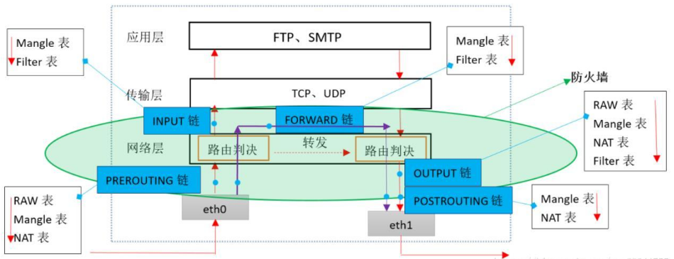
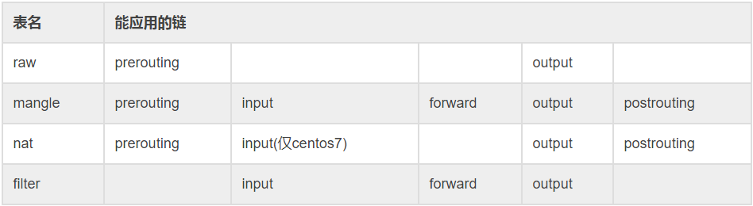
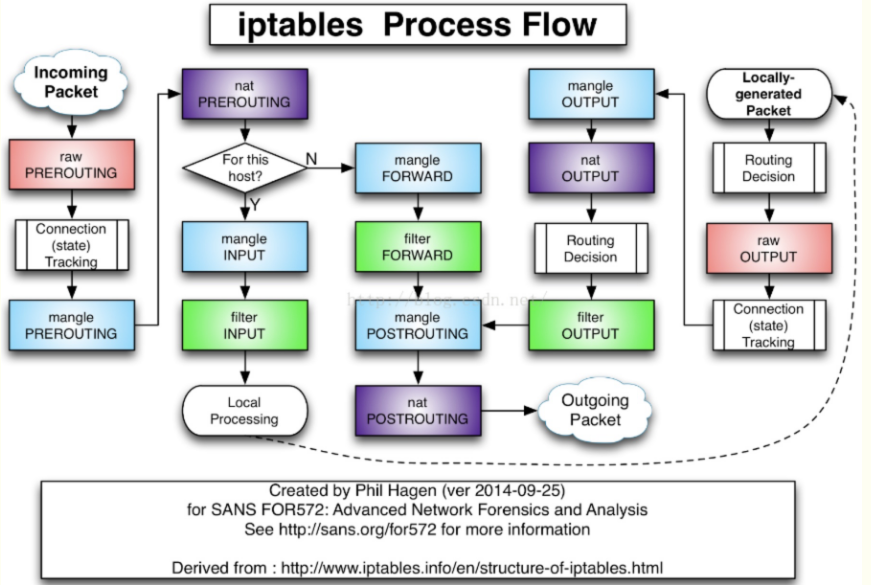

# iptables/netfilter
Netfilter是由Rusty Russell提出的Linux2.4内核防火墙框架，该框架可实现安全策略应用中的许多功能，如数据包过滤、数据包处理、地址伪装、透明代理、动态网络地址转换（Network Address Translation,Nat），以及基于用户及媒体访问控制（Media Access Control,MAC）地址的过滤和基于状态的过滤、包限速等。

Netfilter平台中制定了数据包的五个挂载点（Hook Point，可以理解为回调函数点，数据包到达这些位置时会主动调用我们的函数，使得我能有机会能在数据包路由的时候改变它的方向、内容），这5个挂载点分别是PRE_ROUTING、INPUT、OUTPUT、FORWARD、POST_ROUTING

Netfilter所设置的规则是存放在内核空间的，而iptables是一个应用层的应用程序，它通过Netfilter放出的接口来对存放在内核空间的Netfilter配置表进行修改。这些表由表tables、链chains、规则rules组成，iptables在应用层负责修改这个文件，类似的还有firewalld

> 表table、链chain实际上是netfilter的两个维度，其中
> - 表：按照对数据包的不同操作区分的
> - 链：按照不同的Hook点区分的

# 工作层面
  

# 规则
规则（rules）其实就是网络管理员预定义的条件，规则一般的定义为“如果数据包头符合这样的条件，就这样处理这个数据包”。规则存储在内核空间的信息包过滤表中，这些规则分别指定了源地址、目的地址、传输协议（如TCP、UDP、ICMP）和服务类型（如HTTP、FTP和SMTP）等。当数据包与规则匹配时，iptables就根据规则所定义的方法来处理这些数据包，如放行（accept）、拒绝（reject）和丢弃（drop）等。配置防火墙的主要工作就是添加、修改和删除这些规则

## 匹配条件
- s: 源IP
- sport: 源端口
- d: 目的IP
- dport：目的端口
- p：协议（4层协议TCP/UDP）

## 处理动作
* ACCEP：接收数据包，跳往下一个chain
* REJECT：拦阻，并通过发送方，中止
* DROP：丢弃数据包，中止
* REDIRECT：重定向、映射、透明代理，将包导向到另一个端口PNAT，继续
* SNAT：源地址转换，跳往下一个chain
* DNAT：目标地址转换，跳往下一个chain
* MASQUERADE：ip伪装(NAT)，改写包源IP，跳往下一个chain
* LOG：记录日志，继续
* MORROR：对调源IP和目的IP，中止
* QUEUE：将包交给其他程序处理，中止
* RETURN：结束当前，返回主链，适用于自定义链，返回
* MARK：染色，继续

# 五条链
* PREROUTING 链：数据包进入路由之前，可以在此处进行 DNAT；_所有的数据包进来的时侯都先由这个链处理_
* INPUT 链：一般处理本地进程的数据包，目的地址为本机；
* FORWARD 链：一般处理转发到其他机器或者 network namespace 的数据包；_只有在网卡个数>=2的系统中才具有此功能_
* OUTPUT 链：原地址为本机，向外发送，一般处理本地进程的输出数据包；
* POSTROUTING 链：发送到网卡之前，可以在此处进行 SNAT；_所有的数据包出来的时侯都先由这个链处理_ 

# 五张表
## filter
  - 用途：用于控制到达某条链上的数据包是继续放行、直接丢弃(drop)还是拒绝(reject)
  - 内核模块: iptables_filter
  
## nat 表
  - 用途：network address translation 网络地址转换，用于修改数据包的源地址和目的地址
  - 内核模块：iptable_nat 
  
> 3种转换
> - DNAT：改变数据包的目的地址使其能够重路由到某台机器（使公网能够访问局域网的机器）
> - SNAT：改变数据包的源地址（使局域网的机器能够访问公网）
> - NASQUERADE：和SNAT类似，但SNAT必须指明IP，而NASQUERADE自动获取网卡当前IP地址来做SNAT（拨号上网）

## mangle
  - 用途：用于修改数据包的 IP 头信息
  - 内核模块：iptable_mangle 
  
> 修改的内容
> - TOS：数据包的服务类型
> - TTL：数据包的生存时间
> - MARK：打标记，后面通过标记来配置带宽限速和做基于请求分类

## raw 
  - 用途：iptables 是有状态的，其对数据包有链接追踪机制，连接追踪信息在 /proc/net/nf_conntrack 中可以看到记录，而 raw 是用来去除链接追踪机制的。一但用户使用了RAW表,在某个链 上,RAW表处理完后,将跳过NAT表和 ip_conntrack处理,即不再做地址转换和数据包的链接跟踪处理了
  - 内核模块：iptable_raw 
  
> 数据包被跟踪连接的4种状态
> - NEW：该包想要开始一个连接（重新连接、连接重定向）
> - RELATED：该包属于某一个已经建立的连接所建立的新连接。例如FTP的数据传输连接就是控制连接所RELATED出来的新连接
> - ESTABLISHED：只要发送并接到应答，一个数据连接从NEW变为ESTABLISHED，而且该状态会持续匹配这个连接的后续数据包
> - INVALID：数据包不能被识别属于哪个连接或者没有任何状态。如内存溢出、错误的ICMP信息，一般应该DROP这个状态的数据包

## security 
  最不常用的表，用在 SELinux 上
  
## 表链关系
  
  
# 流程
这五张表是对 iptables 所有规则的逻辑集群且是有顺序的，当数据包到达某一条链时会按表的顺序进行处理，表的优先级为：raw-->mangle-->nat-->filter-->security

iptables 的工作流程如下图所示
  

# 命令
## 格式
iptables -t 表名 <-A/I/D/R> 规则链名 [规则号] <-i/o 网卡名> -p 协议名 <-s 源IP/源子网> --sport 源端口 <-d 目标IP/目标子网> --dport 目标端口 -j 动作

## 参数
* -A/--append chain，向规则链末尾追加
* -D/--delete chain，-D/--delete chain rulenum，删除链中某条规则（规则编号从1开始）
* -I/--insert chain [rulenum]，插入规则
* -R/--replace chain rulenum，替换规则
* -L/--list [chain [rulenum]]，列出规则，按chain区分
* -S/--list-rules [chain [rulenum]]，列出规则，命令格式
* -F/--flush [chain]，清空全部[指定链]
* -Z/--zero [chain [rulenum]]，重置计数器
* -N/--new chain，创建自定义链
* -X/--delete-chain [chain]，删除自定义链
* -P/--policy target，修改默认策略
* -E/--rename-chain old-chain new-chain，重命名

##  选项
* -4/--ipv4 -6/--ipv6
* -p/--protocol proto，协议类型
* -s/--source address[/mask][...]，源IP
* -d/--destination adress[/mask][...]，目的IP
* -i/--in-interface，网卡进
* -o/--out-interface，网卡出
* -j/--jump target，跳转
* -g/--goto chain，转到链，不return
* -m/--match match，使用扩展
* -n/--numeric ，数字方式显示
* -t/--table table，表名，默认filter
* -v/--verbose，详情模式
* -x/--exact，显示精确值

## 常用命令
### 清除iptables
iptables -F #清空规则

iptables -X #删除自定义链

iptables -Z #重置计数器
### 查看规则
iptables -L -n -v  #-v会显示包和数据大小数据

iptables -L -n --line-numbers  #显示规则序号
### 查看net表规则
iptables -S -t nat
### 显示扩展帮助信息
iptables -m addrtype --help
### 保存规则
iptables-save #会打印到屏幕上

iptables-save > /etc/iptables/iptables.rules #保存到文件中

iptables-restore < /etc/iptables/iptables.rules #恢复
### 添加规则
iptables -A INPUT -p tcp --dport 22 -j ACCEPT #允许访问22端口

iptables -I INPUT 1 -p tcp --sport 80 -j ACCEPT # 将此规则添加到指定位置

> 规则默认是有优先顺序的，默认是插入到最后，使用-I可以添加到指定位置
