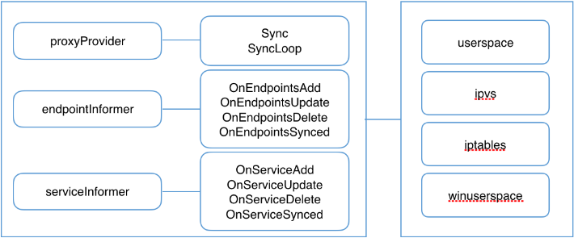

# kube-proxy工作原理
kube-proxy 监听 API server 中 service 和 endpoint 的变化情况，并通过 userspace、iptables、ipvs 或 kernelspace 等 proxier 来为服务配置负载均衡（仅支持 TCP 和 UDP）
  

# kube-proxy模式
- userspace
- iptables
- ipvs

cmd/kube-proxy/app/server.go 
```
const (
        proxyModeUserspace   = "userspace"
        proxyModeIPTables    = "iptables"
        proxyModeIPVS        = "ipvs"
        proxyModeKernelspace = "kernelspace"			#windows用的
)
```

# kube-proxy是如何使用iptables的
在 iptables 模式下，kube-proxy会根据 service 以及 endpoints 对象的改变来实时刷新规则，他使用了 iptables 的 filter 表和 nat 表，并对 iptables 的链进行了扩充。自定义了 KUBE-SERVICES、KUBE-EXTERNAL-SERVICES、KUBE-NODEPORTS、KUBE-POSTROUTING、KUBE-MARK-MASQ、KUBE-MARK-DROP、KUBE-FORWARD 七条链，另外还新增了以“KUBE-SVC-xxx”和“KUBE-SEP-xxx”开头的数个链。除了创建自定义的链以外还将自定义链插入到已有链的后面以便劫持数据包

# 利用iptables实现的功能
* 流量转发：DNAT 实现 IP 地址和端口的映射
* 负载均衡：statistic 模块为每个后端设置权重
* 会话保持：recent 模块设置会话保持时间

# 实现的过程

1. 根据iptables流程图，在nat表的PREROUTING和OUTPUT链将所有进出的数据包导入到自定义的KUBE-SERVICES链中
```
-A PREROUTING -m comment --comment "kubernetes service portals" -j KUBE-SERVICES
-A OUTPUT -m comment --comment "kubernetes service portals" -j KUBE-SERVICES
```
2. 在KUBE-SERVICES链中根据目标地址和端口是service的将数据包导入到KUBE-SVC-XXX链里，如果没有KUBE-SVC-XXX链，则REJECT，其余的导入到KUBE-NODEPORTS链中
```
-A KUBE-SERVICES -d 10.43.122.99/32 -p tcp -m comment --comment "default/test-zdns:dns has no endpoints" -m tcp --dport 53 -j REJECT --reject-with icmp-port-unreachable
-A KUBE-SERVICES ! -s 10.42.0.0/16 -d 10.43.220.178/32 -p tcp -m comment --comment "default/test-headless:dns cluster IP" -m tcp --dport 53 -j KUBE-MARK-MASQ
-A KUBE-SERVICES -d 10.43.220.178/32 -p tcp -m comment --comment "default/test-headless:dns cluster IP" -m tcp --dport 53 -j KUBE-SVC-ULJGWT2JCBL7SVE6
-A KUBE-SERVICES -m comment --comment "kubernetes service nodeports; NOTE: this must be the last rule in this chain" -m addrtype --dst-type LOCAL -j KUBE-NODEPORTS
```
> 这里可以看到KUBE-NODEPORTS出于最后，说明kube-proxy优先查找Cluster-IP类型的，最后再查找NodePort类型的service
3. 在KUBE-NODEPORTS链中根据目标地址和端口是service的将数据导入到KUBE-SVC-XXX链里
```
-A KUBE-NODEPORTS -p tcp -m comment --comment "default/test-headless:dns" -m tcp --dport 32389 -j KUBE-MARK-MASQ
-A KUBE-NODEPORTS -p tcp -m comment --comment "default/test-headless:dns" -m tcp --dport 32389 -j KUBE-SVC-ULJGWT2JCBL7SVE6
```
4. 为每个service创建KUBE-SVC-XXX链，如果endpoint后端有多个pod则创建多个同名的KUBE-SVC-XXX链，如果后端没有，则没有KUBE-SVC-XXX链，根据后端个数以及是会话保持参数、利用不同的扩展模块将数据导入到KUBE-SEP-XXX链中
```
-A KUBE-SVC-WCCYN2ZOQHDVYJ7P -m recent --rcheck --seconds 10800 --reap --name KUBE-SEP-AVOPCOG5E3OPLWV5 --mask 255.255.255.255 --rsource -j KUBE-SEP-AVOPCOG5E3OPLWV5
-A KUBE-SVC-WCCYN2ZOQHDVYJ7P -m recent --rcheck --seconds 10800 --reap --name KUBE-SEP-7SSTJMSP77Z2PSFY --mask 255.255.255.255 --rsource -j KUBE-SEP-7SSTJMSP77Z2PSFY
-A KUBE-SVC-WCCYN2ZOQHDVYJ7P -m recent --rcheck --seconds 10800 --reap --name KUBE-SEP-ER5RRPXYLRRRXASQ --mask 255.255.255.255 --rsource -j KUBE-SEP-ER5RRPXYLRRRXASQ
-A KUBE-SVC-WCCYN2ZOQHDVYJ7P -m recent --rcheck --seconds 10800 --reap --name KUBE-SEP-G4HZVVEPGEEXWFFE --mask 255.255.255.255 --rsource -j KUBE-SEP-G4HZVVEPGEEXWFFE
-A KUBE-SVC-ULJGWT2JCBL7SVE6 -m statistic --mode random --probability 0.25000000000 -j KUBE-SEP-TQDLYFBKYD47OUDX
-A KUBE-SVC-ULJGWT2JCBL7SVE6 -m statistic --mode random --probability 0.33332999982 -j KUBE-SEP-2SZH4AP35VPGPDL2
-A KUBE-SVC-ULJGWT2JCBL7SVE6 -m statistic --mode random --probability 0.50000000000 -j KUBE-SEP-Q2THVJKMQMIECN4Z
-A KUBE-SVC-ULJGWT2JCBL7SVE6 -j KUBE-SEP-I4MBP3ZFWIBVKFD7
```
> 请注意，定义了4个不同的概率，而不是到处都定义为0.25。原因是规则是顺序执行的。

> 第一个规则的执行概率为0.25，执行概率为25%，跳过概率为75%

> 第二个规则的执行概率为0.33，执行的概率为33%，跳过的概率为67%。但是，由于这个规则放在第一个规则之后，所以它的执行概率只有75%。因此，此规则将仅应用于(33/%*75/%=25/%)的请求

> 第三个规则以此类推

> 由于只有25%的流量达到了最后一条规则，所以必须始终应用它

> 可以计算基于规则数量(n)和规则索引(i)(从1开始)设置每个规则的概率
```
     1
  ——————
   n-i+1
```
5. KUBE-SEP-XXX链对数据做DNAT，导向到最终的Pod IP和Pod 端口上
```
-A KUBE-SEP-TQDLYFBKYD47OUDX -s 10.42.1.3/32 -j KUBE-MARK-MASQ
-A KUBE-SEP-TQDLYFBKYD47OUDX -p tcp -m tcp -j DNAT --to-destination 10.42.1.3:53
```

## KUBE-MARK-MASQ
当含有0x4000/0x4000标签的报文离开node节点时进行SNAT，MASQUERADE（伪装）源IP
```
-A KUBE-MARK-MASQ -j MARK --set-xmark 0x4000/0x4000
-A KUBE-POSTROUTING -m comment --comment "kubernetes service traffic requiring SNAT" -m mark --mark 0x4000/0x4000 -j MASQUERADE
```
> MASQUERADE和SNAT的功能类似，只是SNAT需要明确指明源IP的的值，MASQUERADE会根据网卡IP自动更改，所以更实用一些

### Why SNAT
从上面的iptables规则中，我看可以看到有3个地方jump到了KUBE-MARK-MASQ
- -A KUBE-SERVICES ! -s 10.42.0.0/16 -d 10.43.220.178/32 -p tcp -m comment --comment "default/test-headless:dns cluster IP" -m tcp --dport 53 -j KUBE-MARK-MASQ
	 * 适用情形：非集群内的Pod通过Cluster IP访问service
	 * 原因：如果不做SNAT，endpoint收到的请求包中源地址外部节点地址，发出的响应包目的地址也就是外部节点地址，node1会将响应包直接路由给外部节点，但外部节点会因为发出的请求包目的地址是Cluster IP，收到的响应包源地址是node1，导致连接无法建立。所以node2在做完DNAT后还需要再做SNAT，将请求包中的源地址从外部节点自身IP改为node2的集群IP
> 非集群Pod有两种情况，第一种是集群节点（可能有多个IP），第二种是集群外节点通过添加路由的方式

> 如果集群节点只有一个IP，要访问Cluster IP，endpoint看到的源地址是节点IP，这个不是说没有做SNAT，只不过是SNAT前后的地址没有变化，如果集群有两个IP，节点使用非集群IP来访问Cluster IP，endpoint看到的源地址就会被SNAT成节点的集群IP

- -A KUBE-NODEPORTS -p tcp -m comment --comment "default/test-headless:dns" -m tcp --dport 32389 -j KUBE-MARK-MASQ
	* 适用情形：通过集群边界节点上的Node Port方式访问service
	* 原因：如果不做SNAT，endpoint收到的请求包中源地址是client，发出响应的包目的地址也就是client，node1会将响应包直接路由给client，但client会因为发出的请求包目的地址是边界节点node2，收到的响应包源地址的却是node1，导致连接无法建立。所以node2在做完DNAT后还需要再做SNAT，将请求包中源地址从client改为node2的集群IP

- -A KUBE-SEP-TQDLYFBKYD47OUDX -s 10.42.1.3/32 -j KUBE-MARK-MASQ
	* 适用情形：endpoint通过Cluster IP访问service，且被负载到自身（很少见）
	* 原因：如果不做SNAT，endpoint收到的响应包中源地址、目的地址都是自己，而之前发出的请求包中目的地址是Cluster IP，导致连接无法建立。所以node1上在做完DNAT后还需要再做SNAT，将源地址从endpoint改为node1的cni0网卡地址（一般为endpoint的网关地址）
``` 
					       	      client
					                  \ ^
					                    \ \
					                      v \
		   (ens3:202.173.9.4)node 1 <--- node 2（ens3: 202.173.9.3）
		    | ^   SNAT
		    | |   --->
		    v |
		 endpoint
```
> 注意：不论是SNAT还是DNAT，做过之后会使用 Linux 内核的 conntrack 工具包来记录具体NAT的信息，以便可以将未来的数据包做同样的NAT以及回程包反修改。
## KUBE-MARK-DROP
当含有0x8000/0x8000标签的报文会被丢弃
```
-A KUBE-MARK-DROP -j MARK --set-xmark 0x8000/0x8000
-A KUBE-FIREWALL -m comment --comment "kubernetes firewall for dropping marked packets" -m mark --mark 0x8000/0x8000 -j DROP
```

## 流程图
  
# 源码分析
kube-proxy 根据给定的 proxyMode 初始化对应的 proxier 后会调用 Proxier.SyncLoop() 执行 proxier 的主循环，而其最终会调用 proxier.syncProxyRules() 刷新 iptables 规则

##  初始化proxier
cmd/kube-proxy/app/server.go
```
func (o *Options) Run() error {
        ...
        proxyServer, err := NewProxyServer(o)
         ...
        o.proxyServer = proxyServer
        return o.runLoop()
}

func (o *Options) runLoop() error {
        ...
        // run the proxy in goroutine
        go func() {
                err := o.proxyServer.Run()
                o.errCh <- err
        }()
        ...
}
```
cmd/kube-proxy/app/server_others.go
```
func NewProxyServer(o *Options) (*ProxyServer, error) {
        return newProxyServer(o.config, o.CleanupAndExit, o.master)
}
func newProxyServer(
        if proxyMode == proxyModeIPTables {
            proxier, err = iptables.NewProxier(…)
         } else if proxyMode == proxyModeIPVS {
                         proxier, err = ipvs.NewDualStackProxier(…)
         } else {
                 klog.V(0).Info("Using userspace Proxier.")
                 proxier, err = userspace.NewProxier(…)
}
func (proxier *Proxier) SyncLoop() {
          // Update healthz timestamp at beginning in case Sync() never succeeds.
          if proxier.healthzServer != nil {
                  proxier.healthzServer.Updated()
          }
          proxier.syncRunner.Loop(wait.NeverStop)
}
```
## syncProxyRules主函数
该函数的主要功能为：
* 更新proxier.endpointsMap，proxier.servieMap
* 创建自定义链
* 将当前内核中 filter 表和 nat 表中的全部规则导入到内存中
* 为每个 service 创建规则
* 为 clusterIP 设置访问规则
* 为 externalIP 设置访问规则
* 为 ingress 设置访问规则
* 为 nodePort 设置访问规则
* 为 endpoint 生成规则链
* 写入 DNAT 规则
* 删除不再使用的服务自定义链
* 使用 iptables-restore 同步规则
```
func (proxier *Proxier) syncProxyRules() {
#proxier.endpointsMap，proxier.servieMap 两个对象 
         serviceUpdateResult := proxy.UpdateServiceMap(proxier.serviceMap, proxier.serviceChanges)
         endpointUpdateResult := proxier.endpointsMap.Update(proxier.endpointsChanges)
#创建所需要的 iptable 链 
         for _, jump := range iptablesJumpChains {
         }
#将当前内核中 filter 表和 nat 表中的全部规则临时导出到 buffer 中 
         err := proxier.iptables.SaveInto(utiliptables.TableFilter, proxier.existingFilterChainsData)
         err = proxier.iptables.SaveInto(utiliptables.TableNAT, proxier.iptablesData)
         writeLine(proxier.filterChains, "*filter")
         writeLine(proxier.natChains, "*nat")
#SNAT 地址伪装规则，在 POSTROUTING 阶段对地址进行 MASQUERADE 处理，原始请求源 IP 将被丢失，被请求 pod 的应用看到为 NodeIP 或 CNI 设备 IP 
         writeLine(proxier.natRules, masqRule...)
         writeLine(proxier.natRules, []string{
                 "-A", string(KubeMarkMasqChain),
                 "-j", "MARK", "--set-xmark", proxier.masqueradeMark,
         }...)
#为每个 service 创建规则，创建 KUBE-SVC-xxx 和 KUBE-XLB-xxx 链、创建 service portal 规则、为 clusterIP 创建规则 
         for svcName, svc := range proxier.serviceMap {
#若服务使用了 externalIP，创建对应的规则 
                 for _, externalIP := range svcInfo.ExternalIPStrings() {}
#若服务使用了 ingress，创建对应的规则 
               for _, ingress := range svcInfo.LoadBalancerIPStrings() {}
#若使用了 nodePort，创建对应的规则 
                if svcInfo.NodePort() != 0 {}
#为 endpoint 生成规则链 KUBE-SEP-XXX 
               for _, ep := range allEndpoints {}
#如果创建 service 时指定了 SessionAffinity 为 clientIP 则使用 recent 创建保持会话连接的规则 
               if svcInfo.SessionAffinityType() == v1.ServiceAffinityClientIP {
#如果该服务对应的 endpoints 大于等于2，则添加负载均衡规则 
                         if i < (n - 1) {}
                 }
#删除不存在服务的自定义链，KUBE-SVC-xxx、KUBE-SEP-xxx、KUBE-FW-xxx、KUBE-XLB-xxx 
         for chain := range existingNATChains {}
#在 KUBE-SERVICES 链最后添加 nodePort 规则 
         addresses, err := utilproxy.GetNodeAddresses(proxier.nodePortAddresses, proxier.networkInterfacer)
#使用 iptables-restore 同步规则 
         proxier.iptablesData.Reset()
         proxier.iptablesData.Write(proxier.filterChains.Bytes())
         proxier.iptablesData.Write(proxier.filterRules.Bytes())
         proxier.iptablesData.Write(proxier.natChains.Bytes())
         proxier.iptablesData.Write(proxier.natRules.Bytes())
         err = proxier.iptables.RestoreAll(proxier.iptablesData.Bytes(), utiliptables.NoFlushTables, utiliptables.RestoreCounters)
}
```

# 使用iptables存在的问题
- 规则线性匹配时延

	KUBE-SERVICES链挂了一长串的KUBE-SVC-XXX链，访问svc时，需要遍历所有链直至匹配，时间复杂度为O(N)
- 规则更新时延

  非增量更新。Iptables的规则更新是全量更新，即使 --no--flush 也不行（--no--flush 只保证 iptables-restore 时不删除旧的规则链），哪怕增加/删除一条规则，也是整体修改 Netfilter 规则表
- 可扩展性

	当系统存在大量规则时，增加/删除规则可能会出现kernel lock。因为全量提交的过程中做了保护，所以会出现 kernel lock，这时只能等待 
- 可用性

	服务扩容/缩容时，Iptables 规则的刷新会导致连接断开，服务不可用 

