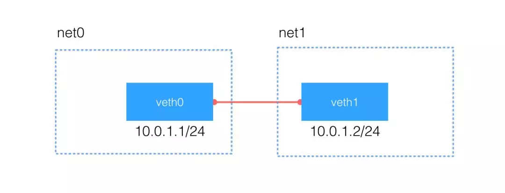
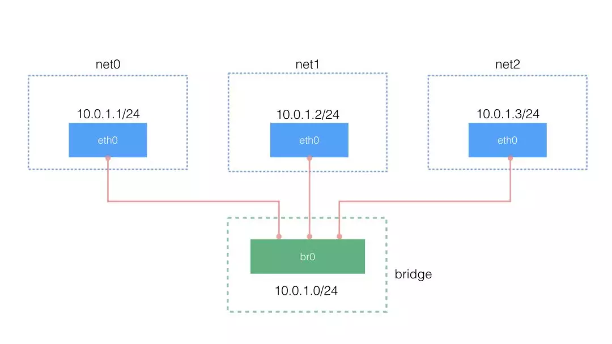
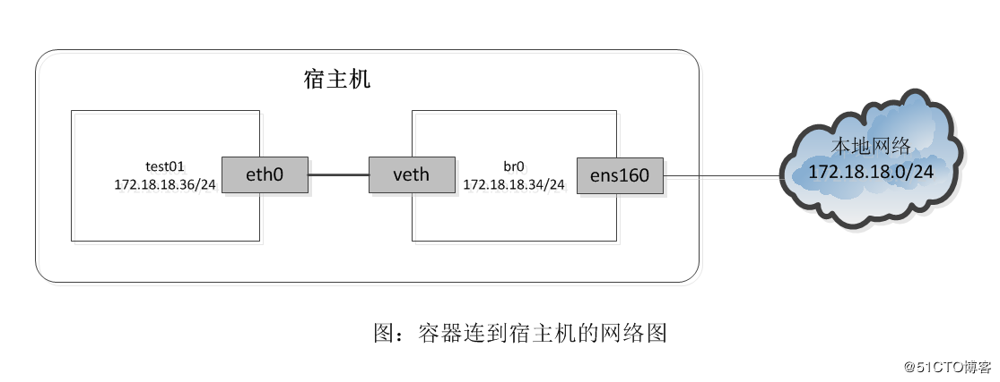

## 操作
* 创建
 
      ip netns add net-test
* 展示
   
      ip netns ls
* 删除
   
      ip netns delete net-test      
* 查看

      ip netns exec net-test ip addr
也可以进入namespace执行命令
      
      ip netns exec net-test bash
      进入bash后可以执行许多系统命令
      
      
## 配置
> 使用ip netns add命令创建了一个network namespace后，就拥有了一个独立的网络空间，可以根据需求来配置该网络空间，如添加网卡，配置IP，设置路由等

> 当使用ip命令创建一个network namespace时，会默认创建一个回环设备（loopback interface:lo）。该设备默认不启动

启动环回设备
    
    ip netns exec net-test ip link set dev lo up  
    
###  主机与namespace之间
1: 在主机上创建两张虚拟网卡veth-1 和 veth-2：

    ip link add veth-1 type veth peer name veth-2   
2: 将veth-2设备添加到net-test这个network namespace中，veth-1留在宿主机中：

    ip link set veth-2 netns net-test
现在net-test这个network namespace就有两块网卡了（lo和veth-2）

3: 为两个网卡分配配置IP并启动
>   #在主机上为veth-1配置IP并启动

    ip addr add 10.0.0.1/24 dev veth-1
    ip link set dev veth-1 up

> #为net-test中的veth-2配置IP并启动

    ip netns exec net-test ip addr add 10.0.0.2/24 dev veth-2
    ip netns exec net-test ip link set dev veth-2 up
> 给两张网卡配置了IP后，会在各自的network namespace中生成一条路由，目的地址 10.0.0.0/24网络的IP包分别从veth-1和veth-2发出。现在net-test这个network namespace有了自己的网卡、IP地址、路由表等信息，就相当于成了一台小型的“虚拟机”了。相互之间能够ping通
 
 
 ### 两个namespace之间
1: 创建两个network namespace ns1、ns2

    ip netns add ns1
    ip netns add ns2
2: 创建veth pair设备veth-a，veth-b

    ip link add veth-a type veth peer name veth-b
3: 将网卡分别放到两个network namespace中：
  
    ip link set veth-a netns ns1
    ip link set veth-b netns ns2
4: 启动这两个网卡

    ip netns exec ns1 ip link set dev lo up
    ip netns exec ns1 ip link set dev veth-a up
    ip netns exec ns2 ip link set dev lo up
    ip netns exec ns2 ip link set dev veth-b up
5: 分配IP

    ip netns exec ns1 ip addr add 10.0.0.1/24 dev veth-a
    ip netns exec ns2 ip addr add 10.0.0.2/24 dev veth-b
6: 验证连通

  

### 更多的namespace之间
 >  引入网桥，就如同docker网络一样，Docker是使用Linux namespace技术进行资源隔离的，网络也是如此。当用默认网络模式（bridge模式）启动一个Docker容器时，一定是在主机上新建了一个Linux network namespace。
 
启动一个名为test1的容器，使用默认的网络（bridge）
    
    docker run -itd --name test1 busybox
    
 注意：此时执行ip netns ls是看不到新建的namespace的，这不代表docker容器没有创建namespace，只是ip netns命令无法查看而已（这个命令的工作方式其实就是查看/var/run/netns目录）
 
 由于docker创建的namespace并不在此目录，而是在/proc/$PID/ns目录下的net
 
1: 用docker inspect查看test1容器的PID
  
    docker inspect  --format '{{.State.Pid}}' test1
2:  在/var/run/netns目录下创建软链接，指向test1容器的network namespace

    ln -s /proc/17037/ns/net  /var/run/netns/test1
3:  测试是否成功

    ip netns ls
    ip netns exec test1 ip addr
 
   
   
 ### 共享主机网络（docker host网络模型）
 1: 启动一个名为test2的容器，使用host网络
 
    docker run -itd --name test2 busybox
 2: 用docker inspect查看test1容器的PID
  
    docker inspect  --format '{{.State.Pid}}' test2
 3: 查看容器的namspace
 
    readlink /proc/4400/ns/net
    
  4: 查看当前shell使用的namespace
  
    readlink  /proc/$$/ns/net
   
  会发现这俩namepsace是一样的，说明使用了同一个网络名称空间，即主机网络
 
 ### pipework  将docker容器配置到本地网络中
1: 下载pipework

    git clone https://github.com/jpetazzo/pipework
2:  将pipework脚本放处指定的目录，/usr/local/bin

    cp ./pipework/pipework /usr/local/bin/
3:  对test01容器进行配置

    docker run -itd --name  test01 --network none busybox
    pipework br0 test01 172.18.18.36/24@172.18.18.1
  
上面配置命令操作如下：

- 查看主机是否存在br0网桥，不存在就创建；
- 向test01中加入一块名为eth1的网卡，并配置IP172.18.18.36/24；
- 若test01中已有默认路由，就删除，把172.18.18.1设为默认路由l
- 将test01容器连接到之前创建的网桥上br0；
- 这个过程和之前采用ip命令配置的过程类似，pipework其实就是用shell写的代码。

> pipework其实还有其它的很多功能，比如还支持open vswitch、支持dhcp获取容器的IP等等
 
 
  

