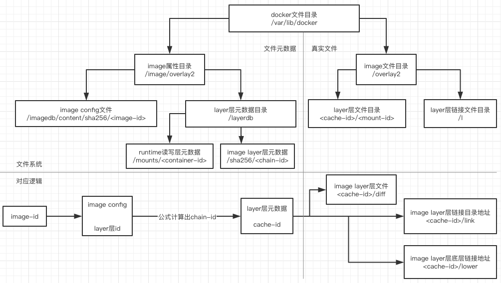

# OCI Image Spec
## OCI
Open Container Initiative(OCI): 由docker和其他container的领军企业于2015-6建立，致力于runtime-spec和image-spec，runtime-spec概述了配置、执行环境和容器生命周期。image-spec定义了oci image，主要包含index、manifest、filesystem layers和configuration文件，概述如何下载、解压runtime所运行的文件系统

## Media Types
* 类型和它所代表的资源，格式为application/vnd.oci.＋关键字＋版本＋文件格式
  * application/vnd.oci.descriptor.v1+json: Content Descriptor
  * application/vnd.oci.layout.header.v1+json: OCI Layout
  * application/vnd.oci.image.index.v1+json: Image Index
  * application/vnd.oci.image.manifest.v1+json: Image manifest
  * application/vnd.oci.image.config.v1+json: Image config
  * application/vnd.oci.image.layer.v1.tar: "Layer", as a tar archive
  * application/vnd.oci.image.layer.v1.tar+gzip: "Layer", as a tar archive compressed with gzip
  * application/vnd.oci.image.layer.v1.tar+zstd: "Layer", as a tar archive compressed with zstd
  * application/vnd.oci.image.layer.nondistributable.v1.tar: "Layer", as a tar archive with distribution restrictions
  * application/vnd.oci.image.layer.nondistributable.v1.tar+gzip: "Layer", as a tar archive with distribution restrictions compressed with gzip
  * application/vnd.oci.image.layer.nondistributable.v1.tar+zstd: "Layer", as a tar archive with distribution restrictions compressed with zstd 

* 关系图

## Content Descriptor
* 通过Descriptor可以知道各个组件的组成关系，以及资源属性，Descriptor是嵌入在其他文件中的描述性信息。
* Descriptor包含以下基础属性
  * mediaType: 所描述的资源
  * digest：资源内容识别码，唯一的表示一段内容，通过digest可以检查内容是否被更改过，digest由algorithm:encoded组成，algorithm如sha256、sha512，encoded表示内容的hash值，如
  
		sha256:45d437916d5781043432f2d72608049dcf74ddbd27daa01a25fa63c8f1b9adc4
  * size：所描述资源的大小(bytes)
  * urls: mediaType所描述的资源的path
  * annotations：注释
 
## Image Layout
* 通过skopeo工具可以从docker hub上拉取image并保存成oci的layout

		git clone https://github.com/containers/skopeo.git
		
		make binary-static DISABLE_CGO=1
		sudo make install

		./skopeo copy docker://docker.io/ubuntu oci:ubuntu
		
* OCI image layout 是内容可寻址blobs和位置可寻址refs的目录结构，refs目录下是image版本描述文件，不一定存在，image layou目录结构如下：
		
		cd ubuntu && ls 
		blobs  index.json  oci-layout
		
  * oci-layout文件：所使用image layout的版本信息 imageLayoutVersion
  
		cat oci-layout 
		{"imageLayoutVersion": "1.0.0"}
		
  * index.json文件：包含manifest信息

		{
    		"manifests": [
        	{
            	"digest": "sha256:48a778107e9a21fac83bd4a1f74d4f91c0ad881169f63660da488236e148455d",
            	"mediaType": "application/vnd.oci.image.manifest.v1+json",
            	"size": 814
        	}
    		],
    		"schemaVersion": 2
		}
		
  * blobs目录
    * 包含各种算法的子目录，算法目录下包含实际内容，包含manifest、config.json和layers文件
    * blobs/<alg>/<encoded> 与 digest <alg>:<encoded> 匹配，如：blobs/sha256/
45d437916d5781043432f2d72608049dcf74ddbd27daa01a25fa63c8f1b9adc4，与之匹配的digest就是sha256:45d437916d5781043432f2d72608049dcf74ddbd27daa01a25fa63c8f1b9adc4
	
			ls blobs/
			sha256
			
			ls blobs/sha256/
			45d437916d5781043432f2d72608049dcf74ddbd27daa01a25fa63c8f1b9adc4
			8c3b70e3904492c753652606df4726430426f42ea56e06ea924d6fea7ae162a1
			48a778107e9a21fac83bd4a1f74d4f91c0ad881169f63660da488236e148455d
			910b24073dd40c7834406a9bee144ae815cf81d0d648769430e58561ed99497c
			7ddbc47eeb70dc7f08e410a6667948b87ff3883024eb41478b44ef9a81bf400c
			c1bbdc448b7263673926b8fe2e88491e5083a8b4b06ddfabf311f2fc5f27e2ff

## Image Index
* 包含多个manifest信息的文件，每个manifest的digest与blobs/sha256目录下文件名对应
* 基础属性
  * schemaVersion: manifest的schema的version
  * mediaType：保留字段
  * manifests：
    * mediaType：application/vnd.oci.image.manifest.v1+json
    * platform：optional
      * architecture：描述所需要的cpu架构
      * os：描述所需要的操作系统
      * os.version：描述所需要的操作系统的版本
      * os.features：描述所需要的操作系统的特别属性
    * digest：manifest文件摘要
    * size：manifest文件大小
  * annotations：index文件的注释
* 官方范例

		{
			"schemaVersion": 2,
			"manifests": [
			{
				"mediaType": "application/vnd.oci.image.manifest.v1+json",
				"size": 7143,
				"digest": "sha256:e692418e4cbaf90ca69d05a66403747baa33ee08806650b51fab815ad7fc331f",
				"platform": {
					"architecture": "ppc64le",
					"os": "linux"
				}
			},
    		{
    			"mediaType": "application/vnd.oci.image.manifest.v1+json",
    			"size": 7682,
    			"digest": "sha256:5b0bcabd1ed22e9fb1310cf6c2dec7cdef19f0ad69efa1f392e94a4333501270",
    			"platform": {
        			"architecture": "amd64",
        			"os": "linux"
        		}
        	}
        ],
        	"annotations": {
        		"com.example.key1": "value1",
        		"com.example.key2": "value2"
        	}
		}

## Image Manifest
* schemaVersion: manifest schema的版本信息
* config: image config文件信息，mediaType为application/vnd.oci.image.config.v1+json， 通过config.digest确定在blobs/sha256下的文件名字，可以找到image的config文件
* layers: image layer文件信息, ubuntu的layers mediaType为application/vnd.oci.image.layer.v1.tar+gzip，可以看到压缩格式为tar+gzip，ubuntu image layers分为4层

		{
    		"config": {
        		"digest": "sha256:910b24073dd40c7834406a9bee144ae815cf81d0d648769430e58561ed99497c",
        		"mediaType": "application/vnd.oci.image.config.v1+json",
        		"size": 2482
    		},
    		"layers": [
        	{
            	"digest": "sha256:7ddbc47eeb70dc7f08e410a6667948b87ff3883024eb41478b44ef9a81bf400c",
            	"mediaType": "application/vnd.oci.image.layer.v1.tar+gzip",
            	"size": 26688847
        	},
        	{
            	"digest": "sha256:c1bbdc448b7263673926b8fe2e88491e5083a8b4b06ddfabf311f2fc5f27e2ff",
            	"mediaType": "application/vnd.oci.image.layer.v1.tar+gzip",
            	"size": 35362
        	},
        	{
            	"digest": "sha256:8c3b70e3904492c753652606df4726430426f42ea56e06ea924d6fea7ae162a1",
            	"mediaType": "application/vnd.oci.image.layer.v1.tar+gzip",
            	"size": 845
        	},
        	{
            	"digest": "sha256:45d437916d5781043432f2d72608049dcf74ddbd27daa01a25fa63c8f1b9adc4",
            	"mediaType": "application/vnd.oci.image.layer.v1.tar+gzip",
            	"size": 162
        	}
    		],
    		"schemaVersion": 2
		}

* docker下载image有自己的layout，并不保存image的manifest文件，只是利用manifest文件中信息，如通过config的digest查看本地是否有相同digest文件，再决定是否下载config文件，然后依次检查layers中每一层文件是否存在并决定是否下载

## Image Configuration
* 主要字段
  * architecture：build image的cpu架构
  * config: 运行容器时用到的参数
    * User
    * ExposedPorts
    * Env
    * Entrypoint
    * Cmd
    * Volumes
    * WorkingDir
    * Labels
    * StopSignal
  * created: 创建时间
  * history: 版本历史
  * os: build image的操作系统信息
  * rootfs: 文件系统信息
    * type: layers
    * diff_ids
    
    		"rootfs": {
        		"diff_ids": [
            		"sha256:cc967c529ced563b7746b663d98248bc571afdb3c012019d7f54d6c092793b8b",
            		"sha256:2c6ac8e5063e35e91ab79dfb7330c6154b82f3a7e4724fb1b4475c0a95dfdd33",
            		"sha256:6c01b5a53aac53c66f02ea711295c7586061cbe083b110d54dafbeb6cf7636bf",
            		"sha256:e0b3afb09dc386786d49d6443bdfb20bc74d77dcf68e152db7e5bb36b1cca638"
        		],
        		"type": "layers"
    		}

* diff_id: image每一层的tar压缩包的digest，且从上到下，层数从低到高，所以与manifest中layers的digest值不同。
* chain_id: 如果两个image的某一层的内容相同，那么他们的diff_id则就相同，一个image多版本之间每个层内容都有可能变化，diff_id也会不同，为了准确的找到所有对应关系，可以通过diff_id计算出来chain_id，来找到每一层保存到文件系统的位置

		ChainID(L₀) =  DiffID(L₀)
		ChainID(L₀|...|Ln₋₁|Ln) = Digest(ChainID(L₀|...|Ln₋₁) + " " + DiffID(Ln))

##  docker image layout
* 查看docker文件系统目录，如docker使用的文件系统为aufs

		ls /var/lib/dockers
		aufs  builder  buildkit  containerd  containers  image  network  plugins  runtimes  swarm  tmp  trust  volumes
	
* 查看image/aufs目录

		ls image/aufs
		distribution  imagedb  layerdb  repositories.json
	
  * repositories.json包含image的repository信息和image id的对应关系, image digest与image id对应关系
  
		"ubuntu": {
            "ubuntu:latest": "sha256:775349758637aff77bf85e2ff0597e86e3e859183ef0baba8b3e8fc8d3cba51c",
            "ubuntu@sha256:6e9f67fa63b0323e9a1e587fd71c561ba48a034504fb804fd26fd8800039835d": "sha256:775349758637aff77bf85e2ff0597e86e3e859183ef0baba8b3e8fc8d3cba51c"
        ｝
        
  * distribution目录存放config文件中diff_ids与manifest文件中layers digest对应关系
  	
		ls distribution
		diffid-by-digest v2metadata-by-diffid
  		
    * diffid-by-digest: manifest layers的digest对应config的diff_id

			cd distribution/diffid-by-digest/sha256/
			cat 7ddbc47eeb70dc7f08e410a6667948b87ff3883024eb41478b44ef9a81bf400c 
			sha256:cc967c529ced563b7746b663d98248bc571afdb3c012019d7f54d6c092793b8b
			
    * v2metadata-by-diffid：config的diff_id对应manifest layers的digest
	
			cd distribution/v2metadata-by-diffid/sha256
			cat cc967c529ced563b7746b663d98248bc571afdb3c012019d7f54d6c092793b8b
			[{
			"Digest":"sha256:7ddbc47eeb70dc7f08e410a6667948b87ff3883024eb41478b44ef9a81bf400c",
			"SourceRepository":"docker.io/library/ubuntu",
			"HMAC":""
			}]

  * imagedb目录存放config文件和image其他信息
  
		ls imagedb
		content  metadata
		
    * content/sha256目录下文件以image id为名，存放image的config文件
    * metadata/sha256目录存放image的其他信息，如parent信息	
  * layerdb目录存放layer属性信息，通过计算每一层的chain_id来查看每个layer的属性
  
		//第一层diff_id就是chain_id
		ls layerdb/sha256/cc967c529ced563b7746b663d98248bc571afdb3c012019d7f54d6c092793b8b/
		cache-id  diff  size  tar-split.json.gz
		
		//第二层chain_id计算
		echo -n "sha256:cc967c529ced563b7746b663d98248bc571afdb3c012019d7f54d6c092793b8b sha256:2c6ac8e5063e35e91ab79dfb7330c6154b82f3a7e4724fb1b4475c0a95dfdd33" | sha256sum
		565879c6effe6a013e0b2e492f182b40049f1c083fc582ef61e49a98dca23f7e
		ls image/aufs/layerdb/sha256/565879c6effe6a013e0b2e492f182b40049f1c083fc582ef61e49a98dca23f7e/
		cache-id  diff  parent  size  tar-split.json.gz
		
		//第三层chain_id计算
		echo -n "sha256:565879c6effe6a013e0b2e492f182b40049f1c083fc582ef61e49a98dca23f7e sha256:6c01b5a53aac53c66f02ea711295c7586061cbe083b110d54dafbeb6cf7636bf" | sha256sum
		b53837dafdd21f67e607ae642ce49d326b0c30b39734b6710c682a50a9f932bf
		
		//第四层chain_id计算
		echo -n "sha256:b53837dafdd21f67e607ae642ce49d326b0c30b39734b6710c682a50a9f932bf sha256:e0b3afb09dc386786d49d6443bdfb20bc74d77dcf68e152db7e5bb36b1cca638" | sha256sum
		4fc26b0b0c6903db3b4fe96856034a1bd9411ed963a96c1bc8f03f18ee92ac2a
		
    * cache-id文件名字是docker下载layer的时候在本地生成的一个随机uuid, 指向真正存放layer目录的文件，
      * /var/lib/docker/aufs/layers: layer的所有父layers的cache-id，最底层的layer内容为空
      * /var/lib/docker/aufs/diff: layer真正文件目录
    * diff文件包含layer的diff_id
    * size文件保存当前layer的大小，单位是字节
    * 如果layer不是最底层，还有parent文件，存放当前layer的父layer的chain_id
    * tar-split.json.gz，layer压缩包的split文件，通过这个文件可以还原layer的tar包，在docker save导出image的时候会用到
    
    
