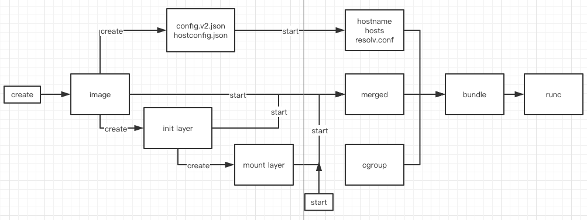

# OCI Runtime Spec
## Abstract
* Open Container Initiative (OCI)的runtime规范了容器的配置、执行环境和生命周期。
* 容器的配置文件名字必须为config.json，配置文件描述了所支持的平台和确保容器能创建成功的字段详情。
* 执行环境描述了确保在容器中运行的应用程序在运行时与容器生命周期定义的常用操作之间具有一致的环境。
* 更多详见 [runtime-spec](https://github.com/opencontainers/runtime-spec/blob/master/spec.md)

## Filesystem Bundle
* filesystem bundle中包含了运行容器所需要的所有信息，符合runtime标准的程序（比如docker-runc或者runc）就可以根据filesystem bundle启动容器

		singlecloud-bundle/
		├── config.json
		└── rootfs
    		└── singlecloud

* filesystem bundle 包含一个config.json文件和容器的根文件系统目录，根文件系统目录不一定要在bundle文件夹下，名字也不一定非要叫rootfs，具体配置在config.json文件中root.path
* hello-world例子
  * 使用skopeo工具下载oci格式的image
  
		skopeo copy docker://hello-world oci:hello-world

  * 根据hello-world的image，使用oci-image-tool创建hello-world的filesystem bundle
  
		mkdir hello-world-bundle
		sudo oci-image-tool create --ref name=latest hello-world hello-world-bundle
		
  * 由于生成的config.json的ociVersion和runc的版本不一致，需要runc自己生成config.json，再运行
  		
		sudo runc spec
		sudo runc run hw

## Configuration
* ociVersion

		"ociVersion":"1.0.1"

* process: 容器启动后所执行的命令
  * user: linux的用户配置如下
  
		"user":{
            "uid":0,
            "gid":0
        }
        
  * args

		 "args":[
            "/singlecloud",
            "-c",
            "/config/singlecloud.conf"
        ]
        
  * cwd: 工作目录，必须为绝对路径
		
		"cwd":"/"
		
  * env
  
		"env":[
            "PATH=/usr/local/sbin:/usr/local/bin:/usr/sbin:/usr/bin:/sbin:/bin",
            "HOSTNAME=477e11149748"
        ]
        
  * capabilities(linux): 描述进程权限，详见[capabilities7](http://man7.org/linux/man-pages/man7/capabilities.7.html)
  * apparmorProfile(linux): 一个mandatory access control，详见[AppArmor](https://wiki.ubuntu.com/AppArmor) 
  
		"apparmorProfile":"docker-default"
		
  * oomScoreAdj(linux): 是否调整oom killer 得分

* root: 描述容器的根文件系统，其中path属性为根文件系统的路径，readonly表明容器的根文件系统是否是只读的，默认为false

		"root":{
        	"path":"/var/lib/docker/overlay2/e95135cbfbe5f3caa27a7b1067678278b9b50aa9d7953e9b7549dcd3b29acf6c/merged"
        }
        
* hostname: 容器的主机名
* mounts: 容器mount目录，其中options为mount参数，具体详见[mount8](http://man7.org/linux/man-pages/man8/mount.8.html)

		 {
            "destination":"/chart",
            "type":"bind",
            "source":"/home/zdns/chart",
            "options":[
                "rbind",
                "rprivate"
            ]
        },
        {
            "destination":"/etc/resolv.conf",
            "type":"bind",
            "source":"/var/lib/docker/containers/477e111497487eee6efc288089ca3aea73e94927e0872106776967446466d959/resolv.conf",
            "options":[
                "rbind",
                "rprivate"
            ]
        }
        
* hooks: 配置容器运行生命周期中会调用的hooks，包括prestart、createRuntime、createContainer、startContainer、poststart和poststop
* linux：描述linux平台的内核属性，包含namespaces, cgroups, resources等

## Runtime and Lifecycle
主要描述了容器的状态、容器相关的操作以及容器的生命周期

* Operations
  * state <container-id>: 返回容器状态
  * create <container-id> <path-to-bundle>: 创建容器，但不执行config.json中的process
  * start <container-id>: 启动容器，执行config.json中的process配置的进程
  * kill <container-id> <signal>: 通过给容器发送信号来停止容器，默认signal为SIGTERM 
  * delete <container-id>: 删除容器
  
* State

		docker-runc --root /run/docker/runtime-runc/moby state 477e111497487eee6efc288089ca3aea73e94927e0872106776967446466d959 
		{
			"ociVersion": "1.0.0",
			"id": "477e111497487eee6efc288089ca3aea73e94927e0872106776967446466d959",
			"pid": 30264,
			"status": "running",
			"bundle": "/run/docker/containerd/daemon/io.containerd.runtime.v1.linux/moby/477e111497487eee6efc288089ca3aea73e94927e0872106776967446466d959",
			"rootfs": "/var/lib/docker/overlay2/e95135cbfbe5f3caa27a7b1067678278b9b50aa9d7953e9b7549dcd3b29acf6c/merged",
			"created": "2020-03-04T01:50:33.321699729Z",
			"owner": ""
	    }

  其中status包含creating、created、running、stopped

* Lifecycle
  * 使用create命令创建容器，参数为filesystem bundle的位置和容器id，容器状态为creating
  * 根据config.json的配置创建运行时的环境，容器状态为created
  * 依次执行config.json中定义的hooks: prestart、createRuntime、createContainer
  * 使用start命令启动容器
  * 依次执行config.json中定义的hooks: startContainer、poststart
  * 如果容器的process由于某些原因退出，容器状态也会变成stopped
  * 使用delete命令可以删除容器
  * 如果容器被删除，会执行poststop的hook
  
* linux runtime: 当创建容器运行时环境时，会建立下面这些软连接

	| Source			| Destination	|
	| - | - |
	| /proc/self/fd		| /dev/fd		|
	| /proc/self/fd/0	| /dev/stdin	|
	| /proc/self/fd/1	| /dev/stdout	|
	| /proc/self/fd/2	| /dev/stderr	|
	
## docker run
docker run从源码可以看出，是docker create和docker start的组合

* docker create
  * 拉取镜像 -> 生成配置 -> 创建容器对象 -> 生成读写层 -> 创建文件夹保存配置 -> 注册容器对象
  * 配置文件: 利用容器默认配置和用户自定义配置生成新的配置，保存在/var/lib/docker/containers/<container-id>，配置文件分别为config.v2.json和hostconfig.json
  
		/var/lib/docker/containers/f4ee030ba4eed9cdc3f811a35ac2a0b25ecfb9a8b20feb0cfcf1fb08c810579e
		├── checkpoints
		├── config.v2.json
		├── hostconfig.json
		
  * 读写层: 即init layer 和 mount layer，元数据信息保存在/var/lib/docker/image/overlay2/layerdb/mounts/<container-id>目录下
    * parent: 表示新创建的layer层在image的哪一层上面
    * init layer: 在parent的上一层，目录信息保存在init-id中，实际文件在/var/lib/docker/overlay2/<init-id>下面，其中link为本层的链接目录，lower为本层依赖的链接目录，lower值为parent的link+lower
    
			cat image/overlay2/layerdb/mounts/f4ee030ba4eed9cdc3f811a35ac2a0b25ecfb9a8b20feb0cfcf1fb08c810579e/init-id 
			7c33bccdb20b1ccc9b61ff19ebdd4aba59574cb21d8849886dcb981f7d66bf3c-init
			
			overlay2/7c33bccdb20b1ccc9b61ff19ebdd4aba59574cb21d8849886dcb981f7d66bf3c-init/
			├── diff
			│   ├── dev
			│   │   ├── console
			│   │   ├── pts
			│   │   └── shm
			│   └── etc
			│       ├── hostname
			│       ├── hosts
			│       ├── mtab -> /proc/mounts
			│       └── resolv.conf
			├── link
			├── lower
			└── work
    			└── work

    * mount layer: 在init layer的上一层，目录信息保存在mount-id中，mount的lower为init layer的link+lower
    
    		cat image/overlay2/layerdb/mounts/f4ee030ba4eed9cdc3f811a35ac2a0b25ecfb9a8b20feb0cfcf1fb08c810579e/mount-id 
			7c33bccdb20b1ccc9b61ff19ebdd4aba59574cb21d8849886dcb981f7d66bf3c
			
			overlay2/7c33bccdb20b1ccc9b61ff19ebdd4aba59574cb21d8849886dcb981f7d66bf3c/
			├── diff
			├── link
			├── lower
			└── work
    			└── work
    			  
* docker start
  * 创建rootfs -> 创建日志以及其他配置文件 -> 创建runtime filesystem bundle -> 准备IO文件 -> 启动容器
  * rootfs: 首先在mount layer目录下创建merged目录，然后将所有layer数据合并到merged目录
  * 日志和一些配置文件在/var/lib/docker/containers/<container-id>目录下
  
		/f4ee030ba4eed9cdc3f811a35ac2a0b25ecfb9a8b20feb0cfcf1fb08c810579e/
		├── checkpoints
		├── config.v2.json
		├── f4ee030ba4eed9cdc3f811a35ac2a0b25ecfb9a8b20feb0cfcf1fb08c810579e-json.log
		├── hostconfig.json
		├── hostname
		├── hosts
		├── mounts
		│   └── shm
		├── resolv.conf
		└── resolv.conf.hash

  * 创建bundle： 目录在/run/docker/containerd/daemon/io.containerd.runtime.v1.linux/moby/<container-id>，从之前Filesystem Bundle那一章节了解到，bundle文件下必须包含配置文件config.json和rootfs，为了创建config.json，还需要配置cgroup
  
		/sys/fs/cgroup/cpuset/docker/f4ee030ba4eed9cdc3f811a35ac2a0b25ecfb9a8b20feb0cfcf1fb08c810579e
		/sys/fs/cgroup/net_cls,net_prio/docker/f4ee030ba4eed9cdc3f811a35ac2a0b25ecfb9a8b20feb0cfcf1fb08c810579e
		/sys/fs/cgroup/pids/docker/f4ee030ba4eed9cdc3f811a35ac2a0b25ecfb9a8b20feb0cfcf1fb08c810579e
		/sys/fs/cgroup/blkio/docker/f4ee030ba4eed9cdc3f811a35ac2a0b25ecfb9a8b20feb0cfcf1fb08c810579e
		/sys/fs/cgroup/cpu,cpuacct/docker/f4ee030ba4eed9cdc3f811a35ac2a0b25ecfb9a8b20feb0cfcf1fb08c810579e
		/sys/fs/cgroup/freezer/docker/f4ee030ba4eed9cdc3f811a35ac2a0b25ecfb9a8b20feb0cfcf1fb08c810579e
		/sys/fs/cgroup/memory/docker/f4ee030ba4eed9cdc3f811a35ac2a0b25ecfb9a8b20feb0cfcf1fb08c810579e
		/sys/fs/cgroup/devices/docker/f4ee030ba4eed9cdc3f811a35ac2a0b25ecfb9a8b20feb0cfcf1fb08c810579e
		/sys/fs/cgroup/perf_event/docker/f4ee030ba4eed9cdc3f811a35ac2a0b25ecfb9a8b20feb0cfcf1fb08c810579e
		/sys/fs/cgroup/hugetlb/docker/f4ee030ba4eed9cdc3f811a35ac2a0b25ecfb9a8b20feb0cfcf1fb08c810579e
		/sys/fs/cgroup/systemd/docker/f4ee030ba4eed9cdc3f811a35ac2a0b25ecfb9a8b20feb0cfcf1fb08c810579e

		/run/docker/containerd/daemon/io.containerd.runtime.v1.linux/moby/f4ee030ba4eed9cdc3f811a35ac2a0b25ecfb9a8b20feb0cfcf1fb08c810579e/
		├── config.json
		├── init.pid
		├── log.json
		└── rootfs

  * io文件：在目录/run/docker/containerd/<container-id>下，它们被dockerd和docker-containerd-shim打开
  
		init-stderr: fifo (named pipe)
		init-stdout: fifo (named pipe)
  
		COMMAND     PID USER   FD   TYPE DEVICE SIZE/OFF NODE NAME
		dockerd     899 root   21u  FIFO   0,23      0t0  660 init-stdout
		dockerd     899 root   39u  FIFO   0,23      0t0  661 init-stderr
		dockerd     899 root   40r  FIFO   0,23      0t0  660 init-stdout
		dockerd     899 root   41r  FIFO   0,23      0t0  661 init-stderr
		docker-co 17511 root   11u  FIFO   0,23      0t0  660 init-stdout
		docker-co 17511 root   13w  FIFO   0,23      0t0  660 init-stdout
		docker-co 17511 root   14u  FIFO   0,23      0t0  660 init-stdout
		docker-co 17511 root   15r  FIFO   0,23      0t0  660 init-stdout
		docker-co 17511 root   16u  FIFO   0,23      0t0  661 init-stderr
		docker-co 17511 root   17w  FIFO   0,23      0t0  661 init-stderr
		docker-co 17511 root   18u  FIFO   0,23      0t0  661 init-stderr
		docker-co 17511 root   19r  FIFO   0,23      0t0  661 init-stderr
		
		root     17511  1351  0 09:26 ?        00:00:00 docker-containerd-shim -namespace moby -workdir /var/lib/docker/containerd/daemon/io.containerd.runtime.v1.linux/moby/f4ee030ba4eed9cdc3f811a35ac2a0b25ecfb9a8b20feb0cfcf1fb08c810579e -address /var/run/docker/containerd/docker-containerd.sock -containerd-binary /usr/bin/docker-containerd -runtime-root /var/run/docker/runtime-runc

