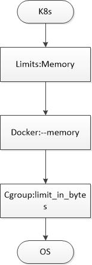
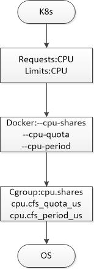

#c的理解kubernetes中的资源限制：CPU、MEM

资源限制是您提供给kubernetes的操作参数，它告诉kubernetes关于工作负载的两件重要事情:正常运行所需的资源;以及它所能消耗的最大资源。第一个是调度程序的关键输入，它使调度程序能够选择运行pod的正确节点。第二点对kubelet很重要，kubelet是每个节点上负责pod健康状况的守护进程。

## 资源限制

资源限制是在每个容器的基础上使用containerSpec的resources属性设置的，它是ResourceRequirements类型的v1 api对象。每个对象都为可控制的资源类型指定“限制”和“请求”。目前这意味着cpu和内存。第三种类型的资源，即临时存储，目前还处于测试阶段。对于我们大多数人来说，我们将遇到的资源限制是在deployment、statefulset或daemonset中，每个podSpec包含一个或多个containerspec。下面是一个完整的v1资源对象在yaml的例子:

```
resources:
  requests:
    cpu: 50m
    memory: 50Mi
  limits:
    cpu: 100m
    memory: 100Mi
```

该对象做如下声明:在正常操作中，该容器需要50m的cpu时间和50M字节的ram(请求);它最多允许使用100m的cpu时间和100M字节的ram(限制)。我将在下面更多地讨论请求和限制之间的区别，但是一般来说，请求在调度时很重要，限制在运行时很重要。虽然在每个容器上都设置了资源限制，但是您可以将pod的限制看作是其中所有容器限制的总和。

## 内存限制



首先说一下内存限制，因为在许多方面内存限制对CPU限制来说是比较简单的。在这里的目标之一是展示如何在系统中实现限制，因为kubernetes将限制委托给容器运行时(本例中是docker/containerd)，而容器运行时将限制委托给linux内核。让我们回顾上面的例子，只是内存限制:

```
resources:
  requests:
    memory: 50Mi
  limits:
    memory: 100Mi
```

单位Mi代表兆字节，因此这个资源对象指定容器需要50 Mi，最多可以使用100 Mi。为了了解如何使用这些值来控制容器进程，让我们首先创建一个非常简单的pod，完全没有内存限制:

```
$ kubectl run limit-test --image=busybox --command -- /bin/sh -c "while true; do sleep 2; done"
deployment.apps "limit-test" created
```

使用kubectl，我们可以验证kubernetes创建的pod没有限制:

```
$ kubectl get pods limit-test-7cff9996fc-zpjps -o=jsonpath='{.spec.containers[0].resources}'
map[]
```

kubernetes很酷的一点是，你总是可以在系统之外看问题。所以让我们ssh到节点，看看docker是如何运行的容器:

```
$ docker ps | grep busy | cut -d' ' -f1
5c3af3101afb
$ docker inspect 5c3af3101afb -f "{{.HostConfig.Memory}}"
0
```

容器**.HostConfig.Memory**字段对应于docker run的**--memory**参数，0表示没有设置限制。docker如何处理这个值?为了控制容器进程可以访问的内存量，docker配置了一个控制组的属性，简称cgroup。Cgroups是在2008年1月发布的内核版本2.6.24中添加到linux的。它们是一个很大的话题，所以现在我们假设cgroup是一组相关属性的容器，这些属性控制内核如何运行进程。有特定的cgroup来控制内存、cpu、设备等。cgroup是层次化的，这意味着每个cgroup都有一个父类，它从父类继承属性，一直到在系统启动时创建的根cgroup。

使用/proc和/sys伪文件系统很容易查看cgroup，因此查看docker如何为我们的容器配置内存cgroup是一个简单的事情。在容器的pid命名空间内，根进程有pid 1，但是在这个命名空间之外，它有一个系统级的pid，我们可以用它来查找它的cgroups:

```
$ ps ax | grep /bin/sh
   9513 ?        Ss     0:00 /bin/sh -c while true; do sleep 2; done
$ sudo cat /proc/9513/cgroup
...
6:memory:/kubepods/burstable/podfbc202d3-da21-11e8-ab5e-42010a80014b/0a1b22ec1361a97c3511db37a4bae932d41b22264e5b97611748f8b662312574
```

除了我们关心的内存cgroup，其他的全部忽略。如你所见，这是一条路径——这就是我上面提到的层级。有些特点比较重要:一开始是kubepods cgroup的路径,所以我们的进程将继承group里面的所有属性,以及**burstable **group ([burstable QOS class](https://kubernetes.io/docs/tasks/configure-pod-container/quality-service-pod/))和一个代表我们的pod的组，主要用于审计。路径的最后一个组件是进程的实际内存cgroup。要查看详细信息，我们必须将上面的路径附加到/sys/fs/cgroups/memory，这将导致:

```
$ ls -l /sys/fs/cgroup/memory/kubepods/burstable/podfbc202d3-da21-11e8-ab5e-42010a80014b/0a1b22ec1361a97c3511db37a4bae932d41b22264e5b97611748f8b662312574
...
-rw-r--r-- 1 root root 0 Oct 27 19:53 memory.limit_in_bytes
-rw-r--r-- 1 root root 0 Oct 27 19:53 memory.soft_limit_in_bytes
```

先忽略**memory.soft_limit_in_bytes**，重点看设置内存限制的**memory.limit_in_bytes**。它是cgroup中的docker参数**--memory**，也是kubernetes中的内存资源限制。让我们看下例子：

```
$ sudo cat /sys/fs/cgroup/memory/kubepods/burstable/podfbc202d3-da21-11e8-ab5e-42010a80014b/0a1b22ec1361a97c3511db37a4bae932d41b22264e5b97611748f8b662312574/memory.limit_in_bytes
9223372036854771712
```

在kubernetes中没有设置内存限制导致docker内存设置**HostConfig.Memory**为0，这导致容器进程被放入内存cgroup中，**memory.limit_in_bytes**的默认值为“no limit”。现在让我们创建一个内存限制为100兆字节的pod:

```
$ kubectl run limit-test --image=busybox --limits "memory=100Mi" --command -- /bin/sh -c "while true; do sleep 2; done"
deployment.apps "limit-test" created
```

同样，我们可以使用kubectl来验证pod是按照我们指定的限制创建的:

```
$ kubectl get pods limit-test-5f5c7dc87d-8qtdx -o=jsonpath='{.spec.containers[0].resources}'
map[limits:map[memory:100Mi] requests:map[memory:100Mi]]
```

* 您将立即注意到，除了我们设置的限制之外，pod现在还有一个内存请求。当您设置了一个限制，而不是一个请求时，kubernetes将默认该限制设置为该请求。
* pod创建之前，**LimitRange admission controller**会检查request和limits进行设置。

如果你从调度器的角度来考虑，这是有意义的。我们将在下面详细讨论这个请求。一旦pod启动，我们可以看到docker是如何配置容器和进程的内存cgroup的:

```
$ docker ps | grep busy | cut -d' ' -f1
8fec6c7b6119
$ docker inspect 8fec6c7b6119 --format '{{.HostConfig.Memory}}'
104857600
$ ps ax | grep /bin/sh
   29532 ?      Ss     0:00 /bin/sh -c while true; do sleep 2; done
$ sudo cat /proc/29532/cgroup
...
6:memory:/kubepods/burstable/pod88f89108-daf7-11e8-b1e1-42010a800070/8fec6c7b61190e74cd9f88286181dd5fa3bbf9cf33c947574eb61462bc254d11
$ sudo cat /sys/fs/cgroup/memory/kubepods/burstable/pod88f89108-daf7-11e8-b1e1-42010a800070/8fec6c7b61190e74cd9f88286181dd5fa3bbf9cf33c947574eb61462bc254d11/memory.limit_in_bytes
104857600
```

正如你所看到的，docker根据我们的containerSpec设置进程的内存cgroup。但这在运行时究竟意味着什么呢?Linux内存管理是一个复杂的话题，但是kubernetes的工程师需要知道的是:当主机受到内存压力时，内核可能会选择终止进程。如果一个进程使用的内存超过了它的限制，它就会移到潜在受害者列表的最前面。由于kubernetes的工作是将尽可能多的内容打包到一个节点上，因此对这些主机的内存压力并不少见。如果您的容器使用了太多的内存，它可能会被oom-kill。如果一个容器收到内核的通知，那么kubernetes会找到这个容器，并根据设置尝试重新启动pod。

那么kubernetes在我们的pod中默认创建的内存请求呢?100Mi内存请求会影响cgroup吗?是我们之前提到的**memory.soft_limit_in_bytes**？让我们来看一看：

```
$ sudo cat /sys/fs/cgroup/memory/kubepods/burstable/pod88f89108-daf7-11e8-b1e1-42010a800070/8fec6c7b61190e74cd9f88286181dd5fa3bbf9cf33c947574eb61462bc254d11/memory.soft_limit_in_bytes
9223372036854771712
```

可以看到，软限制仍然设置为默认的“no limit”值。尽管docker支持通过docker run的参数--memory-reservation设置软限制，但是kubernetes并不使用它。这是否意味着为容器指定一个内存请求并不重要?不是的。请求比限制更重要。限制告诉linux内核何时将您的进程视为释放内存的候选进程。请求可以帮助kubernetes调度程序确定它可以在哪里运行您的pod。不设置他们，或是把他们设置在一个较低的水平，都会产生不好的影响。

例如，假设您运行一个pod，没有内存请求，并且限制很高。正如我们刚才看到的，kubernetes将把请求的缺省值限制到极限值，如果没有节点有那么多可用的ram, pod将无法调度，即使它的实际需求可能要少得多。另一方面，如果您运行一个请求很低的pod，则只会鼓励内核杀死它。为什么?让我们假设您的pod通常使用100Mi的ram，但是您使用50Mi的请求来运行它。如果你有一个节点有75Mi可用，调度程序可以选择运行pod在那里。当pod内存消耗稍后扩展到100 Mi时，节点将受到压力，此时内核可能会选择终止您的进程。因此，正确处理内存请求和内存限制非常重要。

### 演示cgroup oom-killer

```
#cd /sys/fs/cgroup/memory
#mkdir test
#ls test
#cd test
// $$ 当前base的pid
#echo $$ >> cgroup.procs
#cat memory.usage_in_bytes  
#echo 1K > memory.limit_in_bytes
#cat memory.limit_in_bytes
```

操作系统的oom-killer可以禁止，禁止后其他程序再申请内存直接报错。但是root cgroup的oom-killer无法禁止。Linux下每个进程都有个OOM权重，在/proc//oom_adj里面，取值是-17到+15，取值越高，越容易被干掉。  最终OOM killer是通过/proc//oom_score这个值来决定哪个进程被干掉的。这个值是系统综合进程的内存消耗量、CPU时间(utime + stime)、存活时间(uptime - start time)和oom_adj计算出的，消耗内存越多分越高，存活时间越长分越低。总之，总的策略是：损失最少的工作，释放最大的内存同时不伤及无辜的用了很大内存的进程，并且杀掉的进程数尽量少。  另外，Linux在计算进程的内存消耗的时候，会将子进程所耗内存的一半同时算到父进程中。

##CPU限制



cpu限制比内存限制更复杂，是由cgroups机制控制的。cpu限制的resources对象示例:

```
resources:
  requests:
    memory: 50Mi
    cpu: 50m
  limits:
    memory: 100Mi
    cpu: 100m
```

单位m表示“千分之一内核”，因此这个resources对象指定容器进程需要50/1000个内核(5%)，并且最多允许使用100/1000个内核(10%)。同样，2000m将是两个完整的内核，也可以指定为2或2.0。让我们创建一个pod，只请求cpu，看看这是如何配置在docker和cgroup级别:

```
$ kubectl run limit-test --image=busybox --requests "cpu=50m" --command -- /bin/sh -c "while true; do sleep 2; done"
deployment.apps "limit-test" created
```

我们可以看到kubernetes配置了50m cpu请求:

```
$ kubectl get pods limit-test-5b4c495556-p2xkr -o=jsonpath='{.spec.containers[0].resources}'
map[requests:map[cpu:50m]]
```

我们还可以看到docker对容器配置了相同的限制:

```
$ docker ps | grep busy | cut -d' ' -f1
f2321226620e
$ docker inspect f2321226620e --format '{{.HostConfig.CpuShares}}'
51
```

为什么是51，而不是50?cpu控制组和docker都将一个内核划分为1024 片，而kubernetes将其划分为1000 片。docker如何将此请求应用于容器进程?就像设置内存限制会导致docker配置进程的内存cgroup一样，设置cpu限制会导致它配置cpu,cpuacct cgroup:

```
$ ps ax | grep /bin/sh
   60554 ?      Ss     0:00 /bin/sh -c while true; do sleep 2; done
$ sudo cat /proc/60554/cgroup
...
4:cpu,cpuacct:/kubepods/burstable/pode12b33b1-db07-11e8-b1e1-42010a800070/3be263e7a8372b12d2f8f8f9b4251f110b79c2a3bb9e6857b2f1473e640e8e75
$ ls -l /sys/fs/cgroup/cpu,cpuacct/kubepods/burstable/pode12b33b1-db07-11e8-b1e1-42010a800070/3be263e7a8372b12d2f8f8f9b4251f110b79c2a3bb9e6857b2f1473e640e8e75
total 0
drwxr-xr-x 2 root root 0 Oct 28 23:19 .
drwxr-xr-x 4 root root 0 Oct 28 23:19 ..
...
-rw-r--r-- 1 root root 0 Oct 28 23:19 cpu.shares
```

容器属性**HostConfig.CpuShares**映射到cgroup的属性**cpu.shares**，我们来看一下:

```
$ sudo cat /sys/fs/cgroup/cpu,cpuacct/kubepods/burstable/podb5c03ddf-db10-11e8-b1e1-42010a800070/64b5f1b636dafe6635ddd321c5b36854a8add51931c7117025a694281fb11444/cpu.shares
51
```

设置cpu请求会将一个值传播到cgroup。内存软限制对kubernetes无用，设置cpu限制是有用的。在下面详细讨论原因。那么当设置cpu限制时会发生什么呢?让我们来看看:

```
$ kubectl run limit-test --image=busybox --requests "cpu=50m" --limits "cpu=100m" --command -- /bin/sh -c "while true; do
sleep 2; done"
deployment.apps "limit-test" created
```

现在我们还可以看到kubernetes pod资源对象的限制:

```
$ kubectl get pods limit-test-5b4fb64549-qpd4n -o=jsonpath='{.spec.containers[0].resources}'
map[limits:map[cpu:100m] requests:map[cpu:50m]]
```

在docker容器配置中:

```
$ docker ps | grep busy | cut -d' ' -f1
f2321226620e
$ docker inspect 472abbce32a5 --format '{{.HostConfig.CpuShares}} {{.HostConfig.CpuQuota}} {{.HostConfig.CpuPeriod}}'
51 10000 100000
```

cpu request 存储在**HostConfig.CpuShares**。cpu限制由两个值表示:**HostConfig.CpuPeriod**和**HostConfig.CpuQuota**。这些docker容器配置属性映射到cpu的两个附加属性cpu,cpuacct cgroup: **cpu.cfs_period_us**和**cpu.cfs_quota_us**。让我们来看看这些:

```
$ sudo cat /sys/fs/cgroup/cpu,cpuacct/kubepods/burstable/pod2f1b50b6-db13-11e8-b1e1-42010a800070/f0845c65c3073e0b7b0b95ce0c1eb27f69d12b1fe2382b50096c4b59e78cdf71/cpu.cfs_period_us
100000
$ sudo cat /sys/fs/cgroup/cpu,cpuacct/kubepods/burstable/pod2f1b50b6-db13-11e8-b1e1-42010a800070/f0845c65c3073e0b7b0b95ce0c1eb27f69d12b1fe2382b50096c4b59e78cdf71/cpu.cfs_quota_us
10000
```

正如预期的那样，这些值被设置为与docker容器配置中指定的值相同。但是这两个属性的值是如何从pod中设置的cpu限制100m 中得到的呢?它们是如何实现这个限制的呢?答案在于cpu请求和cpu限制是使用两个独立的控制系统实现的。请求使用CpuShares系统，两者中较早的一个。Cpu份额将每个核心划分为1024个片，并保证每个进程将获得这些片的比例份额。如果有1024个片，并且有两个进程都设置cpu分享到512个，然后他们将各自得到大约一半的可用时间。然而，CpuShares系统不能强制执行上限。如果一个进程不使用它的CPU，另一个进程可以自由使用。

大约在2010年，谷歌和其他人注意到这可能会导致问题。作为回应，增加了第二个更强大的系统:cpu带宽控制。带宽控制系统定义了一个周期，通常是1/10秒，或100,000微秒，以及一个配额，它表示允许进程在cpu上运行的时间段内的最大片数。在本例中，我们要求pod的cpu限制为100m。这是一个内核的100/1000，或者说cpu时间的100000微秒中的10000。因此，在进程的**cpu,cpuacct** cgroup上，我们的limit请求转换为设置**cpu.cfs_period_us=100000**和**cpu.cfs_quota_us=10000**。顺便说一下，这些名称中的cfs代表完全公平的调度程序，它是默认的linux cpu调度程序。还有一个实时调度程序，它具有自己对应的配额值。

我们已经看到，在kubernetes中设置cpu请求最终会设置cgroup属性**cpu.shares** ，并且通过设置不同的系统**cpu.cfs_period_us** 和 **cpu.cfs_quota_us**来参与cpu限制。与内存限制一样，请求主要对调度程序有用，调度程序使用它查找至少具有那么多可用CpuShares的节点。与内存请求不同，设置cpu请求还会在cgroup上设置一个属性，帮助内核将该数量的片分配给进程。对极限的处理也与内存不同。超过内存限制使您的容器进程成为oom杀死的候选对象，而您的进程基本上不能超过设置的cpu配额，并且永远不会因为试图使用超过分配的cpu时间而被驱逐。系统在调度程序上强制执行配额，这样进程就会在限制时被节流。

如果不将这些属性设置在容器上，或者将它们设置为不准确的值，会发生什么?与内存一样，如果您设置了一个限制，但是没有设置请求，kubernetes将默认将请求设置为该限制。如果您非常清楚您的工作负载需要多少cpu时间，这是可以的。设置一个没有限制的请求怎么样?在这种情况下kubernetes能够准确地安排你的POD,内核将确保它至少获取到请求的时间片,但您的进程不会阻止使用更多的CPU。既不设置请求也不设置限制是最坏的情况:调度器不知道容器需要什么，进程对CpuShares的使用是无限制的，这可能会对节点产生负面影响。最后一件事是:确保名称空间中的默认限制。

##默认的限制

鉴于我们刚刚讨论过的所有关于负面影响和POD忽略资源限制,你可能会认为设置默认值是非常好的,所以,每一个POD在集群中至少有一些限制。Kubernetes允许我们这样做,在每个名称空间的基础上,使用LimitRange v1 api对象。要建立默认限制，您可以在名称空间中创建LimitRange对象。这里有一个例子:

```
apiVersion: v1
kind: LimitRange
metadata:
  name: default-limit
spec:
  limits:
  - default:
      memory: 100Mi
      cpu: 100m
    defaultRequest:
      memory: 50Mi
      cpu: 50m
  - max:
      memory: 512Mi
      cpu: 500m
  - min:
      memory: 50Mi
      cpu: 50m
    type: Container
```

这里的命名可能有点混乱，所以让我们简单地分解下。limits下的default键表示每个资源的默认限制。在这种情况下，任何没有内存限制而被允许进入名称空间的pod都将被分配一个100Mi的限制。任何没有cpu限制的POD将被分配100m的限制。defaultRequest键用于资源请求。如果在没有内存请求的情况下创建pod，它将被分配默认的50Mi请求，如果没有cpu请求，它将获得默认的50m请求。max和min键是一个范围:如果设置了违反这些界限的请求或限制，pod在名称空间内就不会创建成功。

LimitRange中设置的默认值由LimitRanger插件应用于pods，它是一个kubernetes的入口控制器。入口控制器是一种插件，它在api接收到请求之后，在创建pod之前，修改podspec。如果一个POD没有指定请求或限制，它将应用LimitRanger默认值。通过查看pod元数据中的annotations ，您可以看到LimitRanger已经在pod上设置了默认值。下面是一个例子，LimitRanger应用了一个默认的cpu请求100m:

```
apiVersion: v1
kind: Pod
metadata:
  annotations:
    kubernetes.io/limit-ranger: 'LimitRanger plugin set: cpu request for container
      limit-test'
  name: limit-test-859d78bc65-g6657
  namespace: default
spec:
  containers:
  - args:
    - /bin/sh
    - -c
    - while true; do sleep 2; done
    image: busybox
    imagePullPolicy: Always
    name: limit-test
    resources:
      requests:
        cpu: 100m
```

这就结束了对kubernetes中CPU资源限制的研究。如果您有兴趣阅读关于使用资源限制和默认值、linux cgroups或内存管理的更多信息，我在下面提供了一些关于这些主题的更详细信息的链接。

##操作系统进程限制


CPU 和 Memory 两个子系统有自己独立的层级系统，而又通过 Task Group 取得关联关系。

两种调度策略：

* 一种是完全公平调度 （CFS：Completely Fair Scheduler）策略

* 另一种是实时调度（Real-Time Scheduler）策略

CFS调度策略下的配置

```
设定CPU使用周期使用时间上限
cpu.cfs_period_us：设定周期时间，必须与cfs_quota_us配合使用。
cpu.cfs_quota_us ：设定周期内最多可使用的时间。这里的配置指task对单个cpu的使用上限，若cfs_quota_us是cfs_period_us的两倍，就表示在两个核上完全使用。数值范围为1000 - 1000,000（微秒）。
cpu.stat：统计信息，包含nr_periods（表示经历了几个cfs_period_us周期）、nr_throttled（表示task被限制的次数）及throttled_time（表示task被限制的总时长）。
按权重比例设定CPU的分配
cpu.shares：设定一个整数（必须大于等于2）表示相对权重，最后除以权重总和算出相对比例，按比例分配CPU时间。（如cgroup A设置100，cgroup B设置300，那么cgroup A中的task运行25%的CPU时间。对于一个4核CPU的系统来说，cgroup A 中的task可以100%占有某一个CPU，这个比例是相对整体的一个值。）
```

查看系统ticks：

```
cat /boot/config-`uname -r` | grep '^CONFIG_HZ='
CONFIG_HZ=1000
```

系统每秒有多少个软中断。

### 测试CPU限制

创建group：`ruletest`

```
[root@ecs ~]# rmdir /sys/fs/cgroup/cpu/ruletest
[root@ecs ~]# mkdir /sys/fs/cgroup/cpu/ruletest
[root@ecs ~]# cd /sys/fs/cgroup/cpu/ruletest
[root@ecs /sys/fs/cgroup/cpu/ruletest]# ll
total 0
-rw-r--r-- 1 root root 0 Jun 14 14:50 cgroup.clone_children
--w--w--w- 1 root root 0 Jun 14 14:50 cgroup.event_control
-rw-r--r-- 1 root root 0 Jun 14 14:50 cgroup.procs
-rw-r--r-- 1 root root 0 Jun 14 14:50 cpu.cfs_period_us
-rw-r--r-- 1 root root 0 Jun 14 14:50 cpu.cfs_quota_us
-rw-r--r-- 1 root root 0 Jun 14 14:50 cpu.rt_period_us
-rw-r--r-- 1 root root 0 Jun 14 14:50 cpu.rt_runtime_us
-rw-r--r-- 1 root root 0 Jun 14 14:50 cpu.shares
-r--r--r-- 1 root root 0 Jun 14 14:50 cpu.stat
-r--r--r-- 1 root root 0 Jun 14 14:50 cpuacct.stat
-rw-r--r-- 1 root root 0 Jun 14 14:50 cpuacct.usage
-r--r--r-- 1 root root 0 Jun 14 14:50 cpuacct.usage_percpu
-rw-r--r-- 1 root root 0 Jun 14 14:50 notify_on_release
-rw-r--r-- 1 root root 0 Jun 14 14:50 tasks
```

这个cgoup的cpu限制

```
[root@ecs /sys/fs/cgroup/cpu/ruletest]# cat /sys/fs/cgroup/cpu/ruletest/cpu.cfs_quota_us
-1
[root@ecs /sys/fs/cgroup/cpu/ruletest]# echo 20000 > /sys/fs/cgroup/cpu/ruletest/cpu.cfs_quota_us

[root@ecs /sys/fs/cgroup/cpu/ruletest]# cat /sys/fs/cgroup/cpu/ruletest/cpu.cfs_quota_us
20000
```

运行一个跑满CPU的程序，并观察状态

```
int main(void)
{
    int i = 0;
    for(;;) i++;
    return 0;
}
```

一核被跑满

```
top - 15:00:14 up 19 days,  1:26,  3 users,  load average: 0.44, 0.13, 0.20
Tasks:   1 total,   1 running,   0 sleeping,   0 stopped,   0 zombie
%Cpu0  :  0.3 us,  0.0 sy,  0.0 ni, 99.7 id,  0.0 wa,  0.0 hi,  0.0 si,  0.0 st
%Cpu1  :100.0 us,  0.0 sy,  0.0 ni,  0.0 id,  0.0 wa,  0.0 hi,  0.0 si,  0.0 st
%Cpu2  :  5.0 us,  2.3 sy,  0.0 ni, 92.6 id,  0.0 wa,  0.0 hi,  0.0 si,  0.0 st
%Cpu3  :  6.0 us,  1.7 sy,  0.0 ni, 92.3 id,  0.0 wa,  0.0 hi,  0.0 si,  0.0 st
%Cpu4  :  3.7 us,  1.0 sy,  0.0 ni, 95.3 id,  0.0 wa,  0.0 hi,  0.0 si,  0.0 st
%Cpu5  :  0.3 us,  0.3 sy,  0.0 ni, 99.3 id,  0.0 wa,  0.0 hi,  0.0 si,  0.0 st
%Cpu6  :  2.3 us,  1.3 sy,  0.0 ni, 96.3 id,  0.0 wa,  0.0 hi,  0.0 si,  0.0 st
%Cpu7  :  2.0 us,  1.7 sy,  0.0 ni, 96.3 id,  0.0 wa,  0.0 hi,  0.0 si,  0.0 st
KiB Mem : 32779804 total,  3207136 free,  2965740 used, 26606928 buff/cache
KiB Swap:  1048572 total,  1048572 free,        0 used. 28961712 avail Mem

  PID USER      PR  NI    VIRT    RES    SHR S  %CPU %MEM     TIME+ COMMAND
  910 root      20   0    4208    356    280 R  99.7  0.0   0:30.71 ./deadloop
```

再启动一个同样的程序，CPU占用各50%。把其中一个加入到cgroup中：

```
[root@ecs ~/tmp]# echo 910 > /sys/fs/cgroup/cpu/ruletest/tasks
[root@ecs ~/tmp]# cat /sys/fs/cgroup/cpu/ruletest/tasks
910
```

然后，就会在top中看到CPU的利用立马下降成20%了。（前面我们设置的20000就是20%的意思）

```
[root@ecs ~/tmp]# top -p 910
top - 15:06:43 up 19 days,  1:33,  3 users,  load average: 0.01, 0.16, 0.22
Tasks:   1 total,   1 running,   0 sleeping,   0 stopped,   0 zombie
%Cpu0  :  4.3 us,  1.7 sy,  0.0 ni, 94.0 id,  0.0 wa,  0.0 hi,  0.0 si,  0.0 st
%Cpu1  :  3.3 us,  2.0 sy,  0.0 ni, 94.7 id,  0.0 wa,  0.0 hi,  0.0 si,  0.0 st
%Cpu2  :  2.0 us,  0.3 sy,  0.0 ni, 97.7 id,  0.0 wa,  0.0 hi,  0.0 si,  0.0 st
%Cpu3  :  0.0 us,  0.0 sy,  0.0 ni,100.0 id,  0.0 wa,  0.0 hi,  0.0 si,  0.0 st
%Cpu4  : 20.7 us,  0.3 sy,  0.0 ni, 79.0 id,  0.0 wa,  0.0 hi,  0.0 si,  0.0 st
%Cpu5  :  0.0 us,  0.0 sy,  0.0 ni,100.0 id,  0.0 wa,  0.0 hi,  0.0 si,  0.0 st
%Cpu6  :  6.4 us,  2.0 sy,  0.0 ni, 91.6 id,  0.0 wa,  0.0 hi,  0.0 si,  0.0 st
%Cpu7  :  2.7 us,  1.7 sy,  0.0 ni, 95.7 id,  0.0 wa,  0.0 hi,  0.0 si,  0.0 st
KiB Mem : 32779804 total,  3206684 free,  2966044 used, 26607076 buff/cache
KiB Swap:  1048572 total,  1048572 free,        0 used. 28961312 avail Mem

  PID USER      PR  NI    VIRT    RES    SHR S  %CPU %MEM     TIME+ COMMAND
  910 root      20   0    4208    356    280 R  20.0  0.0   3:09.83 ./deadloop
```


Understanding Linux Container Scheduling

https://engineering.squarespace.com/blog/2017/understanding-linux-container-scheduling?source=post_page-----9eff74d3161b----------------------

Managing Compute Resoures fro Containers

https://kubernetes.io/docs/concepts/configuration/manage-compute-resources-container/?source=post_page-----9eff74d3161b----------------------

Red Hat Customer Portal

https://access.redhat.com/documentation/en-us/red_hat_enterprise_linux/6/html/resource_management_guide/sec-memory?source=post_page-----9eff74d3161b----------------------

Chapter 1. Introduction to Control Groups(Cgroups)

https://access.redhat.com/documentation/en-us/red_hat_enterprise_linux/6/html/resource_management_guide/ch01?source=post_page-----9eff74d3161b----------------------

Configure Default Memory Requests and Limits for a Namespace

https://kubernetes.io/docs/tasks/administer-cluster/manage-resources/memory-default-namespace/?source=post_page-----9eff74d3161b----------------------