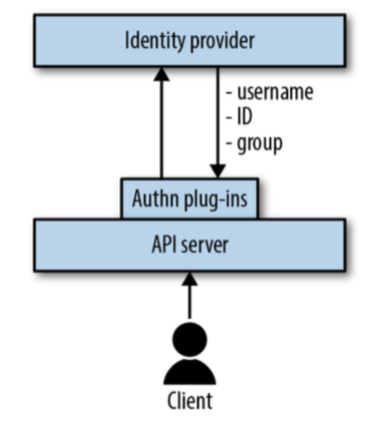
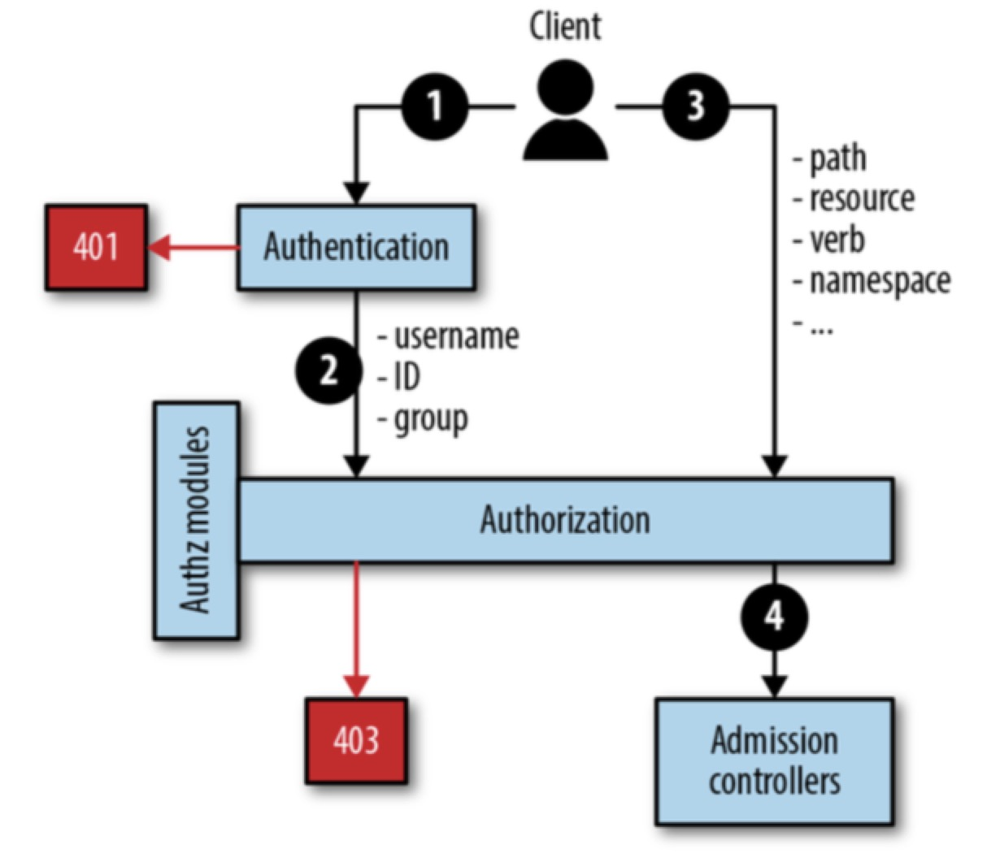

# Security Principles
1. Defense in depth
2. Least privilege
3. Limiting the attack surface

# Security Core component
1. RBAC
  * --authorization-mode=RBAC
  * x.509 certificates to identify user,group
  * JWT for service account
  * binding user/group/sa to role
2. Node Authentication
  * --authorization-mode=Node
  * --enable-admission-plugins=NodeRestriction
  * only a kubelet could modify its own node
  * node and node status, pod and pod status
3. Disable anonymous access
  * --anonymous-auth=false
  * --read-only-port=0

# Authentication & Authorization
1. Concepts
  * Authentication 
    
  * Authorization 
    
  * RBAC 

    

2. Default roles
  * user-facing roles
    - cluster-admin
    - admin
    - edit
    - view
  * Core component
    - system:kube-controller-manager
    - system:kube-scheduler
  * Other component
    - system:persistent-volume-provisioner

# Securing container images
1. Scan container images
  * [clair](https://github.com/coreos/clair)
  * [microscanner](https://github.com/aquasecurity/microscanner)
2. Patch container images
  * rebuild the image
  * redeploy the workload
3. Using private registry

# Running containers securely
1. Security Context
  * SecurityContext in container spec
  * PodSecurityContext in pod spec
  * privileged (access all the devices in host and set system configuration, only available in container security context)
  * runAsUser/runAsGroup
  * runAsNonRoot
  * allowPrivilegeEscalation (allowed to run cmd like su, ping to promote the privilege) 
  * supplementalGroups, fsGroups are used to allow user to access shared storage when its uid isn't allowed
  * docker is support user namespace, but k8s doesn't use it yet

2. PSP (Pod Security Policy)
  * enable PodSecurityPolicy in admission controller
  * PSP is k8s cluster-level resource
  * pod's service account has the role to use at least one PSP
  * pod is validated by any PSP 
  * In addition to settings in Security Context, PSP could limits:
    * host namespaces (HostPID, HostIPC, HostNetwork, HostPorts, AllowedHostPaths)
    * volumes and file systems
    * capabilities

3. LimitRange and ResourceQuota
4. Network Policies
  * ingress and egress traffic control

# Secret
1. By default, Secret is saved in etcd
2. Secret is encoded in base64 and isn't encrypted
3. Secret could be passed to code in container
  * Through Environment variable 
  * Mount as a file into the container

# Advanced topics
1. seccomp, a kernel mechanism to limit the system calls a application can make.
   Both SecurityContext and PSP can specify the seccomp profile
2. AppArmor and SELinux
  * Mandatory Access control
3. Kata containers run application inside a lightweight vm
4. gVisor runs container code in a sandbox through a kernel API implemented in user space
