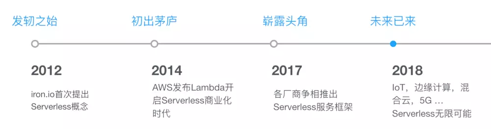
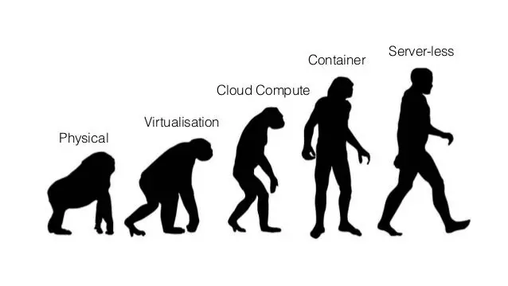

# `Serverless` 

## What is `Serverless`

通常，我们可以控制向我们已经部署的的Web应用发起的Http请求。
我们负责为应用配置和管理资源，保证应用在服务上运行。
这有一些问题：

1. 即使我们的服务没有被用户请求，也会被收取服务费用。

2. 我们需要负责服务器及其所有资源的正常运行和维护。

3. 我们还负责将适当的安全更新应用于服务器。

4. 当应用使用量激增的时候我们需要扩展服务。当应用使用量下降时我们需要减少服务投入。

对于较小的公司和个人开发者来说，这可能需要处理很多。
这最终会分散我们的精力，分散我们投入在构建和维护实际应用的力量。

在大型组织中，这由基础架构团队处理，通常不是单个开发人员的责任。
但是，支持此操作所需的过程最终会减慢开发时间。

应用因为必需与基础架构团队合作才能启动和运行，所以很难持续构建应用。
作为开发人员，我们一直在寻找这些问题的解决方案，而`serverless`正是应运而生。

### Serverless 历史

### 云计算发展看 `serverless`

首先，抛一个总结性观点：云计算的发展从IaaS，PaaS，SaaS，到最新的BaaS，FasS，在这个趋势中serverless(去服务器化）越来越明显，而Serveless的完善带给云计算将会是一次完美进化！

## Severless Coumputing

**Serverless Coumputing**（简称为 `serverless`）是一种执行模型，其中云提供商（AWS，Azure或Google Cloud）负责通过动态分配资源来执行一段代码。
并且根据运行代码的资源量进行收费。

代码通常在无状态容器内运行，可以由各种事件触发，包括
`http requests`, `database events`, `queuing services`, `monitoring alerts`, `file uploads`, `scheduled events` (`cron jobs`), 等。
发送到云的代码执行提供程序通常采用函数的形式。

因此，`serverless`有时被称为`Fucntions as Services`或`FaaS`。
以下是主要云提供商的FaaS产品：

- AWS：[AWS Lambda](https://aws.amazon.com/lambda/)
- Microsoft Azure：[Azure Functions](https://azure.microsoft.com/en-us/services/functions/)
- Google Cloud：[Cloud Functions](https://cloud.google.com/functions/)

虽然`serverless`将底层基础架构从开发人员手中抽象出来，但`server`仍然参与执行我们的`function`。

由于代码将作为单独的函数执行，因此我们需要注意一些事项。

## Microservices

在转换到`serverless`世界时，我们面临的最大变化是我们的应用程序需要以`functions`的形式进行组织。
我们可能习惯将应用程序部署为单个Rails或Express整体应用程序。

在`serverless`的世界中，我们通常需要采用更基础的微服务的架构。
我们可以通过在单个函数中运行整个应用程序，并自行处理应用整体路由来解决这个问题。
但不建议这样做，因为我们需要尽量减小`functions`的大小。

## Stateless Functions

我们的`functions`通常运行在安全的无状态容器内。
这意味着我们不能在应用服务中运行一些代码：
- 在event完成后还需要运行，执行时间超长
- 需要使用先前的上下文来执行请求
我们必须认为我们的函数每次都在新的容器中运行使用。

这有一些细微之处，我们将在什么是AWS Lambda章节中讨论。

## Cold Starts

由于我们的函数是在按需响应事件的容器内运行的，因此存在一些与之相关的延迟，这被称之为`Cold Start`。
在`function`完成执行后，我们的容器可能会保留一段时间。如果在此期间触发了另一个事件，则响应速度更快，这通常称为`Warm Start`。

`Code Start`的延迟时间取决于所使用的云提供商的实现。
在AWS Lambda上，它的范围可以从几百毫秒到几秒不等。
它可以取决于所使用的运行时（或语言），函数的大小（作为包），当然还有所涉及的云提供者。
多年来，`Code Start`已经大大改善，因为云提供商在优化低延迟时间方面已经做得更好。

除了优化我们的`functions`外，我们还可以使用一些简单的技巧，例如指定时间内执行脚本，每隔几分钟调用一次`function`以保持`Warm`。

使用 [`Serverless Framework`](https://serverless.com) 可以帮助我们很好的使 `serverless` 应用 [`Warm Start`](https://github.com/FidelLimited/serverless-plugin-warmup)

