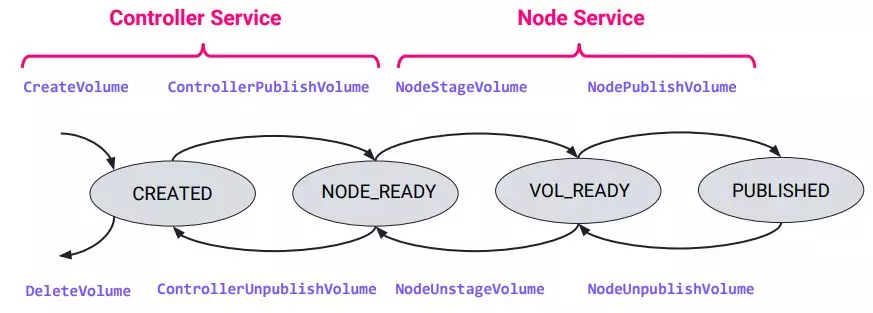
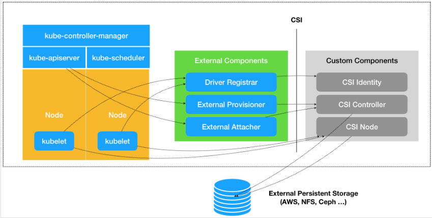

# CSI设计思想
将Pod挂载PV扩展成Provision、Attach 和 Mount 三个阶段。其中

* Provision 等价于&quot;创建磁盘&quot;

* Attach 等价于&quot;挂载磁盘到虚拟机&quot;

* Mount 等价于&quot;将该磁盘格式化后，挂载在 Volume 的宿主机目录上&quot;
## Volume生命周期


# CSI设计方案

K8S通过gRPC协议与CSI插件交互，每个SP（存储供应商，实现CSI插件的）都必须提供两类插件：

* Node plugin：在每个节点上运行,，作为一个grpc端点服务于CSI的RPCs，执行具体的挂卷操作。
* Controller Plugin：可以在任何地方运行，一般执行全局性的操作，比如创建/删除卷。

CSI有三种RPC：

* 身份服务：Node Plugin和Controller Plugin都必须实现这些RPC集。
* 控制器服务：Controller Plugin必须实现这些RPC集。
* 节点服务：Node Plugin必须实现这些RPC集。

> 为了方便管理，建议将3个服务部署在一个Container中，使用DaemonSet方式部署到所有存储节点

# CSI架构

 

## External Components

    是从 Kubernetes 项目里面剥离出来的那部分存储管理功能，由 Kubernetes 社区来开发和维护

* Driver Registrar：用于向kubelet注册Custom Components

* External Provisioner ：用于创建PV

* External Attacher：用于将PV attache到节点

实际上还有

* External snapshotter：用于管理快照

* External resizer：用于为Volume调整容量

## Custom Components（csi-driver）

    3个RPC服务，是由第三方负责开发和维护

* Identity Service：负责对外暴露这个插件本身的信息

* Controller Service：用于创建、删除以及管理 CSI Volume

* Node Service：用于将 Volume存储卷挂载到指定的目录中

# CSI流程总结

 1. Driver Registrar调用Identity Service的GetPluginInfo方法后向kubelet注册csi-driver，便于后面kubelet调用
 2. 用户创建storageClass，其provisioner指向External Provisioner的名称，用户创建PVC，引用这个storageClass
 3. PV Controller监听到PVC事件之后为这个PVC添加Annotation（volume.beta.kubernetes.io/storage-provisioner: Provisioner Name）
 4. External Provisioner监听到这个PVC的Annotation为自己的名称后，开始调用Controller Service的CreateVolume/DeleteVolume方法完成PV的创建/删除。
 3. Pod使用该PVC，并被Scheduler调度到Node节点 
 4. Node节点上Kubelet看到该Pod使用了PV，其Volume Manager（通过CSI-Plugin）会创建一个volumeattachments，并等待其attached状态变化
 5. External Attacher监听volumeattachments，调用Controller Service的ControllerPublishVolume/ControllerUnpublishVolume方法完成Attach/Detach Node节点上Kubelet的volume
 6. Volume Manager观察到attached状态变为true后，调用Node Service的NodeStageVolume和NodePublishVolume方法完成Mount/Unmount

# csi-driver

https://github.com/container-storage-interface/spec/blob/master/spec.md#rpc-interface

需要定义三个service（RPC集合）：identity、controller、node
根据不同的Capability实现其对应的接口功能，然后其他程序调用identity/GetPluginCapabilities就可以知道该csi-driver能够做什么了

## 公共部分

https://github.com/kubernetes-csi/drivers/tree/master/pkg/csi-common

k8s实现了一个官方的公共代码，公共代码实现了CSI要求的RPC方法，我们自己开发的插件可以继承官方的公共代码，然后把自己要实现的部分方法进行覆盖即可

## identity

GetPluginInfo(required)

        必须实现的。获取csi-driver的版本和名称等信息

        注：Name字段需要使用反向域名表示法

Probe(required)

        必须实现的。获取csi-driver的健康和就绪状态

        注：可以返回一个空值

GetPluginCapabilities(required)

        必须实现的。获取csi-driver的总的可用功能
        分为两大类
         - Service
                CONTROLLER_SERVICE
                VOLUME_ACCESSIBILITY_CONSTRAINTS
         - VolumeExpansion
                ONLINE
                OFFLINE

## controller

CreateVolume

        如果ControllerServiceCapability要实现CREATE_DELETE_VOLUME，那么这个方法必须实现，用来完成卷的创建

DeleteVolume

        如果ControllerServiceCapability要实现CREATE_DELETE_VOLUME，那么这个方法必须实现，用来完成卷的删除

ControllerPublishVolume

        如果ControllerServiceCapability要实现PUBLISH_UNPUBLISH_VOLUME，那么这个方法必须实现，用来完成卷的附加

ControllerUnpublishVolume

        如果ControllerServiceCapability要实现PUBLISH_UNPUBLISH_VOLUME ，那么这个方法必须实现，用来完成卷的分离

ValidateVolumeCapabilities(required)

        用来检查卷具有的VolumeCapabilities是否能满足所需的所有VolumeCapabilities功能。一般是kubelet执行NodePublishVolume/NodeStageVolume失败后会调用这个方法验证一下。

ListVolumes

        如果ControllerServiceCapability要实现LIST_VOLUMES，那么这个方法必须实现，用来展示所有卷的信息（支持分页）。一般用于当CreateVolume超时后且K8S不再需要这个卷，K8S有三种方案：
        - 重新执行CreateVolume，成功后得到Volume ID，进行DleteVolume
        - 执行ListVolumes获取，进行DleteVolume
        - 不做任何操作，由管理员手动进行

GetCapacity

        如果ControllerServiceCapability要实现GET_CAPACITY，那么这个方法必须实现，用来返回存储池的可用容量

ControllerGetCapabilities(required)

        必须实现的。用来返回control service的所拥有的功能

CreateSnapshot

        如果ControllerServiceCapability要实现CREATE_DELETE_SNAPSHOT，那么这个方法必须实现，用来为一个源卷创建快照

DeleteSnapshot

        如果ControllerServiceCapability要实现CREATE_DELETE_SNAPSHOT，那么这个方法必须实现，用来删除快照

ListSnapshots

        如果ControllerServiceCapability要实现LIST_SNAPSHOTS ，那么这个方法必须实现，用来展示所有快照的信息。与ListVolumes类似

ControllerExpandVolume

        如果ControllerServiceCapability要实现EXPAND_VOLUME ，那么这个方法必须实现，用来给卷扩容/缩容

## node

NodeStageVolume

        如果NodeServiceCapability要实现STAGE_UNSTAGE_VOLUME ，那么这个方法必须实现，完成卷的临时挂载。这么做的目的是K8S允许多个Pod使用同一个卷。
        
        注：如果有需要这个功能，则格式化需要在这里进行

NodeUnstageVolume

        如果NodeServiceCapability要实现STAGE_UNSTAGE_VOLUME ，那么这个方法必须实现，完成卷的临时卸载

NodePublishVolume(required)

        必须实现的。完成卷的挂载

NodeUnpublishVolume(required)

        必须实现的。完成卷的卸载

NodeGetInfo

        如果ControllerServiceCapability要实现PUBLISH_UNPUBLISH_VOLUME ，那么这个方法必须实现，返回此插件节点的ID和Topology信息

NodeGetCapabilities(required)

        必须实现的。用来返回node service的所拥有的功能

NodeGetVolumeStats

        如果NodeServiceCapability要实现GET_VOLUME_STATS ，那么这个方法必须实现，用来展示卷的容量统计信息

        注：暂时不知道如果被调用

NodeExpandVolume

        如果NodeServiceCapability要实现EXPAND_VOLUME ，那么这个方法必须实现，完成卷的扩容/缩容。


## 能力列表

https://github.com/container-storage-interface/spec/lib/go/csi/csi.pb.go

### UNKNOWN

### CONTROLLER\_SERVICE

 - ControllerServiceCapability\_RPC\_UNKNOWN
   
 - ControllerServiceCapability\_RPC\_CREATE\_DELETE\_VOLUME

 - ControllerServiceCapability\_RPC\_PUBLISH\_UNPUBLISH\_VOLUME

 - ControllerServiceCapability\_RPC\_LIST\_VOLUMES

 - ControllerServiceCapability\_RPC\_GET\_CAPACITY

 - ControllerServiceCapability\_RPC\_CREATE\_DELETE\_SNAPSHOT

 - ControllerServiceCapability\_RPC\_LIST\_SNAPSHOTS

 - ControllerServiceCapability\_RPC\_CLONE\_VOLUME

 - ControllerServiceCapability\_RPC\_PUBLISH\_READONLY

 - ControllerServiceCapability\_RPC\_EXPAND\_VOLUME

### VOLUME\_ACCESSIBILITY\_CONSTRAINTS

 - VolumeCapability\_AccessMode\_UNKNOWN
 
 - VolumeCapability\_AccessMode\_SINGLE\_NODE\_WRITER
 
 - VolumeCapability\_AccessMode\_SINGLE\_NODE\_READER\_ONLY
 
 - VolumeCapability\_AccessMode\_MULTI\_NODE\_READER\_ONLY
 
 - VolumeCapability\_AccessMode\_MULTI\_NODE\_SINGLE\_WRITER
 
 - VolumeCapability\_AccessMode\_MULTI\_NODE\_MULTI\_WRITER

### NODE\_SERVICE

 - NodeServiceCapability\_RPC\_UNKNOWN
 
 - NodeServiceCapability\_RPC\_STAGE\_UNSTAGE\_VOLUME
 
 - NodeServiceCapability\_RPC\_GET\_VOLUME\_STATS
 
 - NodeServiceCapability\_RPC\_EXPAND\_VOLUME

# driver-registrar

https://github.com/kubernetes-csi/node-driver-registrar

## 作用

- 向Kubelet注册CSI驱动程序。因为kubelet调用CSI的方法时需要知道向哪个套接字发出调用
- 将CSI驱动程序自定义NodeId添加到Kubernetes Node API对象上的标签。便于后面ControllerPublishVolume调用能够获取到nodeid与csi-driver的映射关系

## 逻辑

 1. 通过CSI driver socket 调用csi-driver/identity的GetPluginInfo函数，获取CSI驱动的名称
 2. 通过Registration socket，向kubelet注册CSI驱动程序，Kubelet的plugin watcher观察到这个socket之后开始注册调用csi-driver/node的NodeGetInfo，获取节点的ID用于给节点打标签

## 源码

node-driver-registrar/cmd/csi-node-driver-registrar/main.go
```golang
csiDriverName, err := csirpc.GetDriverName(ctx, csiConn)
```
github.com/kubernetes-csi/csi-lib-utils/rpc/common.go
```golang
rsp, err := client.GetPluginInfo(ctx, &req)
```
node-driver-registrar/cmd/csi-node-driver-registrar/node\_register.go
```golang
registrar := newRegistrationServer(csiDriverName, *kubeletRegistrationPath, supportedVersions)
grpcServer := grpc.NewServer()
registerapi.RegisterRegistrationServer(grpcServer, registrar)
```
k8s.io/kubernetes/pkg/kubelet/apis/pluginregistration/v1alpha1/api.pb.go
```golang
func RegisterRegistrationServer(s *grpc.Server, srv RegistrationServer) {
         s.RegisterService(&_Registration_serviceDesc, srv)
}
```
github.com/kubernetes/pkg/volume/csi/csi\_plugin.go
```golang
driverNodeID, maxVolumePerNode, accessibleTopology, err := csi.NodeGetInfo(ctx)
```
github.com/kubernetes/pkg/volume/csi/nodeinfomanager/nodeinfomanager.go
```golang
updateNodeIDInNode(driverName, driverNodeID),
node.ObjectMeta.Annotations[annotationKeyNodeID] = string(jsonObj)
```
> 注：
>   打标签有两种模式，一个模式是自己给 node 打上这个 annotation，并且在退出的时候把这个 annotation去掉。另一个模式是交给 kubelet 的 pluginswatcher 来管理， kubelet 自己会根据node-driver-registrar 提供的 socket 然后调用 gRPC 从 registrar 获取 NodeId 和DriverName 自己把 annotation 打上。

# external-provisioner

## 作用

根据用户的PVC请求创建/删除PV，完成Provision和Delete。

## 逻辑

    用户创建PVC引用storageclass，storageclass的provisioner属性会让kubernetes在创建PVC时指定annotations（volume.beta.kubernetes.io/storage-provisioner
Provisioner监听Kube-API中的PVC对象，执行其Provision函数

1. 调用csi-driver/identity的GetPluginCapabilities
2. 调用csi-driver/controller的ControllerGetCapabilities
3. 判断其是否拥有PluginCapability\_CONTROLLER\_SERVICE和ControllerCapability\_CREATE\_DELETE\_VOLUME，如果任意一个功能没有则结束provision，判断ControllerCapability\_CREATE\_DELETE\_SNAPSHOT功能是否需要，如果前面两个功能都有，则
4. 调用csi-driver/identity的GetPluginInfo，获取csi-driver的相关信息
5. 再根据PVC和Storageclass的属性组成CreateVolumeRequest对象，传递并调用csi-driver/controller的CreateVolume/DeleteVolume函数返回CreateVolumeResponse对象，根据返回信息组成pv并返回，然后kube-apiserver 中的 VolumeController 的 PersistentVolumeController进行创建和绑定PVC。
## 源码
github.com/kubernetes-incubator/external-storage/lib/controller/controller.go
```golang
volume, err = ctrl.provisioner.Provision(options)
if _, err = ctrl.client.CoreV1().PersistentVolumes().Create(volume); err == nil || apierrs.IsAlreadyExists(err) {
```
external-provisioner/pkg/controller/controller.go
```golang
rsp, err := client.GetPluginInfo(ctx, &req)
rsp, err := client.GetPluginCapabilities(ctx, &req)
rsp, err := client.ControllerGetCapabilities(ctx, &req)
func makeVolumeName(prefix, pvcUID string, volumeNameUUIDLength int) (string, error) {
         driverState, err := checkDriverState(p.grpcClient, p.timeout, needSnapshotSupport)
         rep, err = p.csiClient.CreateVolume(ctx, &req)
}
         _, err = p.csiClient.DeleteVolume(ctx, &req)
```
> 注：可以部署多个provisioner，但只能有一个provisioner领导者。可以在启动时指定--enable-leader-election开启选举。--volume-name-prefix参数可以指定PV的名称前缀（默认pvc-&lt;uuid&gt;）

# Volume-Manager

## 作用

调用in-tree 的 CSI-Plugin创建VolumeAttachment，并使用WaitForAttach等待其状态变为true后再通过in-tree 的 CSI-Plugin 调用csi-driver/node的NodeStageVolume和NodePublishVolume方法完成Mount

## 逻辑

kubelet 有一个 volume manager 来管理 volume 的 mount/attach 操作。volume Manager 有两个 goroutine ，一个是同步状态，一个 reconciler.reconcile。

 - desiredStateOfWorld：是从 podManager 同步的理想状态
 - actualStateOfWorld：是目前 kubelet 的上运行的 pod 的状态

每次 volume manager 需要把 actualStateOfWorld 中 volume 的状态同步到 desired 指定的状态。

reconcile方法先后分别调用in-tree 的 CSI plugin 的 Attach、WaitForAttach，当WaitForAttach满足后调用in-tree 的 CSI plugin 的 MountDevice、NodeExpand和SetUp方法

## 源码

github.com/kubernetes/pkg/kubelet/volumemanager/volume\_manager.go
```golang
go vm.desiredStateOfWorldPopulator.Run(sourcesReady, stopCh)
go vm.reconciler.Run(stopCh)
```
github.com/kubernetes/pkg/kubelet/volumemanager/reconciler/reconciler.go
```golang
func (rc *reconciler) reconcile() {
     err := rc.operationExecutor.AttachVolume(volumeToAttach, rc.actualStateOfWorld)
     err := rc.operationExecutor.MountVolume(
                                 rc.waitForAttachTimeout,
                                 volumeToMount.VolumeToMount,
                                 rc.actualStateOfWorld,
                                 isRemount)
```
github.com/kubernetes/pkg/volume/util/operationexecutor/operation\_executor.go
```golang
func (oe *operationExecutor) AttachVolume(
                 oe.operationGenerator.GenerateAttachVolumeFunc(volumeToAttach, actualStateOfWorld)
func (oe *operationExecutor) MountVolume(
         if fsVolume {
                 generatedOperations = oe.operationGenerator.GenerateMountVolumeFunc(
                         waitForAttachTimeout, volumeToMount, actualStateOfWorld, isRemount)
 
         } else {
                 generatedOperations, err = oe.operationGenerator.GenerateMapVolumeFunc(
                         waitForAttachTimeout, volumeToMount, actualStateOfWorld)
         }
```
github.com/kubernetes/pkg/volume/util/operationexecutor/operation\_generator.go
```golang
func (og *operationGenerator) GenerateAttachVolumeFunc(
                         devicePath, attachErr := volumeAttacher.Attach()
                         volumeToAttach.VolumeSpec, volumeToAttach.NodeName)
func (og *operationGenerator) GenerateMountVolumeFunc(
                         devicePath, err = volumeAttacher.WaitForAttach()
                         err = volumeDeviceMounter.MountDevice()
                         resizeDone, resizeError = og.resizeFileSystem(volumeToMount, resizeOptions, volumePluginName)
                         mountErr := volumeMounter.SetUp(fsGroup)
func (og *operationGenerator) resizeFileSystem(volumeToMount VolumeToMount, rsOpts volume.NodeResizeOptions, pluginName string) (bool, error) {
                         resizeDone, resizeErr := expandableVolumePlugin.NodeExpand(rsOpts)
}
```
# external-attacher

## 作用

将PV附加/分离Node节点，完成Attach和Detach

> 这在云环境中很常见，在云环境中，云API能够将卷附加到节点上，而不需要在节点上运行任何代码。

## 逻辑

    用户创建的Pod在调度到Node节点之后，kubelet会创建一个VolumeAttachment资源

Attacher监听Kube-API中的volumeattachments对象，然后

 1. 调用csi-driver/identity的Probe判断其健康状态，如果正常则
 2. 调用csi-driver/identity的GetPluginInfo得到其名称版本信息，如果得到则
 3. 调用csi-driver/identityGetPluginCapabilities，判断csi-driver是否有PluginCapability\_Service\_CONTROLLER\_SERVICE能力=
 4. 调用csi-driver/controller的ControllerGetCapabilities判断其是否有ControllerServiceCapability\_RPC\_PUBLISH\_UNPUBLISH\_VOLUME能力
 5. 如果同时具备以上两种能力就使用CSIHandler处理attach，否则使用TrivialHandler。
    使用两种不同的handler，都会执行SyncNewOrUpdatedVolumeAttachment ，最终将volumeattachment的attached置为true。
    CSIHandler：先调用csi-driver/controller的ControllerPublishVolume/ ControllerUnpublishVolume函数，再调用markAsAttached将VolumeAttachment.Attached重置为true
    TrivialHandler：直接调用markAsAttached，将VolumeAttachment.Attached重置为true

## 源码

external-attacher/cmd/csi-attacher/main.go
```goalng
supportsService, err := csiConn.SupportsPluginControllerService(ctx)
supportsAttach, err := csiConn.SupportsControllerPublish(ctx)
handler = controller.NewCSIHandler(clientset, csiClientset, attacher, csiConn, pvLister, nodeLister, nodeInfoLister, vaLister, timeout)
handler = controller.NewTrivialHandler(clientset)
```
external-attacher/pkg/controller/csi_handler.go
```golang
func (h *csiHandler) SyncNewOrUpdatedVolumeAttachment(va *storage.VolumeAttachment) {
         va, metadata, err := h.csiAttach(va)
         if _, err := markAsAttached(h.client, va, metadata); err != nil {
         publishInfo, _, err := h.csiConnection.Attach(ctx, volumeHandle, readOnly, nodeID, volumeCapabilities, attributes, secrets)
```
external-attacher/pkg/connection/connection.go
```golang
rsp, err := client.GetPluginInfo(ctx, &req)
_, err := client.Probe(ctx, &req)
rsp, err := client.GetPluginCapabilities(ctx, &req)
rsp, err := client.ControllerGetCapabilities(ctx, &req)
func (c *csiConnection) Attach(ctx context.Context, volumeID string, readOnly bool, nodeID string, caps *csi.VolumeCapability, context, secrets map[string]string) (metadata map[string]string, detached bool, err error) {
         rsp, err := client.ControllerPublishVolume(ctx, &req)
         _, err = client.ControllerUnpublishVolume(ctx, &req)
```
external-attacher/pkg/controller/trivial\_handler.go
```golang
func (h *trivialHandler) SyncNewOrUpdatedVolumeAttachment(va *storage.VolumeAttachment) {
                 if _, err := markAsAttached(h.client, va, nil); err != nil {
```
> 注：可以部署多个attacher，但只能有一个attacher领导者。可以在启动时指定--leader-election开启选举。文件存储就不需要attache，因为不需要绑定设备到节点上，直接使用网络接口就可以了

# CSI-Plugin（In-tree）

## 作用

真正调用csi-driver的方法，完成Volume的mount/unmount。

## 逻辑

1. Attach方法创建一个volumeattachment资源
2. WaitForAttach方法等待volumeattachment的attached状态变化
3. MountDevice方法先调用csi-driver/node的NodeGetCapabilities方法，判断是否有NodeServiceCapability\_RPC\_STAGE\_UNSTAGE\_VOLUME功能，如果没有则结束MountDevice，如果有，则
4. 调用csi-driver/node的NodeStageVolume方法完成临时挂载
5. NodeExpand方法先调用csi-driver/node的NodeGetCapabilities方法，判断是否有NodeServiceCapability\_RPC\_EXPAND\_VOLUME功能和NodeServiceCapability\_RPC\_STAGE\_UNSTAGE_VOLUME功能，如果有，则
6. 调用csi-driver/node的NodeExpandVolume方法完成卷扩容
7. SetUp方法先调用csi-driver/node的NodeGetCapabilities方法，判断是否有NodeServiceCapability\_RPC\_STAGE\_UNSTAGE\_VOLUME功能，如果有则填充deviceMountPath作为下面的一个参数
8. 再调用csi-driver/node的NodePublishVolume方法完成挂载

## 源码

github.com/kubernetes/pkg/volume/csi/csi\_attacher.go
```golang
func (c *csiAttacher) Attach(spec *volume.Spec, nodeName types.NodeName) (string, error) {
         attachment := &storage.VolumeAttachment{
                 ObjectMeta: meta.ObjectMeta{
                         Name: attachID,
                 },
                 Spec: storage.VolumeAttachmentSpec{
                         NodeName: node,
                         Attacher: pvSrc.Driver,
                         Source: storage.VolumeAttachmentSource{
                                 PersistentVolumeName: &pvName,
                         },
                 },
         }
 
         _, err = c.k8s.StorageV1().VolumeAttachments().Create(attachment)
func (c *csiAttacher) MountDevice(spec *volume.Spec, devicePath string, deviceMountPath string) (err error) {
         err = csi.NodeStageVolume(ctx,
                 csiSource.VolumeHandle,
                 publishContext,
                 deviceMountPath,
                 fsType,
                 accessMode,
                 nodeStageSecrets,
                 csiSource.VolumeAttributes)
```
github.com/kubernetes/pkg/volume/csi/expander.go   
```golang
func (c *csiPlugin) NodeExpand(resizeOptions volume.NodeResizeOptions) (bool, error) {
 return c.nodeExpandWithClient(resizeOptions, csiSource, csClient)
}
func (c *csiPlugin) nodeExpandWithClient(
 nodeExpandSet, err := csClient.NodeSupportsNodeExpand(ctx)
 stageUnstageSet, err := csClient.NodeSupportsStageUnstage(ctx)
 ```
github.com/kubernetes/pkg/volume/csi/csi_client.go 
```golang
func (c *csiDriverClient) NodeSupportsNodeExpand(ctx context.Context) (bool, error) {
 resp, err := nodeClient.NodeGetCapabilities(ctx, req)
}
func (c *csiDriverClient) nodeSupportsStageUnstageV1(ctx context.Context) (bool, error) {
 resp, err := nodeClient.NodeGetCapabilities(ctx, req)
}
func (c *csiDriverClient) NodeExpandVolume(ctx context.Context, volumeID, volumePath string, newSize resource.Quantity) (resource.Quantity, error) {
 resp, err := nodeClient.NodeExpandVolume(ctx, req)
 }
 ```
github.com/kubernetes/pkg/volume/csi/csi\_mounter.go
```golang
func (c *csiMountMgr) SetUp(fsGroup *int64) error {
          return c.SetUpAt(c.GetPath(), fsGroup)
  }
  
func (c *csiMountMgr) SetUpAt(dir string, fsGroup *int64) error {
         err = csi.NodePublishVolume(
                 ctx,
                 volumeHandle,
                 readOnly,
                 deviceMountPath,
                 dir,
                 accessMode,
                 publishContext,
                 volAttribs,
                 nodePublishSecrets,
                 fsType,
                 mountOptions,
         )
```

> 注：
> 
> 文件系统类型的存储（NFS/GlusterFS等），只需要NodePublishVolume一步即可

# 其他

## external-snapshotter
https://github.com/kubernetes-csi/external-snapshotter

卷快照是K8S中另外一种存储资源类型,3个标准资源VolumeSnapshot、VolumeSnapshotContent、VolumeSnapshotClass，它们与PersistentVolumeClaim和PersistentVolume以及storageClass的结构类似。

external-snapshotter用来监听VolumeSnapshot和VolumeSnapshotClass，调用csi-driver的ControllerGetCapabilities检查csi-driver是否具有CREATE_DELETE_SNAPSHOT功能，如果有则调用csi-driver/controller的CreateSnapshot和DeleteSnapshot完成快照的创建和删除。

external-snapshotter/cmd/csi-snapshotter/main.go
```golang
*snapshotterName, err = csirpc.GetDriverName(ctx, csiConn)
supportsCreateSnapshot, err := supportsControllerCreateSnapshot(ctx, csiConn)
capabilities, err := csirpc.GetControllerCapabilities(ctx, conn)
```
external-snapshotter/pkg/snapshotter/snapshotter.go
```golang
rsp, err := client.CreateSnapshot(ctx, &req)
if _, err := client.DeleteSnapshot(ctx, &req); err != nil {
```

## external-resizer
https://github.com/kubernetes-csi/external-resizer

监听API对PVC的编辑，当容量大小发生变化时，调用csi-driver/controller的ControllerExpandVolume完成容量调整。

### 版本要求
    CSI:v1.1.0
    
    K8S:v1.14
### K8S开启功能

    --feature-gates=ExpandCSIVolumes=true
    
    --feature-gates=ExpandInUsePersistentVolumes=true

### csi-driver增加plugin功能
```golang
    {
            Type: &csi.PluginCapability_VolumeExpansion_{
                    VolumeExpansion: &csi.PluginCapability_Service{
                            Type: csi.PluginCapability_VolumeExpansion_ONLINE,
                    },
            },
    },
    {
            Type: &csi.PluginCapability_VolumeExpansion_{
                    VolumeExpansion: &csi.PluginCapability_Service{
                            Type: csi.PluginCapability_VolumeExpansion_OFFLINE,
                    },
            },
    },
```
external-resizer/pkg/resizer/csi\_resizer.go
```golang
supportControllerService, err := supportsPluginControllerService(csiClient, timeout)
supportControllerResize, err := supportsControllerResize(csiClient, timeout)
supportsNodeResize, err := supportsNodeResize(csiClient, timeout)
newSizeBytes, nodeResizeRequired, err := r.client.Expand(ctx, volumeID, requestSize.Value(), secrets)
```
github.com/kubernetes-csi/csi-lib-utils/rpc/common.go
```golang
rsp, err := client.GetPluginInfo(ctx, &req)
rsp, err := client.GetPluginCapabilities(ctx, &req)
rsp, err := client.ControllerGetCapabilities(ctx, &req)
```
external-resizer/pkg/csi/client.go
```golang
rsp, err := c.nodeClient.NodeGetCapabilities(ctx, &csi.NodeGetCapabilitiesRequest{})
resp, err := c.ctrlClient.ControllerExpandVolume(ctx, req)
```

## CSI的默认实现
项目[csi-common](github.com/kubernetes-csi/drivers/pkg/csi-common)提供了controller,identity和nodeserver的默认实现
```golang
type CSIDriver struct {
    name    string
    nodeID  string
    version string
    cap     []*csi.ControllerServiceCapability
    vc      []*csi.VolumeCapability_AccessMode
}
```
默认实现的主要逻辑有
```golang
func (ids *DefaultIdentityServer) GetPluginCapabilities(ctx context.Context, req *csi.GetPluginCapabilitiesRequest) (*csi.GetPluginCapabilitiesResponse, error) {
    glog.V(5).Infof("Using default capabilities")
    return &csi.GetPluginCapabilitiesResponse{
        Capabilities: []*csi.PluginCapability{
            {   
                Type: &csi.PluginCapability_Service_{
                    Service: &csi.PluginCapability_Service{
                        Type: csi.PluginCapability_Service_CONTROLLER_SERVICE,
                    },  
                },  
            },  
        },  
    }, nil 
}

func (ids *DefaultIdentityServer) GetPluginInfo(ctx context.Context, req *csi.GetPluginInfoRequest) (*csi.GetPluginInfoResponse, error) {
    glog.V(5).Infof("Using default GetPluginInfo")

    if ids.Driver.name == "" {
        return nil, status.Error(codes.Unavailable, "Driver name not configured")
    }   

    if ids.Driver.version == "" {
        return nil, status.Error(codes.Unavailable, "Driver is missing version")
    }   

    return &csi.GetPluginInfoResponse{
        Name:          ids.Driver.name,
        VendorVersion: ids.Driver.version,
    }, nil 
}

func (cs *DefaultControllerServer) ControllerGetCapabilities(ctx context.Context, req *csi.ControllerGetCapabilitiesRequest) (*csi.ControllerGetCapabilitiesResponse, error) {
    glog.V(5).Infof("Using default ControllerGetCapabilities")

    return &csi.ControllerGetCapabilitiesResponse{
        Capabilities: cs.Driver.cap,
    }, nil 
}

func (ns *DefaultNodeServer) NodeGetCapabilities(ctx context.Context, req *csi.NodeGetCapabilitiesRequest) (*csi.NodeGetCapabilitiesResponse, error) {
    glog.V(5).Infof("Using default NodeGetCapabilities") 

    return &csi.NodeGetCapabilitiesResponse{
        Capabilities: []*csi.NodeServiceCapability{
            {
                Type: &csi.NodeServiceCapability_Rpc{
                    Rpc: &csi.NodeServiceCapability_RPC{
                        Type: csi.NodeServiceCapability_RPC_UNKNOWN,
                    },  
                },          
            },          
        },          
    }, nil      
}
```

CSIDriver作为数据源，决定了其中3个接口的返回
  * ControllerGetCapabilities
  * GetPluginInfo
  * NodeGetInfo
