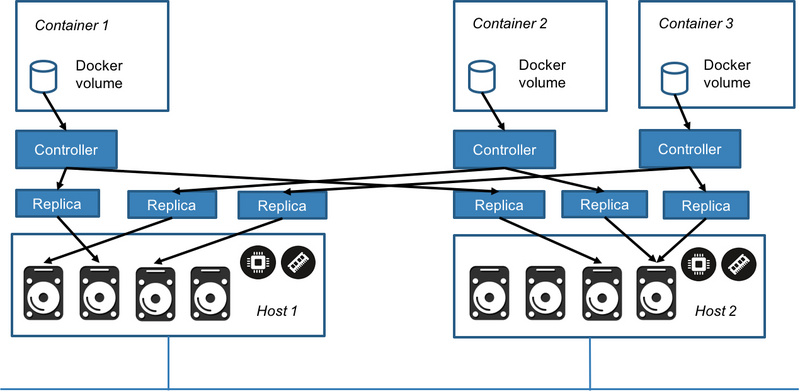

https://github.com/longhorn/longhorn 

# 简介
Longhorn是Kubernetes的分布式块存储系统。 它使用容器和微服务实现分布式块存储。Longhorn为每个块设备卷创建一个专用的存储控制器，并跨多个节点上存储的多个副本同步复制该卷。存储控制器和副本本身使用Kubernetes进行编排。

以下是Longhorn的一些显着功能：
- 企业级分布式存储，无单点故障
- 块存储的增量快照
- 备份到基于有效更改块检测的辅助存储（NFS或与S3兼容的对象存储）
- 定期快照和备份
- 自动化无中断升级
- 直观的GUI仪表板

> 当前是Beta 状态，最新版本v0.7.0

# 要求
- Docker v1.13+
- k8s v1.14+
- 节点安装并启动open-iscsi
- 节点文件系统支持ext4/XFS

# 说明
longhorn主要有两部分
- Longhorn Engine：实现数据平面
- Longhorn Manager：实现控制平面

##  Longhorn Engine
实现了轻量级的块设备存储控制器，该控制器能够将数据存储在多个副本中。它的功能类似于网络RAID控制器。 
- 副本由Linux稀疏文件支持，并支持使用差异磁盘的高效快照。
- 副本的功能类似于联网磁盘，支持通过网络协议进行的读/写操作。
- 前端（目前支持Open-iSCSI / tgt）是一个内核驱动程序，可将Longhorn块设备（映射到/dev/longhorn/vol-name）上的读/写操作转换为控制器上的用户级网络请求。
- 每个Longhorn块设备都由其自己的专用控制器支持。
- 控制器将写入操作同步复制到所有副本。
- 控制器检测到错误的副本并重建副本。
- 控制器协调快照和备份操作。
- 控制器和副本包装为Docker容器。

### 架构图

### volume controller


### 两种工作模式
- engine:连接到所有副本，写操作同步到所有副本，读操作任一一个
- replica:存储数据，每个卷有多个副本，每个副本包含完整数据。意味着只要有一个副本正常，就可以恢复数据

### 前端模式
-	block device		(已经登录target了)
-	iscsi			(用户自己使用iscsi客户端（open-iscsi）连接)

longhorn的CSI暂时不支持iscsi，因此默认前端使用block device

tgtd和主机上的open-iscsi结合完成创建和使用

https://github.com/rancher/tgt 

### 相关组件
####  instance-manager
在v0.6.0之前，longhorn把k8s的pod理念用到了极致，每个engine和replica都使用pod来启动，带来的问题就是单个主机上pod的数量限制

v0.6.0版本开始引入instance-manager，daemonset方式部署instance-manager-e 运行engine进程，instance-manager-r 运行replica ，单个pod里运行多个进程，同时还启动了tgtd

####  go-iscsi-helper
https://github.com/longhorn/go-iscsi-helper

是一个库，用于实现为engine创建target。它既可以创建initiator（使用tgtd），又可以使用initiator，从而为最终用户创建块设备。 

####  Backupstore 
https://github.com/longhorn/backupstore

实现了备份和还原功能。目前支持两种协议：NFS和S3

####  Sparse tools
https://https://github.com/longhorn/sparse-tools

Longhorn依赖于文件系统的稀疏文件支持来存储卷数据的元数据，例如已写入哪个块。但是普通的Linux命令可能不会保留文件的稀疏元数据。 sparse-tools确保将文件的元数据保留用于某些文件操作 
它有两个主要功能：
* sfold 用于合并快照文件，这是快照删除过程的一部分。
* ssync 复制快照文件，作为副本重建过程的一部分。


##  Longhorn Manager
### 用途
根据k8s需求创建longhorn volume
调度longhorn engine
	首次创建volume时，副本数据存放在哪些节点
	副本异常时，在哪里重建副本
面向用户
	定期备份
	多磁盘管理
	灾难恢复
监视volume 状态

### 实现
Manager作为daemonset运行在所有节点，负责监视本节点上的volume
利用了k8s的控制权原理，数据全部保存在CRD中，致力于协调spec和status之间的差异

### CRD
- volumes

  volume controller 负责监听engine和replica  创建/删除/更新事件，完成volumes的创建/删除/Attach/Detach/更新
- engines

  engine controller负责启停engine，并通过engine监听volume的状态
- replicas

  replica controller负责启动replica
- instancemanagers

  反应了该实例的状态，包括engine和replica
- nodes

  node controller负责收集节点信息（磁盘、调度标志、节点标签、磁盘标签）
- engineimages

  代表engine的版本。由于Longhorn引擎是微服务，因此每个卷都可以运行不同版本的引擎映像。当Longhorn Manager升级但引擎尚未升级时，就会发生这种情况。Longhorn Manager使用部署在节点上的引擎二进制文件与卷进行通信。这些引擎二进制文件是使用引擎映像控制器部署的。
引擎映像控制器还负责创建/删除实例管理器对象，因为引擎的每个版本都需要与相同版本的实例管理器一起运行。

# 源码解读（部分）
longhorn-engine

longhorn-engine/pkg/controller/control.go 
```
c.frontend.Startup(c.Name, c.size, c.sectorSize, c)
```
longhorn-engine/pkg/frontend/tgt/frontend.go 
```
t.s.Startup(name, size, sectorSize, rw)  	//启动socket
t.dev.Start()							//创建并登陆tgt
```

创建socket
```
SocketDirectory = "/var/run"
filepath.Join(SocketDirectory, "longhorn-"+t.Volume+".sock")

func (t *Socket) startSocketServer(rw types.ReaderWriterAt) error {}

收到请求后进行数据读写
server := dataconn.NewServer(c, NewDataProcessorWrapper(rw))
server.Handle()
func (d DataProcessorWrapper) ReadAt(p []byte, off int64) (n int, err error) {
    return d.rw.ReadAt(p, off)
}

func (d DataProcessorWrapper) WriteAt(p []byte, off int64) (n int, err error) {
    return d.rw.WriteAt(p, off)
}

func (d DataProcessorWrapper) PingResponse() error {
    return nil
}
```
创建tgt磁盘
go-iscsi-helper/longhorndev/dev.go
```
d.WaitForSocket(stopCh)
iscsidev.NewDevice
d.scsiDevice.CreateTarget()	//创建tgt
d.scsiDevice.StartInitator()	//在pod所在主机上登陆iscsi
d.createDev()				//使用mknod创建块设备
```

数据写入(所有副本同时写)
longhorn-engine/pkg/controller/replicator.go 
```
n, err := r.writer.WriteAt(p, off)
```
longhorn-engine/pkg/controller/multi_writer_at.go 
```
func (m *MultiWriterAt) WriteAt(p []byte, off int64) (n int, err error) {
    errs := make([]error, len(m.writers))
    errored := false
    wg := sync.WaitGroup{}

    for i, w := range m.writers {
        wg.Add(1)
        go func(index int, w io.WriterAt) {
            _, err := w.WriteAt(p, off)
            if err != nil {
                errored = true
                errs[index] = err
            }
            wg.Done()
        }(i, w)
    }

    wg.Wait()
    if errored {
        return 0, &MultiWriterError{
            Writers: m.writers,
            Errors:  errs,
        }
    }

    return len(p), nil
}
```
数据读取（）
longhorn-engine/pkg/controller/replicator.go 
```
func (r *replicator) ReadAt(buf []byte, off int64) (int, error) {
    var (
        n   int
        err error
    )

    if !r.backendsAvailable {
        return 0, ErrNoBackend
    }

    readersLen := len(r.readers)
    r.next = (r.next + 1) % readersLen
    index := r.next
    retError := &BackendError{
        Errors: map[string]error{},
    }
    for i := 0; i < readersLen; i++ {
        reader := r.readers[index]
        n, err = reader.ReadAt(buf, off)
        if err == nil {
            break
        }
        logrus.Error("Replicator.ReadAt:", index, err)
        retError.Errors[r.readerIndex[index]] = err
        index = (index + 1) % readersLen
    }
    if len(retError.Errors) != 0 {
        return n, retError
    }
    return n, nil
}
```


# 安装
kubectl apply -f https://raw.githubusercontent.com/longhorn/longhorn/master/deploy/longhorn.yaml


# 配置
```
  default-setting.yaml: |-
    backup-target:					#备份目标（NFS/S3）
    backup-target-credential-secret:			#备份使用的密钥
    create-default-disk-labeled-nodes: true		#在带标签（node.longhorn.io/create-default-disk=true ）的节点上创建默认磁盘。默认false，在所有节点创建
    default-data-path: /var/lib/zcloud/longhorn		#磁盘目录。默认/var/lib/rancher/longhorn 
    replica-soft-anti-affinity:				#副本调度亲和性。默认true
    storage-over-provisioning-percentage:		#超出配置存储的百分比（由于使用的linux Sparse File）。默认500
    storage-minimal-available-percentage:		#磁盘存储最小可用的百分比。默认10
    upgrade-checker:					#定期检查longhorn版本，有新的时在UI提醒。默认true
    default-replica-count:				#副本数。默认3
    guaranteed-engine-cpu:				#引擎CPU保证。默认0.2。建议不超过可用CPU的1/4（因为这个会应用于多个pod）
    default-longhorn-static-storage-class:		#静态存储类名称
    backupstore-poll-interval: 200			#备份轮询频率，以秒为单位，用以更新volume的上次备份时间。
    taint-toleration:					#通过给longhorn设置容忍污点，然后给部分节点打上污点，阻止其他workload使用该存储节点
```
可以在安装时修改yaml文件，也可以在UI进行修改

# 使用
支持FlexVolume 和CSI （v0.4.0之后）。CSI是首选

kubectl create -f https://raw.githubusercontent.com/longhorn/longhorn/master/examples/storageclass.yaml

可以创建多个storageclass，并设置
- diskSelector
- nodeSelector
- recurringJobs


> 通过CSI创建的volumes  frontend为blockdev。目前还不支持iscsc


# 增加磁盘
* 1：将磁盘格式化后挂载到某个目录
* 2：ui上编辑node，将挂载目录添加到磁盘列表

另外，可以通过禁用默认的磁盘目录，来避免使用

# 减少磁盘
* 1：禁止调度
* 2：没有副本使用当前磁盘目录（找到所有在本节点的副本进行删除）

### 步骤
* 1： 使用storageclass创建一个sts，写入一些数据
* 2： 创建snap
* 3： 再写入一些数据
* 4： 创建backup
* 5： 再写入一些数据

# 快照还原
> 前提：没有被attach
*   1: 将sts的replicas设置为0，致使pod终止，volume被k8s自动detach
*   2: 在UI上将volume attach到任一节点上，注意勾选Maintenance  
*   3: 找到快照进行Revert
*   4: 在UI上将volume detach 
*   5: 将sts的replicas设置为1，进入pod，查看数据，应该是前面的数据1

# 备份还原
> 前提：从备份中创建新的volume
* 1： UI上找到对应volume的想要恢复的backup，进行Restore，为新的volume设定名称sts-name-0
* 2： 在K8S中创建pv
```
apiVersion: v1
kind: PersistentVolume
metadata:
  name: sts-name-0					#前面新建的volume的名称
spec:				
  capacity:
    storage: 3Gi							#前面新建的volume的大小
  volumeMode: Filesystem
  accessModes:
    - ReadWriteOnce
  persistentVolumeReclaimPolicy: Delete
  csi:
    driver: io.rancher.longhorn
    fsType: ext4
    volumeAttributes:
      numberOfReplicas: "3"				#前面新建的volume的副本数
      staleReplicaTimeout: '30'				
    volumeHandle: sts-name-0			#前面新建的volume的名称
  storageClassName: longhorn			#之前pvc的storageclass名称
```
* 3:  在K8S中创建pvc
```
apiVersion: v1
kind: PersistentVolumeClaim
metadata:
  name: longhorn-csi-test-0				#sts中<name of Volume Claim Template>-<name of Stateful Set>-<index> 
spec:
  accessModes:
    - ReadWriteOnce
  resources:
    requests:
      storage: 3Gi
  storageClassName: longhorn
  volumeName: csi-test-0				#前面创建的pv的名称
```
* 4： 创建sts
> 注意：由于pvc的名称改变了，因此新的sts与之前的sts不能一样。也可以删除原有的pvc，在创建新的pvc时使用原有的pvc名称，这样就可以使用之前的sts了
* 5： 进入pod，查看数据，应该是前面的数据2


Q&A
Q: 节点上fdisk看到iscsi 发现的磁盘一般是/dev/sd[a-z],但df看到pod挂载的盘却是/dev/longhorn/pvc-xxx
A: 函数 createDev 中使用了mknod，根据iscsi盘的主次设备号（major、minor）创建了便于用户识别的块设备

# ISCSI
##	Target端

instance-manager-e

查看target信息

```tgt-admin -s
	I_T nexus information #客户端的连接信息,IP Addr是node节点的CNI网卡IP地址
	LUN information #LUN 信息，其中Type: disk的才是正在的设备，此处使用了sock
```

查看sock是哪个进程的，可以看到是对应的longhorn controller

```lsof /var/run/longhorn-pvc-e2fe33a6-ffa0-11e9-9ec4-5254008c3f4d.sock```


###	Initiator端
attach节点

查看target上的共享磁盘

```iscsiadm -m discovery -t sendtargets -p 10.42.2.7(instance-manager-e的IP)```

查看所有发现的设备

```iscsiadm -m node```	

登陆target后，本机上fdisk -l会看到多出一个磁盘，在target端tgt-admin-s可以看到一个新的Initiator

```iscsiadm -m node -T iqn.2014-09.com.rancher:pvc-c46ca0d8-fee9-11e9-9ec4-5254008c3f4d --login```


登出target后没本机上fdisk -l会发现之前的那个磁盘没有了，在target端会看到之前的initiator消失了

```iscsiadm -m node -T iqn.2014-09.com.rancher:pvc-c46ca0d8-fee9-11e9-9ec4-5254008c3f4d --logout```


删除发现的设备

```iscsiadm -m node -T iqn.2014-09.com.rancher:pvc-46f33f2c-f9f5-11e9-b8b5-5254008c3f4d -o delete```

